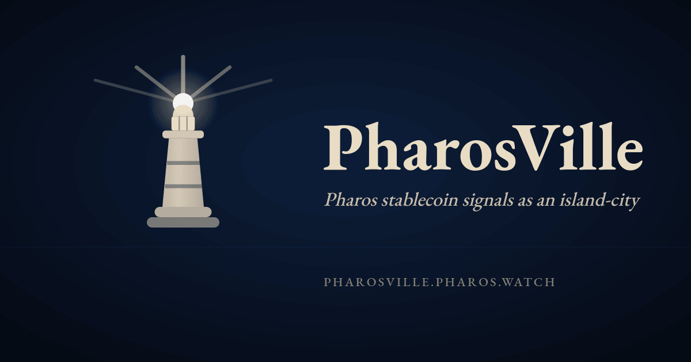
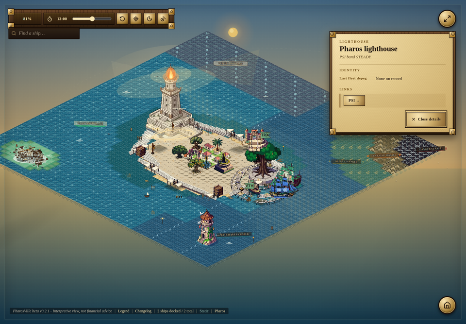

# PharosVille

[](https://github.com/TokenBrice/pharosville/actions/workflows/deploy-cloudflare.yml)
[](https://github.com/TokenBrice/pharosville/actions/workflows/canary-smoke.yml)
[](https://github.com/TokenBrice/pharosville/actions/workflows/codeql.yml)
[](./LICENSE)

PharosVille turns live Pharos stablecoin signals into a desktop-only maritime observatory built with React, Canvas 2D, TypeScript, Vite, and Cloudflare Pages.

[Open PharosVille](https://pharosville.pharos.watch/) | [Changelog](./CHANGELOG.md) | [Roadmap](./ROADMAP.md) | [Architecture](./docs/pharosville/ARCHITECTURE.md) | [Contributing](./CONTRIBUTING.md) | [Security](./SECURITY.md)





## What It Shows

PharosVille renders a living island-city view of Pharos stablecoin market signals:

- stablecoin supply, presence, and identity as ships
- chain presence as harbors and docks
- risk/status water zones around the island
- detail panels and an accessibility ledger that mirror canvas semantics
- local pixel-art sprites loaded from a manifest-backed asset pipeline

The app is intentionally desktop-only. Narrow screens, short screens, and capable portrait screens must not mount the world runtime or fetch world data; they show a fallback or rotate prompt instead.

## Trust Boundaries

PharosVille is an interpretive data visualization, not financial advice.

It does not provide:

- wallet connection
- trading
- custody
- user accounts
- browser-exposed API credentials

The browser calls same-origin `/api/*` paths only. `functions/api/[[path]].ts` proxies the allowlisted PharosVille read endpoints to `PHAROS_API_BASE` and injects `PHAROS_API_KEY` server-side. Never expose `PHAROS_API_KEY` as `VITE_*`, static JavaScript, HTML, query strings, logs, docs, or fixtures.

## Architecture

At a high level:

1. The React route gates unsupported viewports before world data is mounted.
2. The browser requests same-origin `/api/*` endpoints.
3. Cloudflare Pages Functions proxy only the allowed PharosVille read paths.
4. `src/systems/` builds a pure world model from live data.
5. `src/renderer/` draws the Canvas 2D world and keeps DOM parity through panels and ledgers.
6. `public/pharosville/assets/manifest.json` controls runtime art and sprite budgets.

For the full implementation map, see [Architecture](./docs/pharosville/ARCHITECTURE.md).

## Repo Map

- `src/` - PharosVille React shell, canvas runtime, hooks, content, systems, and renderer
- `shared/` - runtime-neutral PharosVille API contract and data logic
- `functions/` - Cloudflare Pages Function proxy and server-side response hardening
- `public/pharosville/assets/` - local runtime sprite manifest and promoted PNG/WebP assets
- `docs/pharosville/` - architecture, testing, operations, visual, and asset-maintenance docs
- `.github/workflows/` - deploy, canary, CodeQL, and dependency/security automation
- `agents/` - active planning and handoff artifacts
- `outputs/` - scratch screenshots, renders, and generated test artifacts

## Local Development

Use Node 24:

```bash
npm ci
npm run onboard:agent
npm run dev
```

The maintained local dev server is `http://localhost:5173/`.

`npm run dev` proxies same-origin `/api/*` through `functions/api/[[path]].ts`, which requires `PHAROS_API_KEY` server-side. The dev proxy resolves `PHAROS_API_KEY` in this order:

1. `process.env.PHAROS_API_KEY`
2. `.env.local` in the current worktree
3. `.env.local` in the main worktree, auto-discovered for linked worktrees
4. `.git/pharosville.env.local`, shared across worktrees

Initialize or update the shared key file:

```bash
npm run setup:local-api-key
```

Smoke the allowlisted Pharos endpoints before debugging missing local data:

```bash
npm run smoke:api-local
npm run smoke:dev-proxy
```

## Validation

Use the smallest relevant check while iterating:

```bash
npm run validate:changed
```

Common focused checks:

```bash
npm run validate:docs
npm run typecheck
npm test
npm run check:pharosville-assets
npm run check:pharosville-colors
npm run build
npm run test:visual
```

Before release-level confidence:

```bash
npm run validate:release
```

For deployed changes:

```bash
npm run smoke:live -- --url https://pharosville.pharos.watch
```

## Operations

Cloudflare Pages project: `pharosville`

Required Pages setup:

```bash
wrangler pages project create pharosville --production-branch main
wrangler pages secret put PHAROS_API_KEY --project-name pharosville
```

`PHAROS_API_BASE` is set in `wrangler.toml` as `https://api.pharos.watch`.

For deployment, smoke, rollback, and credential rotation, see [Operations](./docs/pharosville/OPERATIONS.md).

## Community

- Report bugs and visual/data issues with the GitHub issue forms.
- Read [CONTRIBUTING.md](./CONTRIBUTING.md) before opening a pull request.
- Report vulnerabilities privately through the guidance in [SECURITY.md](./SECURITY.md).
- Use [SUPPORT.md](./SUPPORT.md) for support scope and triage expectations.

## License

MIT. See [LICENSE](./LICENSE).
