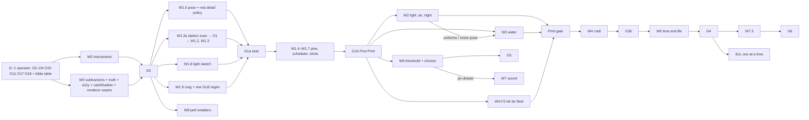

# PharosVille — The Hour-Print: consolidated implementation plan

Date: 2026-09-26. Base: `main` @ `5a187df` (v0.17.0 "Reborn"). Status: **approved for execution 2026-09-26; G−1 decisions recorded in §4.1.**
Author: orchestrator (Opus 5.5), from 19 Opus 5.5 lane reports (`reviews/`), 4 Opus 5.5 index passes
(`catalogue/`), 3 Opus 5.5 council reviews (`council/`) and 15 serial real-GPU baseline frames
(`outputs/opus-review/`, Chrome / ANGLE Metal / Apple M5 Pro, tier `full`, 60 fps, ~280 draws, ~380k tris,
184 ships).

Every item carries the lane IDs it came from (`water-2`, `critic-1`, …). The lane report holds the full
technique, parameters, `file:line` anchors and acceptance; this plan decides **what, in which order, owned by
whom, measured how, and against which picture**. §3 records rulings where lanes disagreed; §11 records how
each council finding was disposed.

---

## 0. The diagnosis in one page

v0.17 made the right structural move (a perspective camera on a harbour-garden) but the scene is still tuned
for the orthographic diorama it replaced. Nineteen independent reviewers converged on five facts, each
measured on the real GPU:

1. **There is no shot.** The rest camera is the corner solution of a zoom-maximiser (`camera.ts:177` scores
   `zoom + …`): every gate rests at the 1.15 ceiling with the tower dead centre (crown x 0.499) filling
   58–65 % of the frame. The garden the code already authored — engawa, tōrō, hero pine, the bible's "pine
   bough across the near corner" — sits outside the frustum at every viewport (the bough is 56° off-axis).
   The viewer hovers 20.6 u above open water instead of sitting in shade looking out.
   (camera, garden-master, garden, art-director, pharos)
2. **The light comes from the wrong side and the air is a wall.** The noon sun is 176° from the eye, behind
   the Pharos: both visible tower faces measure the same colour at noon and golden; no cast shadow is visible
   at rest. Golden hour stacks four warm sources into one orange wash (38 % of pixels saturated orange; tower
   L\* 34 on sky L\* 64). By day the far half of the frame is a cream wall (right-middle ninth L\* 77–91 vs the
   bible's 42; far band std L\* 1.2). At night the sky is a void (L\* 2 vs 9–14), the moon is behind the camera,
   and a world-fixed "moon road" smear (L\* 30) outshines the tower (L\* 17). Night value correlation with
   the bible: r = −0.19. (light, sky, printmaker, critic, art-director)
3. **The sea ignores its sky.** Fresnel and sky gains were tuned for the old 35° ortho rig: golden water is
   slate L\* 21 under an L\* 72 amber sky. Risk bands are dyed plates (calm reads as a mint pool, L\* 52). The
   tower reflection is 0.85-opaque isotropic squiggles; the foreground chop is 10× the sky's high-frequency
   energy; 84 of 279 draws are 1-px white wake hairlines. (water, critic, printmaker, art-director,
   fleet-motion, headroom)
4. **Four finish levels and no hand.** An over-detailed hero among asset-pack props: pines are upside-down
   cones, bamboo reads as palms, maples as vermillion mushrooms; brand-hex chain flags at ×4.2 out-chroma
   vermillion (Tron C 0.256 vs 0.177) and fly at gallery height; stations are toy towers; half the sails are
   framed banners hanging off one side of a pole, dyed lavender by linear-RGB arithmetic; the far fleet is tan
   planks; two torii quote a shrine at a lighthouse to Zeus; lamps and windows glow at noon.
   (fleet-craft, harbour, garden, garden-master, art-director, critic)
5. **Time does not move and life is not alive.** Attract re-claims the director's only slot every frame, so
   an idle viewer never gets the rituals; the "birds" at the crown are smoke puffs and mis-anchored geese
   cards; gulls are 1-px hairlines; koi swim outside their pond; both herons are invisible; one arrival
   nameplate is effectively permanent — and its caption claims "supply increased" even when issuance is flat
   (`pharosville-world.tsx:577`); every mouse move jolts the frame ~28 px and back 2.5 s later; a night visit
   opens white → stale v0.16 **noon** still → 320 ms cut. Morning equals noon and 22:00 equals 02:30 to
   within 1 L\*. (life, ambient-journey, chrome, critic, camera, sky, fleet-motion)

Underneath all five: **ortho-era premises still live in code** — Fresnel caps, tilt-shift band maths, beam
scattering, geese anchors, sea-edge ×1.5, calm "mirrors", the sun-arc rationale, flag ×4.2 — and, found by
the engineering council, **every rest-frame policy is keyed to `IsoCamera.zoom`**: pitch (clamped 4–12°,
`projection.ts:14-27`), eye height, semantic view (`explore` needs zoom ≥ 1.05,
`garden-observatory-slice.ts:517`), overview LOD, fleet thinning, zone buoys, hit thinning, arrival and URL
state. A better shot therefore needs a pose model, not a solver tweak (W1.0).

The leap is mostly **re-authoring for the camera that exists, and subtraction**. Most ★ items cost 0 draws,
0 textures and ~0 ms.

## 1. North star: the Hour-Print

**Style decision (art-director, printmaker, garden-master; unanimous among holistic lanes and the art
council):** PharosVille becomes a *shin-hanga hour-print* — Hiroshi Yoshida's *Sailboats* principle, one
fixed composition printed at each hour of the real day. The print is made from **authored light, air and
composition**, plus a few *selective* print devices (a cool shade ink, a night silhouette law, and — if the
operator chooses at the Print gate — a sky-contact keyline). The §6 rejection of uniform toon/ink/paper
filters stands.

**The Pharos keeps its dress.** It is the one foreign monument, printed in the garden's hand, as Yoshida
printed the Sphinx and the Taj Mahal hour by hour: Hellenistic form kept; weathered neutral limestone; dark
window openings by day; a few stair embers by night; a bronze god that never glows at noon. No Japanese
restyling of the tower.

**The picture.** You sit in shade on the south shore. A dark, cloud-pruned black pine leans in from the lower
left; you see its pads from below. The approach water between you and the island is wide, still and empty —
it mirrors the sky of the hour and carries the tower's reflection as vertical broken strokes. The Pharos
stands on the right third on an asymmetric crag, about 40–45 % of the frame tall, crown in open sky,
side-lit so its courses read like an engraving. Behind it five borrowed ridges step back in value; the
fleet recedes from rigged boats near the island into ink silhouettes in the far air. The sky has a side:
warm toward the sun, cool opposite. At night one fire burns in the lantern, the real moon lays a silver road
toward you, the sky is deep indigo so tower and ridges read as ink, and every other light is an ember.
Things happen rarely — a heron, the lamps kindling at blue hour, one ship crossing the mirror — and then the
garden is quiet again.

### 1.1 The hand (every subsystem obeys; each rule is checked at a gate)

1. **Organic masses are smooth-shaded** (pads, rocks, rim land, crag, hills). Their value comes from authored
   planes (pad crown vs underside vertex colour), not facets. Hard normals only on architecture and hulls.
   Check: land/foliage high-frequency energy at `#t=12.25` after the sun turn is no higher than today.
2. **Nothing glows by day** except the beacon's mirror glint. A lamp is on only because it was kindled.
3. **Specular is drawn, not simulated**: water glints and roads, the wet waterline band, the statue's sun-side
   line. Props and roofs `envMapIntensity` ≤ 0.3; no glaze sparkle, no caustics.
4. **Detail goes where the eye goes** (tower courses, hero boats). Water, sky and land masses are flat fields.
5. **Only `vermillion` and `lantern_warm` exceed OKLCH C 0.12**; vermillion itself is reserved for the beacon
   flame and danger water.
6. **Edges are found against the sky near the viewer and lost in the air far away.** No 1-px line at rest.
7. **People are implied by light and craft**, never shown as figures at rest distance.

### 1.2 Hero moments (acceptance frames)

Captured at the four gate profiles — 1600×1000, 1200×640, 900×720 and **720×900** (dimensions are sorted, so the tall 0.8-aspect window is a supported profile) — with `--fixture calm` (PSI pinned at STEADY) and a pinned date
(`--clock`, W0.3), plus one BEDROCK and one CRISIS re-check.

| # | Name | Hash / clock | Needs |
| --- | --- | --- | --- |
| H1 | Noon clarity | `#t=12.25` | W1 First Print |
| H2 | Evening glow at the Pharos | `#t=18.5` golden / `#t=19.2` belt (solar clock, 2026-09-26) | W1, W2 sky/light, W3 water-1/2, far fleet W4.F3 |
| H3 | Moon road | `#t=22`, `--clock 2026-09-26` (full moon) | W2 moon/night/beacon, W3 road + reflection |
| H4 | Morning kasumi | `#t=7.0` (dawn on the solar clock, 2026-09-26) | W2 air + ridge-foot kasumi (+ dawn band if K6 signed off) + alpenglow |
| H5 | The crossing | arrival forced through the director seam | W1 inlet scheduler, W3 inlet calm, W5 ceremony |
| H6 | The lamps are lit | motion sheet `#t=18.3`, crown + rim clip | W2 lantern, W5 kindling |

### 1.3 Measured targets

Since W2.14 the beats follow the real solar clock (nominal 35°, hemisphere from the timezone). On the pinned capture day 2026-09-26 (UTC+2): sunrise 07:06, full golden ≈ 18:15–18:36, sunset 18:54, blue/belt peak ≈ 19:12, night from ≈ 20:00. Captures name the hour **and** `--clock`.

The bible table is corrected first (G−1: tower in the middle-**right** cell, as the prose says). Measured with
the W0.3 picture-metrics tool on the rest frame. Blur, "not toys" and blind-sort checks are **operator
review**, labelled as such.

| Beat | Target | Today |
| --- | --- | --- |
| Noon | ninths MAE ≤ 8 L\*, r ≥ 0.85; pixels L\*>85 ≤ 8 %; tower lit/shade face ratio ≥ 1.6; bottom-left ≤ 18 | MAE 16.6, r 0.73, 25.6 %, 1.0, 31 |
| Golden | MAE ≤ 8, r ≥ 0.85; saturated-orange share ≤ 15 %; tower ≥ 8 L\* off its air; lit/shade ≥ 2.0; left/right sky hue Δ ≥ 25°; bottom-left ≤ 14 | MAE 19.0, 38 %, tower −30, ratio 1.0 |
| Blue | ≤ 4 lit tower openings; land darker than sky; rose-over-slate band opposite the sun; no ninth > 5 L\* worse than today's `blue.png` outside corrected cells | closest beat to plan today |
| Dawn | crown hue 20–40° with base 200–240° in one frame; lit/shade ≤ 1.3 | uniform |
| Night | r ≥ 0.6; top row L\* 8–14; beacon max ≥ 90; land darker than sky; **no world-fixed or horizontal water band > L\* 10 — the moon road is the only water feature above L\* 10, peaks ≤ L\* 60 and reads as a column toward the viewer** | r −0.19, top 2–5, band 30 |
| All | notan: a 3-value posterise of each H-frame at 16 px blur keeps hero, inlet and threshold as distinct shapes (operator review) | fails |

## 2. What changes, in one table

| Theme | Leap | Lead items |
| --- | --- | --- |
| Composition | An authored pose from a real seat, not a solved inventory view | camera-1, garden-master-1/2, garden-1, art-director-1 |
| Light | Side-lit tower, warm key/cool shade, per-beat exposure, nothing glowing by day | light-1/2, printmaker-1, art-director-2 |
| Air | Real aerial perspective, sky with a side, five borrowed ridges, clear air earned | sky-1/2/3, data-poetry-1, critic-4 |
| Night | One fire, one real moon, a deep readable sky | sky-5/6, light-3, pharos-1/3, critic-1, printmaker-5 |
| Water | Sky in the sea, broken-stroke reflection, risk as surface state | water-1/2/3/5/6/8 |
| Craft | One shape grammar: niwaki, crag headland, vernacular harbour, sails on yards, ink far fleet | garden-2, pharos-2, harbour-1/2, fleet-craft-1/2/3 |
| Motion | Boats ride to anchor, swell passes through, wakes as slicks, the ma survives | fleet-motion-1/2/3/4, garden-master-2 |
| Time & life | A small score of rare rituals within an attention budget; real birds and heron | life-1/2/3, K20, K21 |
| Threshold UX | Mist lifts in the true hour; chrome as print; Stay holds the print | ambient-journey-1/2/3, chrome-2/3/5 |
| Sound (opt-in) | A procedural sea bound to the world's clocks; music by separate consent | sound-2/1/3 |
| Memory (Ext) | Stone garden of the fallen; tidal flat; the Long Record | data-poetry-2/3/4 |

## 3. Rulings

Full evidence per conflict is in `catalogue/D-conflicts-dependencies.md` (K1–K43); K44–K46 come from the
councils. **(O)** = also needs the operator (§4).

| K | Conflict | Ruling | Why |
| --- | --- | --- | --- |
| K1 | Rest seat | **A pose, not a zoom.** `ShotSpec = {eyeTile, eyeHeight, yaw, pitch, vFOV, rects}` built on the W1.0 pose model. Rest yaw stays 45° **if** the W1.2a scan finds legal destinations for `watch-south-reed` (Polygon) and `calm-engawa-south` (BSC); otherwise rest yaw 30–35° (seat C). Targets: tower foot x 0.62 (0.58–0.68), crown y 0.14 (0.12–0.20), span 0.42 (0.36–0.47), eye 14–16 u, pitch 2.5–3.5°, vFOV 32°. Rects reference world-fixed points (crown y, waterline), not the C3 constants that the crag changes. **Tall-window rule (720×900):** the ShotSpec solves a separate aspect class (< 1): tower foot x 0.56–0.62, span ≤ 0.50, crown y ≥ 0.10, threshold reduced to the pine's lower pads and bank in the bottom-left; the baseline `gate-720x900.png` shows today's centred tower filling the frame with no threshold at all. Candidate seats: A south shore (`cam=1136,-326.9,0.7`, today eye 28.2 u / pitch 7.6° — must be re-expressed), B engawa (`cam=1404.8,-695.2,0.9`, today foot x 0.742 — must re-aim), C yaw 32°. **(O1)** | Neither measured seat meets K1 under the zoom-keyed rig (engineering council). Taste lean: B (the deck edge is the strongest "you are inside" device) if its near field passes §1.1. |
| K2 | Threshold | **Delete the eye-relative bough. A rooted hero kuromatsu at the seat, seen from below**: trunk enters from the lower-left edge; the lowest pad crosses the left/upper-left edge at or above eye height (centroid ≈ (0.06, 0.18)) so its undersides show. The lower-left corner is shaded moss bank or deck edge; an **off-frame caster** behind-right of the seat (eave or cedar group inside the shadow frustum) keeps the threshold shaded from 10:00 to sunset. Smooth-shaded; excluded from picking; covers no hull. Corner composition holds at breath extremes and through the arrival rise. | Seen from above, the side-lit pads would be lit exactly when the bible wants the corner darkest (art council). |
| K3/K4 | Moon | **sky-5 owns `gardenMoonPose`** (real phase; compressed arc scaled per viewport to **0.85 × the horizontal half-FOV** (≈ ±21° at 1600×1000, ±16.7° at 900×720, ±11° at 720×900, whose half-width is only 12.9°); elevation inside the visible sky window ≈ 1.4–9°). **One road** in `garden-water.ts`: view-dependent half-vector glitter (water-4) with printmaker-6's broken slats. light-3 and the rim read the same pose. | water-4's 15–25° is above the rest sky; ±23° fails the narrow gate. |
| K5 | Who owns the air | **Sky lane owns one `gardenAerial()` fog function** and the **shared shader-patch chain** (the `garden-height-fog.ts` injector; 41 `onBeforeCompile` sites + 3 `fog_fragment` replacers). Kasumi, the arrival veil, PSI clarity, printmaker-4's two-ink air and pharos-8's beacon-lit mist are parameters of it; W2.11 (shade ink), W4.F4 and X10 go through it. headroom-2 post-side air is parked. | One writer for every material patch; avoids double fog. |
| K6 | Kasumi / mist vs "low fog means stale" | By day, **no aesthetic low mist** (data-poetry-1). Kasumi lives as high bands at the ridge feet (sky-3 quads, clearly scenery). A **dawn-only low band**, keyed to solar elevation, spatially uniform, is **pending data-truth sign-off**: Print-gate entry test — under `--fixture stress` with a stale peg summary at `#t=5.75`, the stale fog bank stays separable. H4 must pass on the ridge-foot kasumi alone. The arrival veil is air-only above sea-fog height, done within 6 s, and is dropped if the sky lane cannot keep it separate. | The earlier draft claimed a sign-off that does not exist (restraint council). |
| K7 | Water risk carrier | **Surface state primary** (water-3 roughness ladder; calm glass → danger leaden; noise-warped slick edges); **hue secondary** at `tintStrength` ≈ 0.25 until separation is measured; printmaker-3 engraved lines are a rung-3 option at the Print gate. **Zone buoys stay visible at rest** (W1.0 rest detail policy). Ledger/sea-sign copy gains surface words. Must pass a **rest-frame** greyscale blind-sort, not only whole-map. **(O7)** | At a 2.5–3.5° pitch the mid/far water mostly mirrors the sky; separation must be proven where the visitor looks. |
| K8 | Wake field | **HalfFloat** ping-pong targets (texture count unchanged); per-channel `vec4` decay; R existing foam, **G** slick (fleet-motion-3, ~30 s), **B** hull contact (water-7, zeroed in the feedback pass); stamp kind packed in the sign of `aParam.x`; a residue policy for a field that no longer sleeps. Acceptance: slick visible ≥ 25 s, residue ≤ 1 % at 60 s, at 60 and 120 Hz. | 8-bit targets and one shared `uDecay` make the naive split impossible (engineering council). |
| K9 | Beam | **Keep the mesh; shade by view-ray path length** (pharos-3): no hard edge, no end-cap, fades into a tighter halo end-on (×1.25, α 0.3). The lantern glass **swells** (≥ 1.5 s rise and fall, peak ≤ 2.0 HDR, **at most about once a minute, independent of sweep speed**); no swell under reduced motion. Facade flood cut. | A flare per revolution paced by PSI stress would be an urgency metronome (restraint council). |
| K10 | Sun direction | **light-1 side light**, `NOON_BEARING` ≈ −45°, tuned −30…−60° against the chosen seat; lands **in W1** so the seat is chosen in the new light. Late-golden contre-jour (O12) later. | Everything else is tuned against it. |
| K11 | Golden/noon colour | Light rigs + sky dome own it (light-2, sky-1); authored per-beat exposure; grade split-tone and LUT orange boosts removed; printmaker-1 shade ink at rung-1 strength. art-director-2's numbers are acceptance. | Atmosphere before grade. |
| K12 | Night fill | sky-6 owns the numbers (zenith L\* ≈ 7.5, horizon ≈ 15, ridges 9–11); printmaker-5's law (land darker than sky) is acceptance; light-3 lifts hemi fill only as needed. | Bible table asks 9–14. |
| K13 | Whole-map | **Chart re-pitch** (camera-5, scheduled as W3.10) + water-6 coast + sky-2 annulus fog; keep the 0.28 floor. **(O14)** | Kills the slab; keeps discovery. |
| K14 | Tilt-shift | **Delete.** **(O4)** | Blurs the selected ship; band stranded by ortho maths. |
| K15 | SMAA at DPR ≥ 1.75 | Only after W0.1 proves rigging (and the keyline, if chosen) holds at DPR 2. | Measure first. |
| K16 | Camera breath | **Eased weight, idle-only**: in after 45 s untouched (12 s smootherstep), out in ~1.5 s, phase integrates; amplitude yaw ±0.8°, pitch ±0.6°, dolly ±1.2 %; hit-tests use the breathed pose. Breath and idle-depth are **one idle signal** (with the render scheduler's 180 s idle and W0.21). **(O10)** | Merges camera D3, ambient-journey-2, ambient-journey-8. |
| K17 | Arrival | **Inline hour-gradient veil** from the first byte; the world emerges as the air veil thins and the eye rises 3 u — authored as a reveal that satisfies K2's corner check; no lateral slide; director silent for 90 s. Hour stills (chrome-1) only for the desktop-gate fallback, regenerated per release. | Wall-clock truth from the first frame. |
| K18/K19 | Text | Tokens: caption 800 ms out / 1000 ms in; labels 600 in / 900 out. **Stale warnings outrank ceremonies.** Decorative text (kō, moon phase, ritual names) appears only in the ambient phase slot, never triggers the live region, and lives in a collapsed "Almanac" ledger section below the analytic rows; the kō name shows only on the day a kō changes. Nameplate only for the admitted ceremony subject, ≥ 90 s apart, ink-label style, ember ink after dusk. | Truth and a11y channels stay analytic. |
| K20 | Kindling | **No figure. The fire climbs**: stair embers rise one per breath, the lantern catches over three breaths, then lamps kindle outward across the water in distance order, uneven, some coves dark (harbour-3), and the engawa tōrō beside the viewer lights last. Reverse at dawn. The keeper is implied. Keeper figure is **(O19)**. | A walking robed NPC is fantasy-village lore (ambient-journey-5, art and restraint councils). |
| K21 | Attention budget | **§5.0 attention-budget table is a gate.** Ceilings for an idle hour in the rest frame: ≤ 6 discrete events (continuous ambient motion excluded); ≥ one unbroken 12-minute quiet; ≤ 2 gifts between golden 0.5 and night 0.5; only ceremony subjects cross the inlet, ≥ 15 min apart; koi rings ≤ 1 per 15 min; leaf fall and the anniversary lantern count inside the score. The anchor swing is a score gift at most twice a day, or re-keyed to wind shifts (K45). One scheduler owns crossing tokens, tide windows and score slots. | The draft capped only the director slot; its own systems produced an event every 1–3 min. |
| K22/K23 | Heron; reeds | Reeds leave the inlet and open water; banks re-seat on real shore within 1 tile (sea-edge ×1.5 → 1.0). The heron stands in re-seated shallows inside the rest frame, outside the ma, and **not** on the tidal-flat site. | The ma is sacred; one meaning per site. |
| K24/K25 | Seasons | One `garden-calendar.ts`: solar longitude → 72 kō as **event gates** (names only in the Almanac/ledger, K18) + continuous per-specimen phenology for deciduous trees (garden-3). Evergreens carry the market record as depth; no vermillion flora. Leaf/petal fall is a budgeted ritual replacing the petal dressing. Latitude and hemisphere per **O11**. | One clock; the UTC quarters turned 40 maples vermillion on 1 September. |
| K26/K27 | Torii; vermillion | Remove both torii (two set stones + step stone at the landing; gull perch re-homed). Vermillion only for the beacon flame and danger water (`palette.ts:31-32`); red buoys/spar only where semantic; koi and maples use derived tones. **(O6)** | Costume anti-reference; primacy needs rarity. |
| K28 | Flags | **harbour-2 nobori**: ≈ 1.0–1.2 × 3.0–3.8 u, tip ≤ 13.7 u, kinari/palette cloth, chain mark in a muted brand-derived ink (OKLCH C ≤ 0.10, L 0.38–0.62); **every chain mark ≥ 18 px at the 1600×1000 rest** (grow the mark within the cloth, never the cloth); Ethereum as a pair; they ripple in the shared wind; roof health reading unchanged; flag envelope exported to the ShotSpec. **(O5)** | Flags are the only in-world chain identity; legibility is a gate, not a hope. |
| K29 | Graveyard | Recommend data-poetry-2's **stone garden of all 88 fallen coins on land at the Wreck Shoal shore, outside the rest frame**, reached by `sel=grave.*` and the memorial postcard; harbour-4's anniversary lantern counts inside the score. Ext after G4. **(O8)** | The richest poetry in the dataset is invisible today; its site must not fight the hero or the threshold. |
| K30/K31 | Island; weathering | **pharos-2 crag headland** lands **in W1** (landform only; strata/moss/benches in W4) with one batched GLB regeneration (pharos-1, -2, -5, -7). Keep −6 u; crown and beacon heights unchanged; box plinth deleted. `garden-island.ts` is edited pharos first, then garden. Statue: dark bronze, verdigris in recesses, no daytime emissive, dusk gleam ≤ 0.4. | The seat must be chosen on the final landform. |
| K32–K34 | Far fleet; transmission; belly | Far fleet = ink silhouettes in family outline (fleet-craft-3 ∪ critic-5), tone from the airlight, no mark. **Hero band = titan/heritage tiers + the nearest boats**: leaders keep mon and hue at every beat. Light publishes `uKeyColor`/`uSunColor`; fleet-craft owns the sail formula; backlit transmission is accepted at **dawn** (the golden sun is now behind the viewer). Cloth = yard/brace geometry + vertex belly + motion trim; 0 new attributes. | "Hero ships show who leads" must not become "nearest ships show who is near". |
| K35 | Flora | garden-master-4 counts with garden-2 pads; W1 uses a **hero-only species**; the global swap happens in W4.G1 with the count cut. | Avoids +35k tris before the cut. |
| K36/K37 | Sound; lightning | Sound (bed + borrowed) opt-in, default off; **audio starts only from the Sound control** (no resume on an arbitrary key). Music is a separate toggle, default off. Data→sound: sea state (ledger "Sea state") and the beacon-pass tempo (PSI-derived; ledger beam rows). **No "dropped third" mapping.** Foghorn and thunder not scheduled. Lightning becomes nothing new: the ×3.2 key multiplier is deleted and **no** intra-cloud glow is added. **(O13)** | Consent and screen-reader safety first; no market mood in harmony. |
| K38 | Geese | Delete the static geese billboards now; a seasonal dawn skein is an Ext ritual. **(O16)** | |
| K39 | PSI clarity | One signed `clarity` scalar drives far-ridge visibility and haze density. **The composition anchor ridge (beside the crown) never depends on PSI**; W2.6 names which three ridges carry PSI; kasumi stays below their crests; ledger row names what is visible. Cloud cover (sky-4) joins in Ext from the same scalar, with DOM cover words (Clear / Fair / Veiled / Broken / Low cloud / Overcast). | Fixes the one-sided ladder without letting data move the composition. |
| K40 | Seam rule | Superseded by sky-2. | |
| K41 | Textures | headroom-6 pack (R blue-noise dither, G fbm, B Worley, A curl), net 0; scene washi not scheduled; DOM washi is CSS. | Whole-map census 72/72. |
| K42/K43 | Tide line; month record | Retire quay tide-line plates and salt courses only if O9 approves the tidal flat. Month record reads as moss/pad depth, never lime. | |
| K44 | Idle state | **The idle state is the rest ShotSpec.** Postcards become an explicit "Wander" action; if attract is kept, ≤ 1 postcard per hour, held ≤ 6 min, back at rest ≥ 2 min before any score window. Stay holds the rest shot and runs no attract. Until O18 is decided, W0.15 keeps attract at ≤ 1 move per environment window. **(O18)** | Rituals are staged for the print; touring away hides them and raises motion. |
| K45 | One meaning per phenomenon | (a) **Tide**: if the tidal flat ships (O9), the anchor swing re-keys to wind shifts and "tide/ebb/flood" leaves motion copy; otherwise the flat is cut. (b) **Rain**: one source — the DEWS squall (`cue.area.danger-squall`) keeps rain; no PSI rain/snow veils; snow never marks stress. (c) **Low mist**: K6. | Readings must not collide. |
| K46 | Registry | **No new cue unless one retires**; every W2–W7 row names what it displaces; rows without one move to §7. O9 ships with a registry diff. | Bible displacement rule; data-poetry registry freeze. |

## 4. Operator decisions (G−1, before any code)

Each is a reversal or a taste call, with the real cost. Recommendation first. **O4, O10, O11 and O17 must be
decided before W0 starts; O1–O3 and the bible table before W1.** Declined rows fall back as shown.

| # | Decision | Recommend | Real cost / if declined |
| --- | --- | --- | --- |
| O1 | Rest seat method: move Polygon + BSC slots (needs a legal destination from W1.2a) vs authored rest yaw 30–35° | Decide on the W1.2a scan result | Moving touches sea-body lobes and six test files; yaw re-authors sun/flag/label relations |
| O2 | Reverse "prefer a closer rest" (ledger 24) | Yes | The closer rest was chosen for fleet readability; ~25 % of hulls leave the near field (all remain on screen, selectable, in the ledger; hero band keeps leaders legible) |
| O3 | Reverse "noon must not move": side light | Yes | Grade/AO/IBL re-key; sun disc and golden god rays leave the frame |
| O4 | Delete tilt-shift (reverses W2.12) | Yes | Close views rely on air, not blur; fallback: fix its band |
| O5 | Nobori flags: undo ×4.2 and brand-hex fields (reverses ledger 22) | Yes | Flags are the only in-world chain identity; cloth area −75 %; guarded by the ≥ 18 px mark gate |
| O6 | Remove both torii | Yes | Gull perch and three test files move; fallback: keep landing torii only |
| O7 | Water risk: surface state primary, hue secondary | Yes | Must pass a rest-frame blind-sort; fallback: dye stays, roughness added |
| O8 | Stone garden replaces Wreck Shoal (site: Wreck Shoal shore, outside the rest frame) | Yes, Ext | Retires a named water; seven-body tests change; fallback: clear the wreck cove |
| O9 | Amend "three readings" → three live + one slow (tidal flat) + one memory (stone garden), cap 5 | Yes, Ext, with a registry diff | The 2026-09-08 condition ("only if the sky reading has not saturated attention") must be re-checked after W2.6 |
| O10 | Camera breath idle-only (reverses W1.3) | Yes | Rest stills feel more diagrammatic while attentive; fallback: perpetual but eased |
| O11 | Sky clock from solar elevation + date (sky-7): which latitude, which hemisphere? | Yes, decided now, landed before W2 tuning | A fixed 35° N inverts seasons for southern visitors; option: hemisphere from locale/timezone |
| O12 | Late-golden contre-jour | Revisit after the Print gate | — |
| O13 | Sound: separate music toggle (default off); no dropped-third; no foghorn/thunder | Yes | Fallback: bed only |
| O14 | Whole-map chart re-pitch vs zoom floor 0.5 | Re-pitch | Pitch changes shadow/fog frustum fits |
| O15 | Print rung: rung 1 + night law + printed moon as core; **keyline (W2.15) shown as an A/B at the Print gate**; rung 3 decided there; rung 4 no | Yes | Keyline +0.4–0.8 ms at DPR 2 [INFERENCE] |
| O16 | Reopen "more birds" for one seasonal dawn skein after gulls drop from ~30 to ~6 | Yes, Ext | 70 s count spike |
| O17a | Retire the quay-gull tempo cue | Yes | Loses a high-zoom motion affordance; DOM canonical |
| O17b | Signal mast: pennants = top-20-by-supply off peg; cone only if ≥ 1 % of supply off peg | Yes | Changes a data cue's meaning; registry/ledger text rewritten in the same PR |
| O18 | Idle state = rest shot; postcards become "Wander" (K44) — attract was an operator approval (2026-08-13) | Yes | Fallback: attract ≤ 1 postcard/hour |
| O19 | Keeper figure in the kindling (K20) | No | Fallback: figure on the island path only |
| O20 | **Adopted reversals without their own row** — approve as a set or pick: fleet cloth dye ladder vs "never bake restraint into cloth" (W4.F2, identity hue preserved); far-fleet marks dropped (W4.F3, hero band keeps leaders); longer rests 240–480 s → 600–1500 s (W4.F11; rewrites `cue.ship.motion` text); anchor restlessness as sheer (W4.F9); rituals may pre-empt arrival annotations (W5.1; ledger line still posts); microseasons (W5.6, previously deferred); Milky Way on moonless clear nights (W2.8) | Approve set | Each fallback is "not scheduled" |

### 4.1 Decisions recorded 2026-09-26 (operator)

| # | Decision | Effect on the plan |
| --- | --- | --- |
| O1 | Move the two stations if W1.2a finds a legal destination; otherwise turn the rest camera (yaw 30–35°) | W1.2a runs first and decides |
| O2 | Composition first | W1.0/W1.1 as written |
| Seat | **B, the engawa veranda**, preferred | G1a still captures A/B/C; B wins unless it fails the truth or finish checks |
| O3 | Side light | W1.8 as written; contre-jour (O12) stays deferred |
| O4 | Delete tilt-shift | W0.6 |
| O5 | Nobori banners | W1.3 / W4.H2 |
| O6 | Remove both torii | W4.P2 |
| O7 | Surface state first, colour second | W3.3 |
| O8, O9 | **Both approved** (stone garden; tidal flat + "three live + one slow + one memory", cap 5) | X1, X2 ship after G4; the anchor swing re-keys to wind shifts (K45a) |
| O10 | Drift only when idle | W0.12 |
| O11 | Solar clock, nominal mid-latitude (35°), **hemisphere from the visitor's timezone** | W2.14 |
| O13 | Sea bed + separate Music toggle, default off | W7; breath music becomes core W7.4 (no data mapping) |
| O14 | Chart view | W3.10 |
| O15 | **Rung 3 now** | W2.15 keyline at **every** beat (noon ink 0.25, dawn 0.35, golden/blue 0.5, night 0.45) is core; printmaker-3 **engraved risk water** joins W3.3 as core (line density follows the roughness ladder; calm/open/ledger left blank); printmaker-4 **stepped air** (3 steps, object materials only) joins W2.3; printmaker-7 scene washi stays out; rung 4 not scheduled |
| O16 | Seasonal dawn skein approved | X5 |
| O17a/b | Retire the quay-gull cue; gate the mast | W0.16, W0.17 |
| O18 | Idle = the resting view; postcards become "Wander" | K44, X6 |
| O19 | **Keeper figure approved** | K20 becomes: at blue-hour onset a small hatless keeper (life-4, ≤ 1.7 u, lamp box, no costume) walks the island path lighting the tōrō, climbs the tower (the stair embers rise with him, pharos-4), the lantern catches over three breaths, then the station lanterns kindle outward across the water in distance order (no figures there), and the engawa tōrō lights last; reversed at dawn without the climb |
| O20 | All adopted reversals approved | W4.F2, W4.F3, W4.F9, W4.F11, W5.1, W5.6, W2.7 |
| Bible | Tower to the middle-right cell; night = deep indigo sky over darker land | landed at G−1 |

## 5. Waves

Gates, not calendar days. **One owner per shared file per wave**; per-lane branches merged by the wave's
integrator. Every gate runs: the real-GPU contact sheet (`npm run preview`, never a Playwright browser) on the
pinned fixture/clock; `npm run validate:changed`; **`npm run test:visual`** (plus `:cross-browser` at G5);
`preview --assert` at the rest, the arrival start, a selection glide and whole-map; and the whole-map texture
census. Blur, notan, blind-sort and "not toys" checks are operator review.

**Test policy.** Tests that pin incidental values, shader source text or wording (Fresnel gains, flag
multipliers, tilt-shift constants, cone pads, specimen counts; ~79 shader-source `toContain` asserts, 43 in
`garden-water.test.ts`) are **deleted in the wave that touches that code**, not re-pinned. Behaviour contracts
(hit-testing, reduced-motion zero-RAF, a11y ledger parity, budgets, determinism, deep links) are kept and
updated.

### 5.0 Attention budget (gate from G1b onward)

| Generator | Rate in an idle hour | In rest frame | Owner | Ceiling |
| --- | --- | --- | --- | --- |
| Score gifts (W5.1, incl. kindling, heron, moonrise, leaf fall, anniversary lantern) | ≤ 1 | yes | life | ≤ 6/24 h, ≥ 8 min apart; ≤ 2 in dusk (golden 0.5 → night 0.5) |
| Arrival ceremony (crossing) | ≤ 2 | yes | fleet-motion | ≥ 15 min apart; the only nameplate |
| Anchor swing | ≤ 2/day | yes | fleet-motion | score gift or wind-shift keyed (K45) |
| Postcard moves | 0 (default) / ≤ 1 | — | camera | K44 |
| Lantern swell (night) | ≤ ~60 | yes | pharos | ≥ 1.5 s rise/fall, ≤ 2.0 HDR |
| Koi rings (Ext) | ≤ 4 | yes | life | ≤ 1 per 15 min |
| Gust front (600 s) | 6 | yes | weather (existing) | heel cap small; continuous motion |
| **Total discrete events** | **≤ 6** | | | **+ one unbroken 12-min quiet per hour** |

`idleDepth` (K16) also lowers event probabilities the longer the viewer stays.

### G−1 — Operator decisions

§4 rows O1 (after W1.2a), O2–O4, O10, O11, O17a/b, O18 and the bible table (§8.1). W0 rows whose decision is
declined switch to their fallback.

### W0 — Instruments, truth fixes and clearing the lies (gate G0)

Cheap, independent, reversible. All S unless noted.

| ID | Item | Source | Owner file(s) | Perf |
| --- | --- | --- | --- | --- |
| W0.1 | Knockout harness: `preview.mjs --uncapped --knockout <pass>`; a **serial DPR-2 baseline** on the operator's MacBook; relabel the non-additive `gpu` line; a headed 120 Hz arm (M) | headroom-4 | `scripts/pharosville/preview.mjs` | debug |
| W0.2 | Motion instruments **inside `preview.mjs`**, not a second launcher: generalise `runArtifactFlashCheck`'s `canvas.screenshot()` loop (`preview.mjs:1258-1264`) into `--burst N --interval ms [--clip]`, emitting an ordered `-burst-NN.png` sequence (like the existing `-pan-*` / `-light-HHMM` outputs) after the verified GPU check and populate/settle waits; plus `--still-camera` (no breath, no attract) and a stats read of underway %, turns/min and the director event log from `__pharosVilleDebug` (M). The throwaway `outputs/opus-review/tools/motion-sheet.mjs` is reference only | orchestrator, fleet-motion, operator advisory | same | debug |
| W0.3 | Picture metrics: HUD-free capture; ninths, face ratio, tower-vs-air, sky hue Δ, saturated-orange share, high-frequency energy, notan posterise, all with class masks (debug ID render or projected polygons); `--clock <ISO>` via `page.clock` and a dev `d=` hash for dates (M) | light (`light/ninths.mjs`), art-director metrics, engineering council | same | debug |
| W0.4 | Delete `ship-wake-detail` hairlines | C3 | `garden-ships.ts:2847-2858` | −84 draws in explore |
| W0.5 | Delete the world-fixed moon band **and** the test pin of the arithmetic night budget; add a **measured** open-night water-luminance probe over the open-water mask | C4, engineering council | `garden-water.ts:1171-1184`, `garden-water.test.ts:947-951` | ~0 |
| W0.6 | Delete tilt-shift and DOF plumbing (O4) | camera-2 | `garden-post.ts:554-770,…` | −2 draws, −2 RTs |
| W0.7 | Night beacon discipline: PointLight flood cut, statue night gleam 0, halo ×1.25 / α 0.3, stone emissive 0.015 | critic-1 | `garden-day-cycle.ts:370-379`, `garden-lighthouse.ts:400-415` | 0 |
| W0.8 | Delete daytime beacon smoke puffs and the static geese billboards (both culprits of the crown "feather") | C9 | `garden-beacon-fire.ts:32-34`, `garden-sky-billboards.ts:115-123` | −1–2 draws |
| W0.9 | **No daytime glow**: station windows, harbour and island lanterns, tower windows (dark openings by day), statue day gleam 0, engawa tōrō becomes a kindled fixture, stern lantern cores | art council, pharos-5(e), pharos-7 | `garden-day-cycle.ts:376-412`, `garden-rim-mesh.ts:1102` | 0 |
| W0.10 | Sea lies: reeds out of inlet/open water (re-seat on shore; re-verify after G1b), sea-edge ×1.5 → 1.0, shoals as awash wet stone, ledger piles halved, Warning cadence continuous, `foamRings`/`lapFoam` deleted, cloud shadows off until clouds exist | critic-2, water-8, garden-master-2, sky D9 | `garden-sea-edge-sites.ts`, `garden-sea-edges.ts`, `garden-water.ts` | −1 draw |
| W0.11 | **Caption truth**: supply clause only when minting/redeeming; name `motion.currentDockId`; berth inside the frustum; nameplate for the ceremony subject only, ≥ 90 s gap, 600/900 ms fades; stale warnings outrank ceremonies; director initial 90 s silence | fleet-motion D6/-5, critic D16, ambient-journey D4, restraint council | `pharosville-world.tsx:570-585`, `garden-arrival-beats.ts`, `harbor-label-chips.tsx`, `detail-model.ts:105-111`, `garden-director.ts` | 0 |
| W0.12 | Camera breath → eased, idle-only weight with hit-tests on the breathed pose (O10) | K16 | `use-world-render-loop.ts:773-784` | 0 |
| W0.13 | Fine-detail aliasing: gravel/moss mipmapped + anisotropy; sail weave gate tightened | critic-6 | `garden-island.ts:102-106`, `garden-fleet-batch.ts:1007` | 0 |
| W0.14 | Koi double offset fix | life-6 (fix) | `garden-koi.ts:87-100` | 0 |
| W0.15 | Attract stops claiming the director slot **but keeps ≤ 1 move per environment window** until O18 | life-1 (D1), K44 | `use-canvas-resize-and-camera.ts:705-714` | 0 |
| W0.16 | Signal mast (O17b) with registry `visual`/`questionAnswered`/`domEquivalent`, detail row and ledger clause rewritten in the same PR | data-poetry D1 | `visual-cue-registry.ts:171-180`, `garden-signal-mast.ts` | 0 |
| W0.17 | Delete ship gulls and the three `tower-away` perches; retire the quay-gull cue (O17a) | life subtractions | `garden-ship-gulls.ts`, `garden-harbor-life.ts` | −1 draw |
| W0.18 | Remove the golden/dawn grade split-tone and LUT orange boosts; paper tooth 0 | light, printmaker | `garden-post.ts:132-139`, `generate-garden-luts.mjs` | 0 |
| W0.19 | Whole-map sky step: floor `uSkyVisibleHeight`, smoothstep the clamp | critic D12 | `garden-sky.ts:347,632` | 0 |
| W0.20 | Reduced-motion tableau: gulls perched, Ledger idle positions through the berth allocator with `MIN_HULL_GAP`, no hull under the chrome corner (re-verify after G5) | critic D15, ambient-journey-7 | motion samplers, `garden-harbor-life.ts` | fewer draws |
| W0.21 | 120 Hz ambient cadence: 60 Hz untouched, display rate while interacting (proven in the headed 120 Hz arm) | headroom-3 | `use-world-render-loop.ts:538`, `render-scheduler.ts` | halves idle CPU/GPU per second |
| W0.22 | Fleet `castShadow = false` (hulls already grounded by `createShipShadows`); stops every camera move re-rendering 93k fleet tris into the shadow map | headroom D4, engineering council | `garden-fleet-batch.ts:1080` | large on re-steer frames |
| W0.23 | Accessibility now: night text roles to AA (card links 1.23:1 today, controls 3.4–4.4:1); live region announces phrase changes only | chrome D2/D6/D7 | `pharosville.css:98,805,819,882`, `now-caption.tsx`, `pharosville-world.tsx:280` | 0 |
| W0.24 | Renderer seams (no behaviour change): extract world-renderer's ship loop, shadow rig and semantic-view block into owner modules (M) | engineering council | `world-renderer.ts` (5,149 lines) | 0 |

**G0 gate:** the baseline set re-captured on the pinned fixture/clock; no dashes, whiskers, moon band, crown
feather, daytime glow, stuck or false nameplate, or 28-px jolt; motion sheet at `#t=22` shows no beam disc;
W0.1 produces the serial DPR-2 table every later ms claim cites; `test:visual` green.

### W1 — The First Print (gates G1a, G1b; operator checkpoint)

Ship the composition **with** the light, landform and threshold it will be judged in. Cost L.

| ID | Item | Source | Owner |
| --- | --- | --- | --- |
| W1.0 | **Pose model and rest detail policy** (L): ShotSpec pose `{eyeTile, eyeHeight, yaw, pitch, vFOV}`; IsoCamera stays the interactive rig with an eased hand-off (first wheel/drag eases pitch and height, no jump); semantic view, overview LOD, fleet thinning, sea-sign scale and hit thinning re-keyed to a pose-physical measure with an explicit **`rest` state that keeps explore-level truth carriers (zone buoys, hero rig) and zero thinning at every gate**; arrival, selection-return, tour, URL `cam` and clamp ported to the pose; eye search limit (`camera.ts:85-86`) lifted | engineering council, camera-1 | camera (`camera.ts`, `projection.ts`, `garden-observatory-slice.ts`, `garden-fleet-thinning.ts`, URL hooks) |
| W1.1 | ShotSpec solve: rects (tower foot/crown/span on world-fixed points; inlet corridor clear of station massing and the **exported** flag envelope; `plateEdgeHidden`; `panelSafe`), composition objective with no zoom reward, per-gate aspect solve; ground-plane drag pans | camera-1, garden-master-1, art-director-1 | camera |
| W1.2a | Legal-destination scan for `watch-south-reed` and `calm-engawa-south` against `garden-rim.ts:106-122` rules and `sea-bodies.ts:172-175` lobes (reuse `outputs/opus-review/camera/station-scan.ts`); result attached to O1 | engineering council | harbour |
| W1.2 | Per O1: move the two stations (M–L; sea-body areas and risk-placement capacity within ±5 %; six test files) or set rest yaw 30–35° | garden-master-1, camera-1 | harbour / camera |
| W1.3 | Final static nobori (K28) replace the brand flags; envelope exported | harbour-2, critic-3 | harbour |
| W1.4 | Niwaki pad generator, **smooth-shaded**, as a hero-only species (global swap in W4.G1) | garden-2, garden-master-4, art-director-7 | garden (`garden-flora.ts`) |
| W1.5 | The threshold (K2): delete the eye-relative bough; plant the rooted hero kuromatsu seen from below; moss bank or deck edge; off-frame shade caster; optional tsukiyama pocket for eye height; if seat B, the pine's shadow slides over the engawa boards (garden-master-3) | garden-1, garden-master-1/3, camera D4 | garden (`garden-rim-mesh.ts`) |
| W1.6 | **One scheduler**: inlet cost ×8 / impassable core in A\*, crossing tokens for ceremony subjects only (≥ 15 min), tide windows and score slots; empty inlet re-projected for the seat | garden-master-2, fleet-motion-4, K21 | fleet-motion (`motion-planning.ts`, `garden-fleet-placement.ts`) |
| W1.7 | Selection and return as composed shots (subject on the lower-left third with lead space, occlusion probe, yaw ±20°, smootherstep 1.4–2.4 s, 120 ms hold, panel at 70 %; lighthouse 3 s look-up) | camera-3 ∪ ambient-journey-4 ∪ critic-8 | camera (`camera-intent.ts`) |
| W1.8 | **Light sketch** (constants): sun turn `NOON_BEARING` ≈ −45° with rim light reading the live pose; golden `hemiGround` to the night ground value; `uHazeStrength` 0.42 → 0.12; sky-6 night beat colours; hero reflection clamp 0.85 → 0.6 | light-1, printmaker sub 3, sky-2, sky-6, critic-7 | light / sky / water (constants only) |
| W1.9 | **Crag headland landform** (pharos-2 How 1, 3, 4; box plinth deleted; root 8.55, keep −6 u) with **one batched GLB regeneration** (pharos-1 glass, -2 keep, -5 weathering bake + neutral stone `#e4dfd2`, -7 bronze); fallback pharos-6 wave-cut foot | pharos-2/1/5/7, garden-master-6 | pharos (`garden-island.ts` landform, `garden-precinct.ts`, generator) |

**G1a (seat):** seats A, B, C re-expressed as ShotSpecs; K1 rects unit-tested at 1600×1000, 1200×640,
900×720, 720×900 with W1.8 and W1.9 landed; **no ship thinned at rest; zone buoys visible; K1 eye and pitch met;
tracked-supply share and hull count in the rest frame reported against baseline; no hull under the pine or
the chrome corner**; top-3 harbours by supply in frame. Operator picks the seat.

**G1b (the First Print):** H1 (and H2/H3 in the sketch light) at all four gate profiles; bottom-left ≤ 18 at noon
and ≤ 14 at golden **after the sun turn**; corner holds at breath extremes and through the arrival rise; no
facets on pine, deck or tōrō; no station massing or flag in the inlet corridor; no outer ocean in the bottom
25 %; ≤ 1 hull in the projected inlet across a 60-min `--still-camera` motion sheet; attention budget (§5.0)
passes; draws at rest reported against G0 (+10–15 expected), tris ≤ 500k at rest **and** at the arrival
start; `test:visual` green.

### W2 — Light, air and night (entry criteria for the Print gate) — owners: light (sun, rigs), sky (dome, air, moon, ridges, shader-patch chain), pharos (lantern, beam)

| ID | Item | Source | Displaces |
| --- | --- | --- | --- |
| W2.1 | Complementary rigs + authored exposure {dawn 1.0, day 0.96, golden 0.84, blue 1.0, night 1.15} | light-2 | orange ground bounce, constant exposure 1.12 |
| W2.2 | Sky with a side: solar vs anti-solar horizon, broad glow, Belt of Venus + Earth's shadow | sky-1 | view-axis ember band, uniform horizon |
| W2.3 | One air: `gardenAerial()` — height-falloff extinction (blue first), view-direction airlight, desaturation by transmittance, 2–3 px ichimonji; kasumi per K6; pharos-8 beacon-lit mist as a parameter | sky-2, critic-4, art-director-3, printmaker-4, pharos-8 | linear `Fog` + height-fog double mix |
| W2.4 | Shakkei: five painted ridges, opaque, airlight value ladder, sun rim at low sun, kasumi quads at the feet; the anchor ridge beside the crown aligned to the seat (was W1.8) | sky-3, garden-master-1 (5) | 3 ghost cones, 9 mist-bank billboards |
| W2.5 | Clear air is earned (K39): three named PSI ridges + haze; daylight mist removed; ledger "Far shore" row | data-poetry-1 | aesthetic day mist |
| W2.6 | The real moon (K3): `sky-almanac.ts`, dome disc with terminator and earthshine, halo, stars dimmed | sky-5 | moon spheres, fixed moon constants |
| W2.7 | Night sky with depth: zenith L\* ≈ 7.5, horizon ≈ 15, graded stars, slow scintillation near the horizon, rotation by wall clock, faint Milky Way (O20) | sky-6, printmaker-5 | flat night gradient, blinking twinkle |
| W2.8 | Night is one lamp and one moon: moon back-rim, hemi fill to targets, beacon flood ≈ ×2.4–3.0 | light-3, critic-1 | floodlit facade, cyan front key |
| W2.9 | The lantern is the only fire (glass skin from W1.9's GLB, air-glow sprite, flame the only element above 3 linear, windows as embers) | pharos-1 | opaque glow drum |
| W2.10 | The beam as breath + lantern swell (K9) | pharos-3, critic-1, art-director-5 | cone surface shading, end-on disc |
| W2.11 | Ai-zuri shade plate at rung-1 (60 %) through the shared patch chain | printmaker-1 | grade shadow tints |
| W2.12 | First light, last light: height-gated warm key climbs at dawn, descends at dusk | art-director-8 | uniform warm key at dawn/golden |
| W2.13 | Low-sun penumbra `lerp(3, 7, lowSun)`; PCSS-lite only if W0.1 shows headroom | light-7 | uniform PCF softness |
| W2.14 | Sky clock from solar elevation + date per O11 (lands **before** beat tuning closes) | sky-7 | fixed-hour beats |
| W2.15 | Sky-contact keyline at golden, blue and night only (ink 0.5/0.5/0.45, faded by fog, first in the grade pass) — **A/B at the Print gate** with a 2560×1440 rigging check and the W0.1 DPR-2 cost | printmaker-2 (O15) | part of the tower rim gain |

**Entry to the Print gate from W2:** beacon remains the brightest pixel cluster; moon disc ≤ L\* 80; W0.1
knockout shows the wave's ALU within the headroom table; the K6 stale-fog-at-dawn test passes or the dawn
band is dropped.

### W3 — Water (runs in parallel with W2 after G1b) — owner water (`garden-water.ts`, `garden-hero-reflection-pass.ts`; `garden-wakes.ts` with fleet-motion)

W3.1 consumes W2.2/W2.3 uniforms as they land; W3.5 waits for W2.6.

| ID | Item | Source | Displaces |
| --- | --- | --- | --- |
| W3.1 | Let the sky into the water: probe × per-beat `uSkyRadiance`; Fresnel `clamp(F·reflectivity, 0, 0.92)`, F0 0.02; delete the 0.55 cap, env-sheen double mix and `dayValueGain`; low-chroma transmitted body | water-1 | band-ramp colour as main voice |
| W3.2 | One broken reflection: mipmapped target, vertical-only displacement growing with distance, 3-tap vertical kernel, soft-knee emissives, ×0.8, crag plinth in the reflection layer, inlet normals ×0.5 | water-2 ∪ critic-7 ∪ art-director-5 | squiggles, lily pads |
| W3.3 | Risk as surface state (K7) + surface words in ledger/sea-signs | water-3, critic-2 | hue as primary carrier |
| W3.4 | Anti-tile surface + mirror inlet: normals at λ ≈ 5/14/41 u with footprint fade; wind slicks on calm/open/ledger only; Gerstner 18 → ~8 near camera; analytic inlet calm mask that **never covers a named watch→danger body** | water-5, art-director-6 | brush-stroke tiling, uniform chop |
| W3.5 | The moon road (K4) | water-4 ∪ printmaker-6 | gaussian band |
| W3.6 | Coast of the world: annulus shore from `gardenPlateEdgeDistance`, crossfade 8 → 20 u | water-6 | slab edge |
| W3.7 | Shore that breathes once: one lap line on a 9–12 s breath, wet foot on the crag, shallow transmission by day (**no caustics**) | water-8 | contour rings, cyan night halo |
| W3.8 | Hulls touch the water (wake field B, K8) | water-7 | white night hull collars |
| W3.9 | Wakes as glassy slicks (wake field G, K8) | fleet-motion-3 | — (hairlines already gone) |
| W3.10 | Whole-map as a kasumi chart: `edgeHiddenZoom`, pitch 3° → 38° two-segment curve, plate-distance haze as a `gardenAerial` parameter | camera-5 (O14) | ocean-slab read |

### Print gate (replaces G2 + G3a) — operator art review

After W2, W3 and W4.F3 (the ink far fleet sets the right-middle ninth). §1.3 targets met at three
viewports on the pinned fixture/clock; H1–H4 captured (BEDROCK and CRISIS re-checks); keyline A/B shown
(O15); golden water hue within 35° of the sky-horizon hue; blue-hour water violet; noon bottom-centre L\*
38 ± 5; night reflection sheet shows vertical strokes ≥ 3× source height, no curls; **rest-frame greyscale
blind-sort of the water bodies in frame** (`--reduced #t=12.25`, operator review) and whole-map calm↔danger
ΔL\* ≥ 12; foreground high-frequency energy ≤ 3.5 (today 7.5) **and** foreground frame-to-frame |Δ| at 1.5 s
≤ 6 grey levels, no single-frame sparkle in the moon road at 250 ms sampling; measured open-night water
luminance within budget; `cam=0,0,0.28` shows no plate edge or skirt.

### W4 — Craft (gate G3b) — four parallel owners

**Fleet** (owner fleet-craft: `garden-ships.ts`, `garden-fleet-batch.ts`, sail textures; fleet-motion for samplers)

| ID | Item | Source | Displaces |
| --- | --- | --- | --- |
| W4.F1 | Re-hang square sails on a yard crossing the mast, braced, catenary foot, belly shading | fleet-craft-1 | foot spar, framed-banner read |
| W4.F2 | One dye book: hue-locked OKLCH ladder (O20) | fleet-craft-2 | lavender shift, forced-black sails |
| W4.F3 | Far fleet ink silhouettes; hero band = titan/heritage + nearest (K32); far hulls detectable at `#t=22` | fleet-craft-3 ∪ critic-5 | tan planks, far marks |
| W4.F4 | Backlight as shoji, accepted at dawn | fleet-craft-4 ∪ light-4 | colourless backlight add |
| W4.F5 | Panel strips replace the gingham weave at rest | fleet-craft-5 | weave at rest |
| W4.F6 | Bezaisen proportion and a low yagura | fleet-craft-6 | tub + phone box |
| W4.F7 | Stern lanterns that hang (kindled, not glowing by day) | fleet-craft-7 | 244 daylight discs |
| W4.F8 | Standing rigging, hero band only — accepted only if no line reads as a scratch at the 1600×1000 rest at 100 % (alpha by projected width); otherwise deferred | fleet-craft-8 | bare flagpole masts |
| W4.F9 | Ride to the anchor; risk as sway amplitude; the communal swing per K21/K45 | fleet-motion-1 | Lissajous pirouettes |
| W4.F10 | Swell passes through; heel in a crossing gust (small heel cap, so market calm is not read off boats) — after W0.1 CPU numbers | fleet-motion-2 | rigid tokens |
| W4.F11 | Long rests (O20) and consorts in the wake, through the W1.6 scheduler | fleet-motion-4/7 | 29 % underway share |
| W4.F12 | Sailing, not sliding: trim, belly, luff, leeway — after W0.1 CPU numbers | fleet-motion-6, headroom-5 | symmetric luff |
| W4.F13 | Gunwale strake chroma clamp | critic-3 (3) | violet neon ring |

**Garden** (owner garden: `garden-flora.ts`, `garden-rim-mesh.ts`, `garden-islets.ts`, calendar; `garden-island.ts` after pharos)

| ID | Item | Source | Displaces |
| --- | --- | --- | --- |
| W4.G1 | Plant like a gardener: niwaki everywhere; counts to odd groups (pine 120 → ~45 + 3 hero; karikomi 80 → ~40 as ō-karikomi waves; momiji 40 → 5; cherry 20 → 3; bamboo 35 → 1–3 groves) | garden-master-4, garden-2, garden-8 | ~180 specimens, palm/parasol/mushroom reads |
| W4.G2 | Far-west ridge becomes a massed pine grove | garden-4 | black lava lump |
| W4.G3 | Moss, not khaki | garden-6 | khaki causeway |
| W4.G4 | Set stones with intent; one raked court on the crag | garden-5, garden-master-6 | egg stone, evenly spaced pond ring |
| W4.G5 | Evergreens carry the market record as depth; deciduous keep the calendar (K24) | garden-3, data-poetry D4 | lime month record, UTC-quarter seasons |

**Harbour** (owner harbour)

| ID | Item | Source | Displaces |
| --- | --- | --- | --- |
| W4.H1 | One vernacular: low, roof-dominant stations; identity at ground level; nothing past the rim hills | harbour-1 | toy towers, nine roof hues, fort merlons |
| W4.H2 | Nobori breathe in the shared wind | harbour-2 | rigid signboards |
| W4.H3 | One stone lantern per station, off-centre, some coves dark (kindled per K20) | harbour-3 | symmetric water lantern pairs, lit quay strips, moon disc |
| W4.H4 | Smoke and noren join the one wind | harbour-6 | frozen noren |

**Pharos** (owner pharos; landform already in W1.9)

| ID | Item | Source | Displaces |
| --- | --- | --- | --- |
| W4.P1 | Crag finish: strata, moss benches toward the viewer, wave-cut notch meeting W3.7's wet foot | pharos-2, pharos-6 | — |
| W4.P2 | Costume audit of the whole rest frame (G3b and G4): every cultural object does a job (identity, light, landing); ≤ 1 such object per station readable at rest; noren/kasuga detail only at close LOD; torii removed (O6) | garden-master-7, art council, restraint council | both torii, accumulated costume |

**G3b gate:** close captures read as boats, pines, stone and timber (operator review against the H-frames);
no palm/parasol/mushroom silhouette at rest or whole-map; no flag pixel more chromatic than danger water;
**every chain mark ≥ 18 px at the rest; leaders keep mon and hue at every beat**; far fleet reads as hull +
sail at 3× crop; K1 rects re-run with the final flag envelope and stations; tris ≤ 450k at every assert pose;
textures unchanged; motion stats: calm hulls ≤ 0.1 turns/min at rest, ≤ ~10 % underway outside tide windows;
§5.0 budget passes.

### W5 — Time and life (gate G4) — owners life (director, almanac, life meshes), garden (calendar), light delegate for `garden-day-cycle.ts`

| ID | Item | Source | Displaces |
| --- | --- | --- | --- |
| W5.1 | The day score (`garden-score.ts`): heron arrives, heron departs at golden, kindling, moonrise, meteor on dark-moon nights, one seasonal visitor — within §5.0; rituals request through their window; 90 s back-off after any ritual | life-1 (dawn skiff cut) | attract as a director client, background-only beats |
| W5.2 | One heron, told in full (K22) | life-2 | 2-tri dart, almanac card |
| W5.3 | Birds with wings: ~6 flap-glide gulls, mostly perched, crown exclusion disc | life-3 | ~25 hairline gulls |
| W5.4 | The lamps are lit (K20, figureless) | pharos-4, harbour-3, ambient-journey-5, garden-master-3 | phase-switched lamps, off-frame keeper walk |
| W5.5 | The crossing: one significant arrival crosses the mirror inlet with the scheduler's token; the only nameplate; in-frame test uses the current camera | fleet-motion-5 | continuous arrival captions |
| W5.6 | Garden calendar as event gates (K24); names in the Almanac section only | life-5, garden-3 | UTC quarters |

**G4 gate:** 60-minute idle watches at `#t=11` and `#t=17.5` with `--still-camera` and a running clock: ≤ 6
discrete events/h, one quiet run ≥ 12 min, no two foreground events < 8 min apart; the noon hour logs at most
one decorative beat; the golden-onset → blue-hour edge window (17:55–19:10 on 2026-09-26; solar-relative) logs heron-departs and the kindling ≥ 8 min apart; each ritual
also forced through the director seam and captured (H6); every new cue has a ledger line and a
reduced-motion state; kō and phenology fixtures (2026-09-26, mid-November, early April) render as specified.

### W6 — Threshold experience and chrome (gate G5) — owners chrome, camera (arrival)

| ID | Item | Source | Displaces |
| --- | --- | --- | --- |
| W6.1 | Mist lifting in the true hour (K17) | ambient-journey-1, camera-6, chrome-1 (gate stills) | white page, stale noon still, 320 ms cut, fly-in slide |
| W6.2 | The now-line: one sentence in three voices on a feathered scrim | chrome-2 | navy caption box |
| W6.3 | Record card as a washi print (day paper / night indigo, AA at every beat) | chrome-3 | tan cardboard, 4 px offset shadow |
| W6.4 | Ink labels: boxless nameplates and hover with a hairline leader; severity = word + glyph + tone | chrome-5 | grey chips, initials |
| W6.5 | Chrome breathes with the light: continuous per-minute tokens | chrome-6 | binary `data-phase` flip |
| W6.6 | Quiet controls: "explore" + `/`; shared `.pv-drawer` | chrome-7 | hamburger, navy pills, native forms |
| W6.7 | Ink type system | chrome-8 | tracked caps, 900 weights |
| W6.8 | First visit: three one-line teachings; legend as field guide | chrome-4 | spec-sheet legend |
| W6.9 | Stay: holds the rest shot, no attract; wake lock; chrome and cursor fade; caption on beats and the hour | ambient-journey-3 (K44) | implicit attract chrome-hiding |
| W6.10 | The harbour remembers: return visit as a caption only (no camera glide) | ambient-journey-6 | since-last-visit toast |
| W6.11 | **Harbor log as ink, not a panel**: risk-band transitions arrive as one now-line phrase at a time (stale warnings still outrank them) and collect in the ledger; the persistent navy four-line panel (`useHarborLog`, `harbor-log.tsx`) no longer covers the world. Found in `gate-900x720.png` after the lanes ran: a live refresh opened it over the left third | orchestrator (post-review capture) | navy harbor-log panel over the world |

**G5 gate:** cold loads at `#t=5.6`, `#t=12.25`, `#t=22`: load luma ≤ 1.3× settled mean, no stale UI;
`test:visual:cross-browser` green; a forced risk-band transition (`--refresh churn`) leaves no panel over the world; every text role ≥ 4.5:1 at five beat anchors; reduced-motion arrival is
the static final pose; re-verify W0.20's chrome-corner keepout.

### W7 — Sound, opt-in (gate G6) — owner sound (`src/lib/pharosville-audio/`, `use-garden-sound.ts`)

Depends on W6.6's `.pv-drawer`, W1's zoom→pose change and W2.10's beam; W7.3 waits for W5.

| ID | Item | Source |
| --- | --- | --- |
| W7.1 | Harness + consent: context created in the Sound control's click only; lazy chunk ≤ 16 KB gzip; hidden-tab fade/suspend; one `AUDIO_MIX`; debug mixer; `&audio=record:N`; offline render; bundle budgets | sound-2 |
| W7.2 | One wind, heard: procedural sea/wash/stone-lap/wind bed on the 9 s breath, 600 s gust, sea state, pose distance, beacon pass — 0 asset bytes | sound-1 |
| W7.3 | Beats you can hear (arrival luff + fender, kindling tocks, heron wings, meteor as silence) | sound-4 |

**G6 gate:** stem table within ±2 dB of `AUDIO_MIX`, ≤ −6 dBTP; no audio request with sound off; hidden tab
mutes within 0.7 s; no audio from any key other than the Sound control; the operator's 30-minute listening log
on laptop speakers and headphones reads "restful, not decorative"; timbre/species costume review by the
art-director and garden-master criteria (no in scale, koto idiom, shakuhachi, temple bell, shō, taiko;
harbour-universal species only).

### W8 — Performance enablers (alongside; no visual claim of their own)

| ID | Item | Source | When |
| --- | --- | --- | --- |
| W8.1 | Retina-true pixel budget: post targets in CSS pixels; SMAA off at DPR ≥ 1.75 only if W0.1 shows rigging/keyline hold (K15); DPR-1 supersampling under the governor | headroom-1 | after W0.1 |
| W8.2 | Triangle reclaim: stone-shell proxy for the reflection layer (after W1.9, so it proxies the final keep); rim-land decimation 42.7k → ~25k | headroom-7 | before W4 |
| W8.3 | GPU-only motion kit: sail belly, rim wind, pennants merged (−7 draws); particles only for Ext items | headroom-5 | with W4 |
| W8.4 | Packed garden-noise texture (K41) | headroom-6 | before any Ext cloud work |
| W8.5 | Parked: post-side air (headroom-2) | headroom-2 | only if W2.3/W2.10 miss the Print gate |

### Ext — after G4, each shipped alone and re-checked against §5.0 with it switched on

| ID | Item | Source | Needs |
| --- | --- | --- | --- |
| X1 | Stone garden of the fallen + anniversary lantern (O8) | data-poetry-2, harbour-4 | site per K29 |
| X2 | Tidal flat + last-visit wrack line; retire tide-line plates and salt courses (O9, K45) | data-poetry-3/5 | anchor swing re-keyed to wind |
| X3 | Painted clouds on the dome from the clarity scalar, with DOM cover words | sky-4 | W8.4 |
| X4 | Weather ladder: high veil → broken deck with light ladders (no PSI rain/snow, no glow) | sky-8 (reduced) | X3 |
| X5 | Rare events: one tree lets go; seasonal dawn skein (O16); rising fish rings + visible koi; early-summer fireflies over re-seated reeds | garden-7, life-8, life-6, life-7 | §5.0 headroom |
| X6 | Postcard book as the "Wander" action (six ShotSpecs from inside the world) | camera-4 (K44) | W1.0 yaw |
| X7 | The Long Record: emaki scroll of 8.7 years of daily PSI in the lighthouse card (DOM-only; may run any time after G0) | data-poetry-4 | W6.3 card |
| X8 | Borrowed sound; breath music (separate toggle); listening pose | sound-5, sound-3 (no data mapping), sound-7 | W7 |
| X9 | Time inside a beat (morning crisper than afternoon) | light-6 | Print gate |
| X10 | Material ladder as value shapes only (darker wet band, flat grey kawara; no glaze) | light-5 (reduced) | Print gate |

## 6. Budget ledger (net vs today's rest frame, 1600×1000@1x; ms [INFERENCE] until W0.1)

Draw counts at the seats already exclude the explore-only hairlines, so W0 and W1 must not be double counted.

| Wave | Δdraws | Δtris | Δtex | ΔCPU/frame | ΔGPU (analytic) | Events/h (idle, rest frame) |
| --- | ---: | ---: | ---: | --- | --- | --- |
| W0 | −90 to −95 | ~0 | −2 | ≈ −1.0 ms (hairlines −0.9; W0.21 halves idle frames/s) | −0.1 to −0.2 | ↓ (gull loops, fireflies year-round gone) |
| W1 | +10 to +15 (after W0) | measure under the W1.0 policy | 0 | ≈ +0.15 ms (draws) | ≈ 0 | scheduler caps crossings |
| W2 | −1 to −3 | +0.6k | 0 | ≈ 0 | +0.15 to +0.3 | lantern swell ≤ ~60/h at night |
| W3 | 0 to +1 | +1k to +4k | 0 | +0.05 to +0.1 ms (W3.8 stamps) | +0.1 to +0.2 | 0 |
| W4 | ±5 | −10k to +20k | 0 | +0.1 to +0.25 ms (F8–F12; W8.3 −0.08) | ≈ +0.1 | anchor swing ≤ 2/day |
| W5 | +1 to +3 | +1k | 0 | ≈ 0 | ≈ 0 | score ≤ 1/h; crossing ≤ 2/h |
| W6/W7 | 0 | 0 | 0 | ≈ +0.003 ms + audio thread | 0 | 0 |
| **Net (core)** | **≈ −75 to −85** | **≈ −20k to +5k** | **−2** | **≈ −0.5 to −0.7 ms** | **+0.3 to +0.6 @1x (×~4 at DPR 2)** | **≤ 6 discrete** |

**CPU ledger (the binding cost at 120 Hz: 4.3–6.0 ms spent, ~2.5–4 ms free; ~11 µs per draw).** Per-frame
JS adds, from `catalogue/D-conflicts-dependencies.md` B3, all [INFERENCE] until W0.1 measures them:

| Item | Per-frame JS | Estimate | Gate |
| --- | --- | --- | --- |
| W3.8 hull contact stamps (water-7) | ~184 stamp writes; the wake field no longer sleeps | 0.05–0.1 ms | W0.1 before W3 lands |
| W4.F9 ride to anchor (fleet-motion-1) | per-hull heading/rode solve | ≤ 0.05 ms | W0.1 |
| W4.F10 swell + heel (fleet-motion-2) | ~1.3k sin/cos | 0.03–0.06 ms | after W0.1 |
| W4.F11 consorts (fleet-motion-7) | one route sample per consort | ≤ 0.1 ms | W0.1 |
| W4.F8 hero rigging (fleet-craft-8) | CPU-written line segments + 1 draw | 0.02–0.04 ms + 11 µs | conditional acceptance |
| K16 idle signal (W0.12, ambient-journey-8) | scalar weights + phase accumulators | ≈ 0 | — |
| W7.2 sound snapshot (sound-1) | allocation-free struct write | ≈ 0.003 ms (+1–2 % of one core on the audio thread) | G6 |
| W6.5 chrome tokens (chrome-6) | one `:root` write per minute | ≈ 0 per frame | — |
| **Adds total** | | **≈ 0.25–0.4 ms** | ≤ 1 ms core ceiling |
| Savings | W0.4 −84 draws (−0.9 ms), W8.3 −7 draws (−0.08 ms), W1 +10–15 draws (+0.15 ms) | ≈ −0.8 ms | |

Worst poses gated too: the arrival start measured **583k tris** today (over the 500k ceiling) and any camera
move re-renders the shadow map; W0.22 (fleet `castShadow` off) and the W1.0 rest policy address both, and
`preview --assert` runs at rest, arrival start, a selection glide and whole-map at every gate.

Hard ceilings: textures never exceed the whole-map 72/72 census; no new fleet vertex attribute (16/16); per-frame
JS per object only where listed in the CPU ledger (W3.8, W4.F8–F11), each measured by W0.1 before it lands, core adds ≤ 1 ms; measured open-night water luminance within budget; bloom
knee 2.4 (only the flame exceeds 3 linear); light/ember lanes ≤ 16.

## 7. Rejected and deferred

**Rejected:** WebGPU/TSL (three 0.185.1, same NO-GO as July); TAA/temporal upsampling (16-attribute cap,
ghosting); SSR and full-scene planar reflection; FFT ocean; raymarched volumes; cascaded shadows; VSM;
screen-space radial shafts; N8AO at full res; woodblock misregistration, chromatic aberration, animated
grain, monochrome ink filter, uniform outlines; caustics; rainbow (anti-solar point behind the camera);
per-ship price/peg flashes, red water, fireworks; harbour crowding for chain concentration; thunder, the
stale-feed foghorn, intra-cloud glow, PSI rain/snow veils; the music "dropped third"; peg trim "down by the
head" (data-poetry-6: shares the pitch channel with swell and sheer; an alarm metaphor for a 50 bps move); the
dawn skiff (reads as a flight-to-quality tender); the walking keeper figure (unless O19); a second monument.

**Deferred:** printmaker rung 3 (engraved water, keyline every beat, stepped air) decided at the Print gate;
rung 4 per-material ink ramps; late-golden contre-jour (O12); scene washi; headroom-2 post air; PCSS-lite
unless W0.1 shows headroom; everything in Ext.

## 8. Bible amendments

`docs/pharosville/VISUAL_INVARIANTS.md`, reviewed by the operator at G−1 (8.1) or at the gate where the work
lands:
1. **(G−1)** Value table: tower in the middle-right cell; grove and Mole massing own middle-left.
2. Night: "dark" means a deep indigo sky (L\* 7–15) over darker land — silhouettes, not a void.
3. The threshold: "a rooted, cloud-pruned pine at the viewer's seat, seen from below, frames the lower-left";
   "long-lens" becomes "telephoto layering through air and borrowed ridges".
4. The moon: "the real moon, in frame when it is up; its road runs toward the viewer."
5. Air: one aerial perspective; by day, mist means a stale source (plus the dawn band only if K6 is signed off).
6. Readings: amended per O9 if approved (cap 5, displacement rule, registry diff).
7. Vermillion: beacon flame and danger water only; no costume.
8. Motion: the camera breathes only in solitude; **the attention budget (§5.0) is a gate**; the idle state is
   the rest shot.
9. The hand (§1.1) and the Pharos's dress (§1).

## 9. Execution topology

- **Shared-file owners** (one writer per file per wave): water → `garden-water.ts`; post/headroom →
  `garden-post.ts`; camera → `camera.ts`, `projection.ts`, `camera-intent.ts`, `use-world-render-loop.ts`,
  semantic view/LOD/thinning; light → `garden-day-cycle.ts` (with a named light delegate in W4/W5),
  `garden-sun.ts` (sun); sky → `garden-sky.ts`, `garden-height-fog.ts` **and the shared shader-patch chain**,
  `garden-horizon.ts`, `garden-sun.ts` (moon); garden → `garden-rim-mesh.ts`, `garden-flora.ts`, calendar;
  pharos → `garden-lighthouse.ts`, `garden-precinct.ts`, `garden-island.ts` (landform first, then garden);
  fleet-craft → `garden-ships.ts`, `garden-fleet-batch.ts`; harbour → docks/flags/lanterns/`dock-layout.ts`;
  life → director, almanac, harbour-life; chrome → CSS/components; `world-renderer.ts` → the wave
  integrator, after the W0.24 seams.
- **Evidence discipline:** look and ms claims come from `npm run preview` on the real GPU; ms claims cite the
  W0.1 harness; motion claims cite a `--still-camera` motion sheet; value claims cite W0.3 metrics on the
  pinned fixture and clock.
- **Delivery:** per-lane branches merged by the wave integrator, one PR per gate; releases only through
  `.github/workflows/release.yml` per `docs/pharosville/RELEASES.md`; CHANGELOG entries at release.

## 10. Provenance

- Lane reports: `reviews/<lane>.md` — water, sky, light, printmaker, headroom, pharos, garden,
  garden-master, harbour, fleet-craft, fleet-motion, life, camera, chrome, data-poetry, sound,
  ambient-journey, art-director, critic (19 × Opus 5.5).
- Indexes: `catalogue/A-atmosphere-light-water-tech.md`, `B-world-objects.md`, `C-experience-holistic.md`,
  `D-conflicts-dependencies.md` (4 × Opus 5.5).
- Council reviews of the first draft: `council/art.md`, `council/engineering.md`, `council/restraint.md`
  (3 × Opus 5.5, max effort).
- Evidence: `outputs/opus-review/*.png|.txt` (serial baseline) and `outputs/opus-review/<lane>/` (lane
  captures; many ran below tier `full` under shared load and were used for composition only). Throwaway
  tools: `outputs/opus-review/tools/motion-sheet.mjs`, `outputs/opus-review/light/ninths.mjs`,
  `outputs/opus-review/camera/*.ts` (seed material for W0.2, W0.3 and W1.2a).

## 11. Council dispositions

| Council finding | Disposition |
| --- | --- |
| Art 1 / Eng 2: G2 cannot pass without W3; G2→G3a deadlock | **Applied**: one Print gate after W2 + W3 + W4.F3; W3 runs with W2 after G1b |
| Art 2 / Eng 2: G1 chooses the seat before light, landform and flags | **Applied**: W1 is "The First Print" with W1.8 light sketch, W1.9 crag + GLB batch, W1.3 final static nobori; G1a/G1b split |
| Eng 1: every rest policy is keyed to zoom; seats fail K1; rest would go "overview" | **Applied**: W1.0 pose model + `rest` detail policy (buoys, hero rig, zero thinning); G1a truth checks |
| Art 3: no "hand"; flat shading + daytime glow + PBR drift | **Applied**: §1.1 the hand; W0.9 no daytime glow; W1.4 smooth-shaded; caustics cut; W4.P6 → X10 value-only |
| Art 4: threshold pine seen from above, lit by the new sun | **Applied**: K2 rewritten (seen from below, off-frame caster, golden ≤ 14, breath/arrival corner check) |
| Art 5 / Eng 9: O15 approves a rung the waves don't build | **Applied**: W2.15 keyline A/B at the Print gate; O15 rewritten |
| Art 6: tower dress | **Applied**: §1 Pharos statement; day voids and gleam in W0.9; stone retune in W1.9 GLB batch |
| Art 7 / Restraint 12: keeper figure is NPC lore; K20 contradictory | **Applied**: K20 figureless; O19 option; dawn skiff cut |
| Art 8 / Restraint 1 / Eng 17: G4 rewards event density | **Applied**: §5.0 attention budget; G4 is a 60-min quiet audit with ceilings |
| Art 9 / Eng 9: whole-map re-pitch unscheduled | **Applied**: W3.10 |
| Art 10 / Restraint 12: costume accumulates | **Applied**: W4.P2 whole-frame costume audit; kō names out of the caption; K28 dimensions |
| Art 11: targets contradict hero frames; no dawn/blue rows; PSI moves the frame | **Applied**: §1.3 night rule exempts the moon road; dawn/blue rows; golden ratio; notan; pinned STEADY fixture + BEDROCK/CRISIS re-checks; K39 PSI-independent anchor ridge |
| Art 12: K29 has no site | **Applied**: Wreck Shoal shore, outside the rest frame; Ext |
| Art 13: hero rigging brings back 1-px lines | **Applied**: W4.F8 conditional acceptance |
| Art 14 / Restraint: golden transmission designed for the old sun | **Applied**: W4.F4 accepted at dawn |
| Restraint 2: idle viewer is toured away; W0.15 raises the move rate | **Applied**: K44, O18, W0.15 throttle kept, Stay holds the rest shot, postcards → X6 "Wander" |
| Restraint 3: nothing gates truth at rest | **Applied**: truth clauses in G1a, Print gate, G3b (hull count/supply share, leaders keep mon and hue, marks ≥ 18 px, rest-frame blind-sort, buoys at rest) |
| Restraint 4 / Eng: live false caption and AA failures wait until W6; reversals executed before decisions | **Applied**: W0.11 caption truth, W0.23 AA and live region; G−1 operator gate |
| Restraint 5: tide/rain/mist carry two meanings; K6 claimed a sign-off | **Applied**: K45; K6 marked pending with a stale-fog-at-dawn test |
| Restraint 6: reversals adopted without rows; hidden costs | **Applied**: O20 adopted-reversal set; O1/O2/O5/O8/O9/O11/O13 costs rewritten; O17 split |
| Restraint 7: lantern flare paced by PSI; intra-cloud glow; glitter shimmer | **Applied**: K9 swell ≤ once a minute, ≤ 2.0 HDR; glow rejected; temporal water gate |
| Restraint 8: no displacement column or scope tier | **Applied**: Displaces columns in W2–W6; K46; Ext tier with per-item §5.0 re-check |
| Restraint 9: decorative text can outrank warnings | **Applied**: K18/K19 precedence and Almanac section |
| Restraint 10: sound resumes on any keystroke; dropped third | **Applied**: K36 control-only start; dropped third rejected; beacon-pass tempo named PSI-derived |
| Restraint minor (draft W5.14 peg trim, W6.10 glide, event rates) | **Applied**: peg trim rejected; W6.10 caption only; leaf fall/koi rings into Ext within the budget |
| Eng 3: operator reversals executed before being asked | **Applied**: G−1 |
| Eng 4: ledger double counts; worst poses ignored | **Applied**: §6 rewritten (net ≈ −75…−85 draws, ≈ −0.9 ms CPU, events column, worst-pose asserts); W0.22 fleet `castShadow` off |
| Eng 5: gates need instruments W0 does not build | **Applied**: W0.2/W0.3 (masks, clock seam, still camera, stats, event log), measured water emissive (W0.5), `test:visual` at every gate |
| Eng 6: wake-channel split impossible as specified | **Applied**: K8 HalfFloat + per-channel decay + residue policy |
| Eng 7: night emissive budget is arithmetic | **Applied**: W0.5 measured probe; pin deleted |
| Eng 8: station moves underestimated, may have no legal slot | **Applied**: W1.2a scan attached to O1; W1.2 M–L with ±5 % sea-body check |
| Eng 10: ownership gaps (island, day-cycle, shader-patch chain, world-renderer) | **Applied**: §9 owners; sky owns the patch chain; island pharos-then-garden; light delegate; W0.24 renderer seams |
| Eng 11–16 (pine generator, W1.8 cones, flag envelope, moon arc, W0 independence, sound deps) | **Applied**: hero-only species in W1.4; cone alignment folded into W2.4; envelope exported; moon arc ±16°; W0.8 attribution dropped, W0.16 registry text in the same PR, re-verify notes on W0.10/W0.20; W7 dependencies in §9 |
| Eng 18: schedulers split | **Applied**: W1.6 single scheduler |
| Eng 19: test churn and policy source | **Applied**: §5 test policy states deletion in the touching wave; churn named |
| Operator advisory: build motion evidence on `preview.mjs`'s own frame path, not a second launcher | **Applied**: W0.2 generalises `runArtifactFlashCheck`'s screenshot loop into `--burst` |
| Operator advisory: only one of two sorted gate profiles covered | **Applied**: `gate-900x720` and `gate-720x900` captured; four gate profiles in every gate; K1 tall-window rule; moon arc scaled per aspect; W6.11 from the new frame |
| Operator advisory: CPU is binding but not budgeted | **Applied**: §6 itemised CPU ledger (adds ≈ 0.25–0.4 ms vs 2.5–4 ms free); per-object per-frame JS allowed only where listed and measured |
| Missing (pharos-8, garden-master-3 shadow, sky D9, H6, sound costume, inlet mask guard, heel cap, cover words, idleDepth rates, camera-6 fallback) | **Applied** in W2.3, W1.5, W0.10, §1.2, G6, W3.4, W4.F10, K39, §5.0, K6 |
