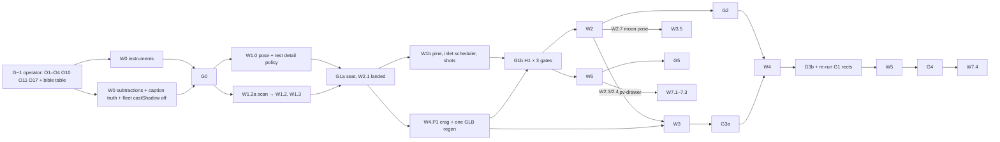

## Verdict

This plan will not produce the leap as written. The diagnosis and the subtraction-first W0 are right. But W1 is the gate everything hangs on, and it is scoped as a solver swap. In this rig, `IsoCamera.zoom` (scaled by viewport height) sets pitch, eye height, detail LOD, fleet thinning, zone buoys, hit thinning, the arrival and URL state. The K1 pose (eye 14–16 u, pitch ≈3°) sits below the rig's 4° pitch floor. Neither measured seat meets K1: A has eye 28.2 u at pitch 7.6°, and B has foot x 0.742. Held at the same physical spot at 1200×640, seat A becomes zoom 0.448: pitch 12°, props shed, fleet thinning on at rest, buoys off. **Biggest risk: G1 passes a prettier frame by quietly dropping data carriers and ships.**

## Findings

### Blocker

**1. W1 has no pose model, and every rest-frame policy is keyed to `zoom`.**
- **Problem:** W1.1 only adds `yaw` to IsoCamera. Pitch, eye height and distance all derive from zoom and viewport height, and so do detail, thinning and buoys.
- **Evidence:**
  - How the pose is built:
    - Pitch is a function of zoom, clamped to 4–12° (`projection.ts:14-27`).
    - Target height is a function of zoom (`:76-81`).
    - Distance is `vpH/(16·zoom·2·tan16°)` (`:89-91`).
    - Yaw is fixed (`:102-110`).
  - I ran the repo's own projection code (`outputs/opus-review/camera/alt-math.ts`):

    | Pose | Eye y | Pitch | Crown | Foot x | Span |
    | --- | --- | --- | --- | --- | --- |
    | Rest today (114 u from tower) | 20.6 u | — | x 0.499 | — | — |
    | Seat A `cam=1136,-326.9,0.7` | 28.2 u | 7.56° | (0.640, 0.129) | 0.636 | 0.423 |
    | Seat B `cam=1404.8,-695.2,0.9` | 22.4 u | 4° | (0.747, 0.154) | **0.742** | 0.466 |

  - The same physical eye and distance at the gate viewports:

    | Seat @ viewport | Zoom | Pitch | Eye y | `overviewLodTargetDetail` | Fleet thinning |
    | --- | --- | --- | --- | --- | --- |
    | A @ 1200×640 | 0.448 | 12.0° | 32.4 u | 0.006 | **on** |
    | A @ 900×720 | 0.504 | 11.0° | — | 0.289 | off (0.004 above threshold) |
    | B @ 1200×640 | 0.576 | 9.8° | — | 0.85 | off |

    All six poses (two seats × three viewports) resolve to semantic view `"overview"`.
  - What `"overview"` switches off at rest:
    - `"explore"` requires zoom ≥ 1.05 (`garden-observatory-slice.ts:512-518`).
    - Ship fine detail and wake detail are explore-only (`world-renderer.ts:4457-4458, 4726-4728, 4813-4814`).
    - Zone buoys are explore-only (`world-renderer.ts:4998-5001`). Buoys exist "so band colour is never the sole cue" (`garden-zones.ts:395-396`).
    - Fleet thinning "is for the approach to whole-map, not for the resting frame" (`garden-fleet-thinning.ts:4-9, 58`).
    - The bible forbids hiding eligible ships at rest and colour as the only carrier (`VISUAL_INVARIANTS.md:8, 36, 47`).
  - Other zoom-keyed or IsoCamera-only code:
    - Hit thinning and sea-sign scale (`garden-observatory-hit-testing.ts:86-91, 203-211`).
    - The arrival interpolates between IsoCameras (`garden-arrival.ts:44-67`).
    - URL `cam` round-trips an IsoCamera only (`use-world-url-state.ts:207-246`, `use-moment-url.ts:86-102`).
    - The eye search stops at tile 144 (`camera.ts:85-86`); both seats sit at y 164–166.
- **Edit:** insert **W1.0 "Pose model and rest detail policy" (camera owner, L)** before W1.1:
  > "ShotSpec pose = {eyeTile, eyeHeight, yaw, pitch, vFOV}. IsoCamera stays the interactive rig, with a defined hand-off: the first wheel or drag eases pitch and height, with no jump. Re-key semantic view, overview LOD, fleet thinning, sea-sign scale and hit thinning to a pose-physical measure, with an explicit `rest` state that keeps explore-level truth carriers (buoys, hero rig) and zero thinning at every gate. Port the arrival, selection-return, tour, URL `cam` and clamp to the pose. Lift `camera.ts:85-86`."

  Add to G1: "at 1600×1000, 1200×640 and 900×720: no ship thinned at rest; buoys visible; K1 eye and pitch met; `npm run test:visual` green." Re-cost W1 as L.

### Major

**2. G1 chooses between seats that fail K1, before the light and landform exist, in a circular order.**
- **Evidence:**
  - Seat numbers are in finding 1.
  - W1.5 plants the pine "at the chosen seat", but the seat is only chosen at G1.
  - The solver's foot and crown come from the C3 constants (`camera.ts:60-65`). pharos-2 changes them: root y 2.55→8.55, height 38→32 (`reviews/pharos.md:212-214`). That lands in W4, after W3.2's reflection plinth and W3.7's wet foot are built on the old island.
  - The G1 criterion "bottom-left ninth ≤ 18 at noon" is measured before W2.1 turns the sun (D: "Light first").
  - The previous review's lesson says the acceptance slice must include island and shore (`agents/pharosville-reborn/02-plan-review.md:5, 29`).
- **Edit:** replace G1 with three steps:
  - **G1a — seat.** Both seats re-expressed as ShotSpecs, K1 rects unit-tested at all three gates, captured with W2.1 already landed. W2.1 moves into W1a.
  - **W1b.** Pine, inlet, selection and arrival shots on the chosen seat, in parallel with W4.P1. Batch pharos-1, pharos-2, pharos-5 and pharos-7 into one GLB regeneration. Fallback if pharos-2 slips: pharos-6.
  - **G1b — acceptance image.** H1 at all three gates.

  Also make ShotSpec rects reference world-fixed points (crown y 40.55, the waterline), not C3 constants. Replace the §9 graph with:

**3. Operator reversals are executed before the operator is asked.**
- **Evidence:**
  - W0.6 is O4, W0.12 is O10, W0.16 is O17, and W1.2 is O1/O2.
  - §5 names G1 as the only operator checkpoint.
  - W0.9 edits the bible, while §8 says the operator reviews bible edits first.
- **Edit:** add **G−1 "Operator decisions"** before W0, covering O1–O4, O10, O11, O17 and the W0.9 table. Any W0 row whose decision is declined moves to its fallback.

**4. The §6 ledger double counts, overstates the CPU gain, and ignores the worst frames.**
- **Evidence:**
  - Hairlines are explore-only (finding 1). The drop at the seats (283→210 and 283→208, HUDs in `alt-b-golden.png` and `threshold-blue.png`) already includes the 84 hairline draws that W0.4 deletes.
  - After W0, moving to the seat costs about **+10–15 draws**. That is why the plan's own G1 threshold (≤ 210) sits above G0's (≤ 195).
  - The real net is ≈ −75 to −85 draws, not −140 to −160. At ~11 µs per draw (`headroom.md:25`) that frees ≈ 0.9 ms, not ~1.5 ms.
  - "No per-frame JS per object" is contradicted by W3.8 (~184 stamps per frame, `water.md:217`) and by W4.F8–F12 (D, B3).
  - The arrival start frame shows **583,494 tris** (`ambient-journey/arrival-noon-frames/00.png`).
  - Any camera move over 0.5 u or 0.5° re-renders the shadow map (`world-renderer.ts:4004-4007`). The fleet is a caster (`garden-fleet-batch.ts:1080`). W1.7 glides, K16 breath (±0.8° yaw and ±1.2 % dolly both exceed the thresholds), W5.8 tours and the W6.1 rise all trigger it. [INFERENCE: this shadow pass is most of the extra ~200k.]
- **Edit:**
  - W1 row: "+10…+15 draws; tris per the W1.0 policy (measure)". Net row: "≈ −75…−85".
  - Add a CPU-ms column, and rows for the arrival start, a selection glide and whole-map. Run `preview --assert` at each gate for those poses.
  - Add **W0.22: fleet `castShadow = false`** (headroom D4). Hulls are already grounded by `createShipShadows` (`garden-ships.ts:2863`).

**5. Most gate criteria need instruments that W0 does not build.**
- **Evidence:**
  - `light/ninths.mjs` only gives 3×3 mean, p10/p90 and "% of pixels > 85", with hard-coded HUD boxes. §1 also needs:
    - face ratio and tower-vs-air contrast;
    - sky hue Δ, land darker than sky, and the night water band;
    - saturated-orange share and high-frequency energy (art-director's own metrics, `art-director.md:14-15`, not in the repo).
  - `--blur-audit` only writes a blurred PNG (`preview.mjs:381-398`); "one calm region" is a judgement, not a metric.
  - `#t=` freezes the hour (`use-world-time-controls.ts:107-111`), and there is no date seam (`season.ts:7`). The H3 "moon-up date", the G4 kō fixtures and the 30-minute ritual watch cannot be reproduced.
  - There is no `--knockout`, `--uncapped` or headed 120 Hz arm (`preview.mjs:47-68`).
  - `validate:changed` runs only `validate` (`validate-changed.mjs:132-146`), never `test:visual`. The hit-target, deep-link and ledger-parity contracts live in `test:visual`.
- **Edit:**
  - W0.3 becomes "picture metrics": class masks (debug ID render or projected polygons), fixed metric definitions, HUD-free capture.
  - **W0.23:** `--clock <ISO>` using `page.clock` (already used at `preview.mjs:737`), plus a dev `d=` hash.
  - **W0.24:** camera-still capture, an inlet overlay, and underway %, turns/min and a director event log read from `__pharosVilleDebug`.
  - Every gate adds `test:visual` (W6 adds `:cross-browser`) and a whole-map `--texture-census`.
  - Label the blur, "not toys" and blind-sort checks explicitly as operator review.

**6. The K8 wake-channel split cannot work as specified.**
- **Evidence:**
  - The render targets are RGBA with no `type`, so they are 8-bit (`garden-wakes.ts:227-236`).
  - One `uDecay` applies to every channel (`:181, 454-455`).
  - The stamp writes R only (`:223`) with additive blending (`:283`).
  - The field clears itself after 14 s idle (`:69, 431-440`).
  - A ~30 s decay is ×0.99942 per frame at 60 Hz, which is 0.15 of one 8-bit step at full value. G cannot decay at all.
  - Stamping every hull into B each frame keeps the field awake and removes that 14 s clear. [INFERENCE: whether it stalls or truncates depends on GPU rounding.]
- **Edit:** W3.8 and W3.9 should specify:
  - HalfFloat ping-pong targets (texture count unchanged).
  - A per-channel `vec4` decay, with B zeroed in the feedback pass.
  - Stamp kind packed into the sign of `aParam.x`.
  - A residue policy for a field that never sleeps.
  - Acceptance: the slick is visible for ≥ 25 s and residue is ≤ 1 % at 60 s, at both 60 and 120 Hz. Cost M.

**7. The "0.016 night-emissive budget" is arithmetic, not a measurement.**
- **Evidence:**
  - The contract says it "does not claim to measure final post-AgX pixels" (`garden-water-contract.ts:85-116`).
  - The test pins the value 0.015715 (`garden-water.test.ts:947-951`).
  - W0.5 deletes the moon band those terms describe, and the glitter is gated by `moonBand` (`garden-water.ts:1172-1199`).
  - So W3.5's "re-derive occupancy" is circular, and G2's "re-measured" has no instrument behind it.
- **Edit:** add **W0.25**, a measured open-night water-luminance probe over the open-water mask. Delete the pin in W0.5. G2 and G3a cite the measured value.

**8. W1.2 (moving two stations) is underestimated and may have no legal destination.**
- **Evidence:**
  - Every mouth must satisfy the rules in `garden-rim.ts:106-122`: water of its declared body, shore distance in (0, 2], rim land within 14 tiles, "no three mouths crowd a 30-tile neighbourhood", and "the southern arc carries three of the eight".
  - The calm body's lobe is authored to reach BSC's mouth at (60,130) (`sea-bodies.ts:172-175`).
  - Also touched: `world-layout.ts:101-131`, the Garden Shore postcard (`garden-attract.ts:27`), `world-layout.test.ts:336-345`, `chain-docks.test.ts:488-490`, `risk-water-placement.test.ts:84-88`, `world-scaffold.test.ts:333-337`.
  - The seat-to-tower sight line crosses the south rim at x ≈ 101–109. Moving BSC 30 tiles east pushes it toward the corridor; 30 tiles west lands on `wreck-shoal-east` (31,125).
  - The 14→24 exclusion lives at `camera.ts:113`, inside the function W1.1 deletes.
- **Edit:** add **W1.2a**, a legal-destination scan (reuse `camera/station-scan.ts`) whose output is attached to O1. Re-cost W1.2 as M–L, and fold the exclusion into the ShotSpec.

**9. Three decisions have no wave row or land in the wrong place.**
- **Evidence:**
  - camera-5 (O14, whole-map chart) appears only in K13 and O14.
  - O15 "rung 2" includes the printmaker-2 keyline (`printmaker.md:81-86`), which has no row. Meanwhile W8.1 cuts the SMAA pass the keyline depends on (K15).
  - O11 (sky-7, "broad re-baseline") lands in W5, after G2 has tuned every beat.
- **Edit:**
  - Add W3.10 camera-5 alongside W3.6, or mark O14 deferred.
  - Add W2.16 printmaker-2 after W2.8, gated on W0.1, and make W8.1 conditional on it. Otherwise change O15 to "rung 1 + night pieces".
  - Decide O11 at G−1: land it before W2, or cut W5.13.

**10. File ownership does not cover the real hotspots.**
- **Evidence:**
  - `garden-island.ts` has two parallel W4 writers: pharos (W4.P1, P4, P5) and garden (island niwaki `:1329-1404`, the court).
  - `garden-day-cycle.ts` belongs to light but is edited by W4.F4/F7, W4.P3 and W5.4, when no light owner is active.
  - W2.4 (air) and W2.12 (shade plate) both patch every material: 41 `onBeforeCompile` sites across 12 files, plus 3 `fog_fragment` replacers. No one owns that chain.
  - `world-renderer.ts` is 5,149 lines and is touched by at least 14 plan items, including four parallel W4 owners.
  - W3 runs on its own branch but consumes W2's uniforms.
- **Edit (§9):**
  - The sky lane owns the shared shader-patch chain (the `garden-height-fog.ts` injector); W2.12, W4.F4 and light-5 go through it.
  - In W4, `garden-island.ts` is edited pharos first, then garden.
  - Name a light delegate for `garden-day-cycle.ts` in W4 and W5.
  - Before W1, extract world-renderer's ship loop, shadow rig and semantic-view block into owner modules, with no behaviour change.
  - Use per-lane branches merged by the wave integrator.

### Minor

**11. Pine generator in W1.4.** `createSpeciesGeometry("pine")` feeds all 120 instanced pines and the bough (`garden-flora.ts:66, 133`; `garden-rim-mesh.ts:955`). Swapping it in W1 adds garden-2's +35k tris before the W4.G1 count cut. **Edit:** use a hero-only species in W1.4 and do the global swap in W4.G1.

**12. W1.8 is wasted work.** It aligns cones that W2.5 replaces. **Edit:** fold it into W2.5.

**13. Flag envelope is hard-coded.** `camera.ts:71-77` fixes tip height 26 and reach ±6. **Edit:** export the envelope from the flag module, and re-run the G1 rect tests at G3b after W4.H1 and W4.H2.

**14. Moon arc exceeds the narrow gate.** The ±23° moon arc is wider than the 900×720 half-width of 19.7° (tan 16° × 1.25), so H3 fails at that gate. **Edit:** clamp the arc to ±16°.

**15. W0 rows that are not independent:**
- W0.8's `--draw-census` cannot attribute pixels, and both culprits are deleted anyway; drop the attribution step.
- W0.16 changes the meaning of a data cue (`visual-cue-registry.ts:171-180`). The same PR must update `visual`, `questionAnswered`, the detail row and the ledger clause.
- W0.12 must hit-test the breathed pose (K16).
- W0.10 (reed re-seat) and W0.20 (chrome-corner keepout) are relative to the seat, so they need re-verification after G1b and G5.
- W0.21 can only be proven in a headed 120 Hz run.

**16. W7 (sound) is not independent.** sound-1 reads zoom and the beacon pass, both changed in W1 and W2.11. W7.1 needs W6.6's `.pv-drawer`, W7.4 needs W5, and W7.6 needs W1.7.

**17. G4 contradicts K21.** The gate asks for "≥ 3 gifts ≥ 6 min apart" in a 30-minute watch; K21 allows "≤ 6 gifts per 24 h, ≥ 8 min apart". **Edit:** name the watch window, what counts as a gift, and use a running clock.

**18. Schedulers are split across waves.** W4.F9 schedules into the quiet windows of W5.1's director. **Edit:** make W1.6's crossing token and W4.F11's tide windows a single scheduler (C27).

**19. Test policy and churn.** The "delete, don't re-pin" rule comes from the harness, not `TESTING.md`. The churn is large: 79 shader-source `toContain` asserts, 43 of them in `garden-water.test.ts`, and `world-renderer.test.ts:1091-1120` pins zoom semantics. **Edit:** state that these are deleted in the wave that touches the code, not re-pinned.

## Missing

- **A false caption, live today.** `supplyTrend` says "increased" when issuance is flat or missing, and it is announced via `setAnnouncement` (`pharosville-world.tsx:577`; fleet-motion D6, fleet-motion-5). The plan only reaches it in W5.5. Move the copy fix to W0; it is small.
- **headroom D4** (fleet off the static shadow map): add as W0.22 (finding 4).
- **A rest detail policy.** No lane proposed one; add it as W1.0 (finding 1).
- **Camera-still capture mode** (`fleet-motion.md:321`) and a clock/date seam: W0.
- **camera-5** belongs in W3 with W3.6; **printmaker-2** in W2 after W2.8.
- **One GLB regeneration** batching pharos-1, 2, 5 and 7, in W1b or W2.
- **A rest-frame risk-legibility criterion.** G3a only measures calm↔danger ΔL* at whole-map, but the rest frame currently loses its buoys.

## Cut or demote

- W1.8: fold into W2.5.
- W5.13 (O11): remove from this plan unless it is decided at G−1.
- W2.15 (impact 3/3): after G2.
- W4.F10 heel and W4.F12 leeway (per-object JS at 120 Hz): after W0.1's CPU numbers.
- W5.12, W5.14, W7.5, W7.6: post-G4 backlog.
- W8.2's reflection proxy: after W4.P1, so it proxies the final keep.
- W6.12: merge into one idle-depth signal with K16, W0.21 and the existing 180 s / 33 ms idle (`render-scheduler.ts:16, 28`) rather than adding a fifth idle clock.

## Five edits

1. Add **W1.0, the pose model and rest detail policy**, and the G1 truth checks: no thinning, buoys visible, K1 eye and pitch at all three gates, `test:visual` green.
2. Add **G−1 operator decisions**, split G1 into **G1a / W1b / G1b**, pull W2.1 and W4.P1 forward, and adopt the corrected §9 graph.
3. Build the **W0 instruments** (picture metrics with masks, clock seam, camera-still mode, motion stats and event log, measured water emissive) and run `test:visual` at every gate.
4. **Rewrite §6** with post-W0 measured deltas, a CPU column and worst-pose triangle gates, and add **W0.22: fleet `castShadow` off**.
5. Run the **W1.2a station feasibility scan** and attach its result to O1 before any W1 work starts. Fall back to the yaw path if no legal slots exist.