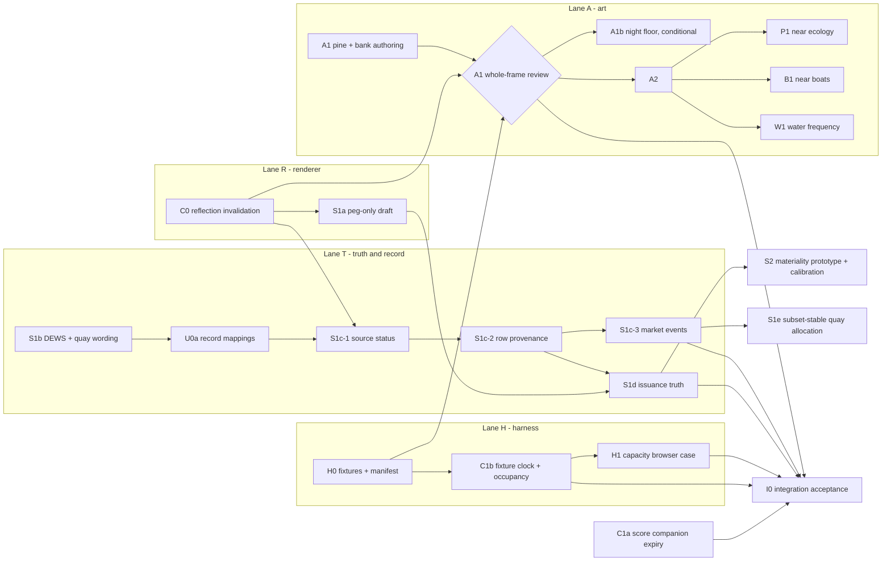

# PharosVille visual upgrade — verified implementation plan

Date: 2026-10-02 · Base: `main` @ `599c822` (v0.19.0 Hour Print) · Status: **ready to execute** — every operator decision in §4 has a default, so lanes can start now.

Source packet: the "Pharosville visual upgrade handoff" PDF (9 pp.) and its implementation companion (`README.md` + `data-contract-scenarios.ts`, copied unmodified to `companion/`). The packet author could not build or run PharosVille; this plan is the packet after verification against the real code, a real-GPU baseline, and two independent model passes.

How this plan was produced:

- 9 slice verifications (C0, U0, A1/A1b, draft/issuance/S2, evidence, clocks/C1, gates/fixtures, A2 + extension ladder, score/quay) — each ruled every packet claim with `path:line` evidence and runnable probes. Reports: `evidence/<slice>-report.md`.
- 9 independent audits re-ran every probe and re-derived every verdict (all rated **high trust**, 0 overturned verdicts, a short must-fix list each, folded into this plan). Audits: `evidence/<slice>-audit.md`.
- Orchestrator gates on unchanged `599c822`: typecheck, lint, build, bundle size, full Vitest, companion module install/typecheck/lint/validate, and the real-GPU preview lane on the operator's Apple M5 Pro (§2).
- 3 adversarial reviews of this plan: design/sequencing, executability against the repo, and transcription fidelity (every §1/§2 number re-derived; 33/35 audit must-fixes confirmed folded in, the remaining 2 since added). Their blockers and majors are applied: shell-array capture commands, the H0-only archived original, GPU arms served from the tree under test, the localhost-only capacity seam, the consort's own DEWS score, the effective-tempo motion signature, harbor-log observation time, and the in-session resize harness. Reviews: `evidence/plan-review-*.md`.

Authority: **this plan > audits > slice reports > packet.** The reports keep the long-form evidence and the exhaustive tables (e.g. the U0 fact-routing appendix); where an audit corrects a report, the audit wins; where this plan states something different, this plan wins. All `path:line` references are at `599c822`; if `main` has moved, run `git log --oneline 599c822..main -- <files>` for the packet's files before starting it.

---

## 1. Verdict on the packet

**The direction holds.** Keep Three.js/WebGL; improve the craft of the existing seated view instead of adding features; prove the method on the threshold pine and bank with signals frozen before spreading it; run truth repairs in parallel as small revertible packets; judge appearance and performance only on the real-GPU lane. Every gate number it quotes is correct, and the main defects it diagnoses are real: the stale static reflection, values lost between model and panel, issuance draft competing with peg trim, unlabeled quay estimates, false all-current certification, and frozen fixture clocks.

**Where it is wrong or imprecise** (each is corrected in the packet specs below):

| # | Packet claim | Verdict | What is actually true |
|---|---|---|---|
| W1 | "final placement ignores riskDepth" | **Wrong** | 108/132 dense ships change final tile as DEWS depth sweeps 0.05→0.95 (940 fleet tile changes). The response is real but **not monotone**, not even reliably for the first-placed ship in a water: `usde-ethena`, first in safe-harbor, still takes one backward step because the preferred-tile snap is not strictly ordered; `dai-makerdao` never moves; `usds-sky` moves only at 100. Retire the calm-edge/rough-edge wording because the order is unreliable, not because the score is ignored. The exact DEWS score is **currently dropped from the DetailPanel** (`Within-zone anchoring` is not in `DETAIL_FACT_LABELS`, `src/lib/format-detail.ts`), and on a consort `riskDepth` is the **flagship's** depth (`ship-placement.ts:419-422`), so "keep exact DEWS inspect-only" means adding the coin's own score and registering it (S1b), not just deleting the clause. |
| W2 | "Keep the three pad anchors" | Imprecise | **Six** visible anchors: three landscape pads (`garden-threshold.ts:577-581`) and three tall-window companion pads (`:601-605`). Metadata order (`pine.pads` by y, `heroLimbPadCentres` by z) is not authored order. |
| W3 | "threshold-only night-floor parameter" | Imprecise | The "floor" is a **shared outgoing-light attenuation** `mix(1.0, 0.055, uNightValue)` in `src/three/garden-flora.ts:111-123`, used by threshold land and pines and all flora. It is a ratio, not a luminance floor. A1b therefore needs a guarded opt-in seam in the shared flora owner. |
| W4 | "isolate [headland] profile from shared Danger stone" | Imprecise | Headland and Danger rock face have **separate materials**; they share the finish *function*, its patch key and the `CRAG_ROCK_LOW/HIGH` ramp constants. The second consumer is only `island-danger-rock-face` (8 instances / 640 triangles). |
| W5 | "No new preview flag is available"; add a flowing-Date clock | Partly wrong | `--clock <ISO>` **already flows Date** (`preview.mjs:2014`), but only for live data (`:361` skips it under `--fixture`, where it pins only `d=`). `--hash '#'` already bypasses the fixture's automatic `#t=12` (`:274`). Fixture Date is fixed at epoch + 60 s (`preview-fixture.mjs:2,18-24`). |
| W6 | Companion `installFlowingFixtureDate` | Unusable as shipped | It is sound in isolation but throws `ReferenceError: __name is not defined` when tsx-compiled and serialized into the page by `addInitScript`. Move the existing self-contained `.mjs` installer instead (C1b); delete the TS helper on install (H0). |
| W7 | Do not erase material flow "into a 10% balanced deadband" | No such deadband | ±10 is the pressure-shift stability band (`shared/lib/mint-burn-signals.ts`), not net direction. Ships keep exact sign. Quays flatten allocated net below $1 only. |
| W8 | Intensity-zero route pace as neutral | Imprecise | Signed-v2 intensity 0 gives pace **0.85 ("Languid")**; only missing intensity gives 1.0 ("Unmeasured"). |
| W9 | "existing whole-frame p90 and worst-window p95 ≤20 ms" as one reference gate | Two lanes merged | p95 worst-window and tier `full` are enforced only by `preview --assert` (12 s sweep). `npm run test:perf:reference` gates 60 s p90, startup ≤2,500 ms and long tasks, never p95 or tier. Keep both. |
| W10 | "new real-browser over-capacity case" | Does not exist, cannot be built from data | The curated registry tops out at 205 active coins (live fleet 187); `buildShipsStage` maps 1:1 over active assets. A real-browser 320+1 case needs a localhost-only ship-limit seam (H1). |
| W11 | "seven-source registry" to be created | Already exists | `shared/lib/pharosville-endpoint-registry.ts` (7 keys). But the ledger (`accessibility-ledger.tsx:597-605`) and the route refresh summary (`src/pharosville-world.tsx:1399-1406`) each hard-code **six** and omit mint/burn; the lamp and caption list seven. Reuse the registry everywhere. |
| W12 | Preflight = one `--assert` arm | Incomplete | The deploy gate runs the animated **and** the settled `--reduced` arm (`validate-deploy-gate.mjs`); a one-arm preflight skips the static budget. |
| W13 | Static mode has "zero continuous RAF" | Needs care | True for self-chaining RAF, but the route calls `useWorldTimeControls` without `reducedMotion` (`src/pharosville-world.tsx:195-199`), so a Date tick still requests a paint every visible second (`use-world-time-controls.ts:43-57`), and with a live hour `wallClockHour` is precise to the millisecond (`:108-112`). The day-cycle lights change **continuously** with it (`updateDayCycle`, `garden-day-cycle.ts:372-424`, including `gardenDayDrift`, `garden-aerial.ts:454-457`), so in static mode the lighting genuinely changes up to once a second. C0 must recapture on every real light change; whether static mode should keep a live clock is D22. |
| W14 | Companion: `$11,615,145,600` unattributed | Correct after normalization only | The stock dense response has a **$11,237,782,400** discrepancy with `unattributedTotalUsd: 0`; scaling the seven 102% rows down adds $377,363,200. |
| W15 | Agents can run the GPU preflight as written | Blocked in agent shells | Agent shells here export `CI=true`; `preview.mjs:2097` then **SKIPs every `--assert` run (exit 78)**. On the operator's machine prefix GPU commands with `env -u CI` (§3). The SwiftShader refusal still applies. |

**What the packet missed** (now in scope, all verified):

- **Recurring risk transitions are swallowed.** `use-harbor-log.ts:41` keeps a session-wide `ship:from->to` set, so Calm→Watch→Calm→Watch logs 2 entries with only one Calm→Watch, not 3 with two (S1c-3).
- **Outages narrate recovery.** Fresh DANGER → same sample stale moves the ship to Calm Anchorage and logs "USDC left Danger Strait for Calm Anchorage" (`risk-placement.ts`, `motion-planning.ts:729-739`, `use-harbor-log.ts:49-63`) (S1c-3).
- **Unknown or missing DEWS certifies calm.** The resolver falls through to fresh "No active peg or DEWS stress" (`risk-placement.ts:72-82,98-115`) (S1c-2).
- **Old row under a fresh envelope stays "fresh"** (stress `computedAt` T−86,400 with fresh meta → current DANGER, all-current ledger) (S1c-2).
- **Retained failure is invisible**: `isError` is discarded, so a failed poll with fresh-looking meta stays current (S1c-1).
- **Anniversary companions catch up** after a two-hour hidden pause: a lantern starts 7,140 s late (`garden-score.ts:581-584,631-635`) (C1a).
- **The stats watch double-counts rituals** (admission row + zero-duration ritual-start row) and reports admission gaps as "quiet" (a 9 s ritual in a 10 s watch reads 9.5 s quiet); the tail sweep and stats watch run one after the other, not over the same interval (C1b).
- **Quay subset renormalization inflates figures**: removing one rendered harbour raised Ethereum's allocated mint from 666,667 to 850,000 (+27.5%) with no wording change (S1b discloses it; a fix is D9b).
- **Issuance provenance would churn the motion epoch**: `world-render-content-signature.ts:52-53` serializes the whole `ship.issuance`, and that signature resets motion and the RAF binding (`use-world-render-loop.ts:500-524,1269`) (S1d).
- **The harness test never runs**: `scripts/pharosville/preview-fixture.test.mjs` passes 3/3 under `node --test`, but no script, hook or CI job invokes it (H0).
- **The stock dense fixture confounds art baselines**: `globalChange7dPct: 1.8` is a fraction read as +180% and clamps the supply tide to full flood; its PSI band `ELEVATED` is unsupported (dropped as no severity); its chains response is internally inconsistent. A quiet representative preset is a prerequisite for the art A/B (H0).
- **Value loss is wider than ships**: the lighthouse panel drops Harbor light, Market stability, snapshot and the 30-day garden record; docks drop rank, share, HHI and quay condition; the pigeonnier record drops every fact; named waters drop their surface. The owner is `src/lib/format-detail.ts`, not the JSX (U0a).
- **Budgets with no headroom**: whole-map framing already uses 72/72 textures (`TESTING.md:471`); CSS gzip has **218 B** spare; JS gzip has 5,550 B; threshold construction has 212 triangles spare.

---

## 2. Measured baseline (`599c822`, 2026-10-02)

Software gates (orchestrator, unchanged tree): `npm run typecheck` ✓ · `npm run lint` ✓ · `npm run build` ✓ · full Vitest **2,095 passed / 2 skipped, 195 files** · `npm run check:bundle-size` ✓ — JS gzip **957.6 KiB** (980,562 B of 986,112 B cap, 5,550 B spare); entry CSS gzip **7.8 KiB** (7,974 B of 8,192 B, 218 B spare). The companion module installed at `src/__fixtures__/data-contract-scenarios.ts` passed `tsc --noEmit`, `eslint --max-warnings=0` and its own validation (21 scenario shapes; `denseQuietArt` 132 ships, 10 chains, global $75,303,140,000), and was then removed again. It is **not** in the tree.

Real-GPU lane: `env -u CI npm run preview …`, Chrome, ANGLE Metal on Apple M5 Pro, headless, 1600×1000 @1x, vsync 60 Hz, dev server `127.0.0.1:5173`. Captures are in `outputs/baseline-2026-10-02/` (scratch, untracked).

| Arm | Verdict | Tier | p90 / worst-window p95 | Recurring calls | Triangles | Geometries | Textures | Ships |
|---|---|---|---|---|---|---|---|---|
| `--fixture calm --assert` | PASS | full | 16.7 / 16.8 ms | 145 | 296,239 | 160 | 50 | 2 |
| `--fixture calm --reduced --assert` | PASS (settled) | full | n/a (static) | 131 | 232,939 | 160 | 50 | 2 |
| `--fixture dense --assert --draw-census --texture-census` | PASS | full | 16.7 / 16.8 ms | 173 | 357,753 | 176 | 50 | 132 (131/131 logos) |
| `--fixture dense --clock 2026-09-26 --hash '#t=12.25' --still-camera --reduced --clean --metrics --value-plan noon --blur-audit` | settled | full | n/a | 156 | 286,999 | 174 | 50 | 132 |
| same, `--hash '#t=22' --value-plan night` | settled | full | n/a | 156 | 286,458 | 174 | 50 | 132 |

Value-plan ninths (mean L*, measured / design-bible target; stock dense, so the sky is confounded by the unsupported `ELEVATED` PSI band):

| | Day, noon column (MAE 9.0, r 0.86) | Night column (MAE 3.3, r 0.76) |
|---|---|---|
| Top row | 47.7/60 · 57.1/72 · 56.7/68 | 13.0/9 · 13.8/14 · 15.4/11 |
| Middle row | 41.3/27 · 39.5/45 · 44.6/42 | 9.5/5 · 9.3/12 · 10.1/8 |
| **Bottom row (threshold)** | 14.5/15 · **19.2/38** · 23.6/23 | **0.8/3 · 0.6/7 · 1.0/4** |

Orchestrator reading of those two real-GPU frames (confirm on `quiet-dense` after H0): by day the bank reads as one broad, evenly lit green band over a dark foreground strip, with no internal plane hierarchy; the hero pine at upper left reads as three dark domed caps on a forked limb (the packet's blunt-cap diagnosis is visible). At night the whole bottom third falls below L* 1, so the deck edge, bank boundary and stepping stones cannot be separated; only the stone lantern's window reads. The bottom-middle ninth misses the bible by 19 L* (day) and 6 L* (night). That is the measurable target region for A1, and evidence that A1b may be needed. Numbers guide the authoring; they never approve it (§7.2).

---

## 3. Executor ground rules

1. **Start-up** (each lane, each session): `git status --short`, `npm run onboard:agent`. Read `AGENTS.md` and the routed docs for the packet.
2. **Branches and worktrees.** Create the integration branch `feat/visual-upgrade` from `main` once. Each lane works in its own worktree and branch off the integration branch: `npm run worktree:new -- vu-<lane> --branch feat/vu-<lane> --install` (lands in `.worktrees/vu-<lane>`). A packet is one or more focused commits that can be reverted on their own. Merge a lane branch into `feat/visual-upgrade` only after its packet gate passes (§8), then rebase the other lanes. **No push, PR merge, tag, release or deploy without separate operator authority** (`docs/pharosville/RELEASES.md`).
3. **GPU commands** run on the operator's machine with real hardware, prefixed `env -u CI` (W15), serially, never two previews at once. **Every GPU arm runs against a dev server started from the tree under test**: the lane worktree for a packet gate, the integration checkout after a merge, the A/B worktrees for §7.2 (`npm run dev -- --host 127.0.0.1 --port <port>` inside that tree; one port per worktree; `--url http://localhost:<port>`). Never reuse a running `5173` without confirming which tree serves it; the manifest's `capture.commit` records the preview script's checkout, not the served tree. Exit 0 = measured pass, 1 = measured failure (diagnose; never lower a tier or a threshold), 78 = not measured (never report it as a pass). `PHAROSVILLE_DEPLOY_GATE: PASS_PERF_SKIPPED` is not a GPU pass.
   Commands in §6–§8 write `--url http://localhost:5173` for brevity; always substitute the port of the tree under test.
4. **Never judge looks or frame time through Playwright/SwiftShader.** Playwright lanes (`test:visual*`) are DOM/telemetry assertions only.
5. **Evidence** goes under `outputs/vu/<packet>/` (pass `--out vu/<packet>/<name>.png --json vu/<packet>/<name>.json`; preview resolves both under `outputs/` and silently overwrites, so use unique names). Plans stay in `agents/`.
6. **Implementation subagents edit only.** The lane owner runs the gates once per packet (§8) over the union of changed files; no formatter runs in parallel.
7. **Docs.** Update `docs/pharosville/CONTRACTS.md`, `TESTING.md` or `VISUAL_INVARIANTS.md` in the same packet whose behavior they describe. Do **not** edit `CHANGELOG.md` or `src/content/pharosville-changelog.ts`; the release branch collects them (`RELEASES.md`). A bundle-cap change would require `npm run docs:runtime-facts` (no packet here is allowed to raise a cap).
8. **Tests.** Behavioral oracles only: no wording pins, source-text or shader-string assertions, or mock echoes. Delete tests that pin superseded behavior (listed per packet) rather than re-pinning them. Build test worlds from real fixtures: `buildPharosVilleWorld` (`src/systems/pharosville-world.ts`) over `makePharosVilleWorldInput(…)` (`src/__fixtures__/pharosville-world.ts`), `WorldBuilder` (`src/__fixtures__/world-builder.ts`), or the companion `SCENARIOS` deep-cloned; never hand-made fact arrays. `src/test-setup.ts` resets held placement before each test; sticky-placement tests must pass a **fresh inputs object** per rebuild (`buildShipsCached` is identity-keyed).
9. **Where to run gates.** Run gates in the lane worktree or the integration checkout. D0's first commit on `feat/visual-upgrade` commits the operator's deletion of the old `agents/` plans together with the 6 doc-link fixes, so `npm run check:doc-paths-and-scripts` is green from then on. The companion `.ts` inside this plan folder passes `eslint` in place; `tsc` does not include `agents/`.

---

## 4. Operator decisions (settled 2026-10-03)

Execution: the orchestrator runs the **full plan autonomously** with Sol 6.1 agents (medium/high effort). Git: agents make local commits and merges on `feat/*` branches only. Shipping: implement everything locally on `feat/visual-upgrade`, pass I0, **then ship** through the normal release path (`docs/pharosville/RELEASES.md`: release branch, PR, green `main` deploy, workflow-published tag; never a manual tag). The reference GPU is this **Apple M5 Pro**. The blind A/B art reviewer and the I0 reading reviewer is the **operator alone**; A1R, A1b/A2/P1/B1/W1 acceptance and I0's reading review stop for the operator.

| ID | Decision | Settled | Packet |
|---|---|---|---|
| D0 | Dangling doc references to the deleted `agents/` plans | **Commit the deletion** with a `docs:` change repointing the 6 references (art-direction routing in `AGENT_ONBOARDING.md` → `VISUAL_INVARIANTS.md` + this plan; historical links dropped or cited as `git show 599c822:<path>`). First commits on `feat/visual-upgrade`. | setup |
| D1 | Fixture source | Install the companion at `src/__fixtures__/data-contract-scenarios.ts` (minus the TS Date helper); new `--fixture` presets route from it. | H0 |
| D2 | Preview CLI surface | New `--fixture` values `quiet-dense`, `mixed-capacity`, `quiet-normal`; `--fixture-clock fixed\|flowing` (default `fixed`); `--ship-limit N`. No other flags. | H0, C1b, H1 |
| D3 | Retained failure with fresh-looking meta | **Held immediately** ("held (as of …)" with the error reason); a new error-free sample restores current. | S1c-1 |
| D4 | Coverage and all-current wording | Never certify complete/current when any coverage is partial or unknown; "all endpoints current; coverage qualified" is allowed. | S1c-1 |
| D5 | Timestamps with no genuine observation field | `observedAt = null`, shown as unknown; a separately labeled `publishedAt` / source as-of. Never `priceSyncedAt`, receipt time, `world.generatedAt` or `largestEvent24h.timestamp`. | S1c-2 |
| D6 | Risk geography during outages | **Today's default berth, conspicuously caveated**; no recovery narration. Retained historical geography is not built. | S1c-2/3 |
| D7 | Age cut-offs | Reuse `status-thresholds.ts` ratios (fresh ≤8×, degraded ≤12×). | S1c-1 |
| D8 | Within-water spatial score | **Retire the claim**; the coin's own exact `DEWS n/100` in the Currently line. No monotone redesign. | S1b |
| D9 | Quay figure label | **Prefix the value**; keep the row label `Net flow 24h`. | S1b |
| D9b | Quay allocation denominator | **Build after S1c**: subset-stable denominator over the payload scope; coins whose presence is entirely outside the rendered harbours count as unattributed, with the reason in the record. New packet S1e. | S1e |
| D10 | Record density | ≤3 first-screen figures; ship ≤11 core rows, lighthouse ≤12, dock 6, pigeonnier 2, grave 3; no hidden facts, no raw fallback. | U0a |
| D11 | Consort's own acute distress | Inside the record, leading the Formation row; ship-local ledger line too; no first-screen warning. | U0a |
| D12 | Harbor light | Observed source status plus "appearance eases over ~2 observations"; no painted-state plumbing. | U0a |
| D13 | Issuance presentation and materiality | S1d ships categorical state + exact gross/net + window/coverage/as-of; balanced-active = one aboard + one ashore lighter. **S2 materiality is prototyped** behind named, uncalibrated constants and calibrated on the authorized live snapshot and the GPU lane before acceptance. | S1d, S2 |
| D14 | Intensity semantics for route pace | **Neutral "Unmeasured"** for anything but current, full-window `signed-v2`; raw reading kept in the record. Own commit. | S1d |
| D15 | Largest-event lift | **Static lift**, never replayed; exact amount and time in the record. | S1d |
| D16 | Crown envelope | **Inward only**; all six pad centres and halfSizes fixed. | A1 |
| D17 | Tall companion in A1 | **Included**, with its own restrained profiles. | A1 |
| D18 | Bank planes | **Colour-only first**; bounded interior geometry only if the colour candidate is rejected. | A1 |
| D19 | A1b night floor | **Only if A1's night review fails**; no coefficient pre-approved. | A1b |
| D20 | A2 scope | **Headland and Danger rock face together** (one shared finish change; see A2). | A2 |
| D21 | DPR change without a CSS resize | Not needed now. | — |
| D22 | Reduced-motion lighting clock | **Live clock; the reflection follows** every real light change (up to 1 Hz in static mode with a live hour). Measure the cost on the GPU lane. | C0 |
| D23 | Capacity seam | **Build it**: honor `window.__pharosVilleTestShipLimit` only when `isVisualDebugAllowed()` is true **and** the hostname is `localhost` or `127.0.0.1`; clamp 1…320; browser case with the dense fixture limited to 131. | H1 |
| D24 | Live data | **Authorized**: the local API key (`.env.local`, server side through the dev proxy) for the 30-minute natural-motion watch and one full-fleet snapshot for I0 and S2 calibration, stored untracked under `outputs/`. | C1b, S2, I0 |
| D25 | Urgent market lane (`kind === "market" && priority >= 100`) | Unchanged and unused; no refresh or issuance path may call it. | S1d, S2 |
| D26 | Squad escape | Out of scope; formation policy stays. | U0a |
| D27 | Value plan target | **The design bible's value table remains the target**; numbers guide the authoring, the operator's whole-frame review approves. | A1, A2, P1 |
| D28 | Extensions after A1R | **P1, B1 and W1 are all in scope**, each gated on A1R and its own operator review; W1 still only if the A1 evidence shows a water-frequency problem. | P1, B1, W1 |

---

## 5. Packet map, lanes and waves



| Wave | Runs in parallel | Entry condition |
|---|---|---|
| 1 | **H0**, **C0**, **S1b**, **A1** (authoring + unit gates), **C1a** | none. Source files are disjoint; H0 and C0 both touch different sections of `TESTING.md` (rebase the second) |
| 2 | **C1b** (after H0), **S1a** (after C0, rebase over S1b), **U0a** (after S1b), **A1 review** (H0 + C0 merged) | wave-1 merges |
| 3 | **S1c-1** (after U0a; C0/S1a merged because it edits world-renderer fog inputs), **H1** (after C1b), **A1b** and/or **A2** per the A1R verdict (when both are needed, A2 moves to wave 4 beside S1c-2; their files are disjoint) | |
| 4 | **S1c-2** | S1c-1 |
| 5 | **S1c-3** ∥ **S1d** (S1d also needs S1a) | S1c-2 |
| 6 | **S1e** ∥ **S2** (after S1d) ∥ **P1** / **B1** / **W1** (each after A1R; W1 only if A1 evidence shows a water problem) | S1c-3, S1d, A1R |
| 7 | **I0** integration acceptance, then ship (§4) | all above accepted |

File ownership (a file is edited by one lane at a time; ✱ = hunk-level overlap, so rebase on merge):

| File | Packets (in order) |
|---|---|
| `scripts/pharosville/preview.mjs`, `preview-fixture.mjs` (+tests), `preview-manifest.mjs` | H0 → C1b → H1 |
| `src/hooks/use-world-render-loop.ts` | H0 (debug seam only) |
| `src/three/garden-hero-reflection-pass.ts` | C0 |
| `src/three/world-renderer.ts` | C0 (reflection, lighthouse ready, context restore) → S1a (draft maps) → S1c-1 ✱ (fog inputs) → S1d ✱ (tender/cargo keys) |
| `src/three/renderer-ship-frame.ts`, `src/three/garden-ships.ts` | S1a |
| `src/systems/ship-issuance.ts` | S1a → S1d |
| `src/lib/format-detail.ts`, `src/components/detail-panel.tsx` | S1b → U0a → S1c-2 ✱ → S1d ✱ |
| `src/components/accessibility-ledger.tsx`, `src/systems/detail-model.ts` | S1b → U0a → S1c-1 → S1c-2 → S1d ✱ |
| `src/systems/visual-cue-registry.ts` (+test) | S1b → S1a ✱ → U0a → S1c-1 ✱ → S1d ✱ |
| `src/systems/world-types.ts` | S1b (`ShipNode.dewsScore`, doc comments) → S1c-1 → S1c-2 → S1d ✱ |
| `src/systems/pharosville-world/stages/ship-placement.ts` | S1b (own `dewsScore`, comments, tests) → S1c-2 → S1d ✱ |
| `src/pharosville-world.tsx` | C1b (forced-crossing debug row) ✱ → S1c-1 → S1c-3 |
| `src/hooks/use-harbor-log.ts` | S1c-3 |
| `src/systems/motion-planning.ts` | S1c-3 (market-transition hunks) → S1d ✱ (effective-tempo signature hunk, landed/rebased after S1c-3 merges) |
| `src/systems/garden-score.ts` | C1a |
| `src/three/garden-threshold.ts` | A1 → A1b |
| `src/three/garden-flora.ts` | A1b (→ P1 later) |
| `src/three/garden-crag-finish.ts`, `src/three/garden-island.ts` | A2 (headland + Danger rock face) → P1 |
| `src/systems/pharosville-world/stages/cargo-tide.ts` (+test) | S1d ✱ → S1e |
| `docs/pharosville/TESTING.md` | H0 ✱ C0 (wave 1, separate sections) → C1b → H1 |
| `docs/pharosville/CONTRACTS.md` | S1a → S1c-1 → S1d |
| `docs/pharosville/VISUAL_INVARIANTS.md` | A1 (after acceptance) → A1b/A2 (after their acceptance) |

---

## 6. Packet specifications

Each spec is self-contained. "Verified" lines are facts at `599c822`; reports in `evidence/` hold the full citations.

### H0 — Fixture presets, companion install, capture manifest (Lane H, wave 1)

**Goal.** Make the quiet representative art baseline and the counterfactual fixtures runnable through the existing real-GPU lane, and record the full identity of every capture.

**Verified.** `--fixture` accepts only `dense|calm|stress` (`preview.mjs:157`). `installPreviewFixture` (`preview-fixture.mjs:13-37`) loads TS fixtures via `tsxRequire`, fixes Date at `fixtureGeneratedAt + 60_000` through `addInitScript(installFixedDate, …)`, and routes payloads with `mockPharosVillePayloads` (`tests/helpers/pharosville-debug.ts:207-241`, one `page.route` per endpoint, `JSON.stringify({...payload,_meta})`). `--out`/`--json` resolve under `outputs/` and overwrite silently (`preview.mjs:300-301,683`). The `--json` output lacks build SHA/dirty state, payload hash, admitted IDs, source epoch, IANA timezone, screen, effective DPR, reduced flag, WebGL vendor, browser version, selected ID and output names. Fixtures never enter the bundle (nothing outside tests imports `src/__fixtures__/**`) but are typechecked.

**Files.** `src/__fixtures__/data-contract-scenarios.ts` (new), `scripts/pharosville/preview-fixture.mjs`, `scripts/pharosville/preview-fixture.test.mjs`, `scripts/pharosville/preview-manifest.mjs` (new), `scripts/pharosville/preview-manifest.test.mjs` (new), `scripts/pharosville/preview.mjs`, `src/hooks/use-world-render-loop.ts` (debug seam only), `package.json` (`test:guard-scripts`), `docs/pharosville/TESTING.md`.

**Steps.**
1. Copy `agents/2026-10-02-visual-upgrade/companion/data-contract-scenarios.ts` to `src/__fixtures__/data-contract-scenarios.ts`. Delete `installFlowingFixtureDate` (W6) and replace the "Intended location" header line with a one-line purpose. Keep every other export unchanged. Check: `node --import tsx --input-type=module -e 'import { validateFixturePayloads, validateSyntheticBookkeeping } from "./src/__fixtures__/data-contract-scenarios.ts"; validateFixturePayloads(); validateSyntheticBookkeeping(); console.log("ok")'`.
2. `preview-fixture.mjs`: export `PREVIEW_FIXTURES = ["calm", "dense", "stress", "quiet-dense", "mixed-capacity", "quiet-normal"]`. For the three new names, `tsxRequire` the companion module and call `denseQuietArtInput()` / `denseMixedCapacityInput()` / `quietNormalInput()`. Map `PHAROSVILLE_API_ENDPOINT_KEYS` (`shared/types/pharosville-endpoint-keys.ts`) to payloads and **throw if any key is missing** (a silent `undefined` route renders a mock world). Use `input.generatedAt` for the epoch (T = 1,700,000,000 s, as in stock), then the unchanged `_meta` / fixed-Date / `mockPharosVillePayloads` path. Return `{ name, sourceEpochMs, payloadHash }`. `calm`, `dense` and `stress` stay byte-identical.
3. `preview.mjs:157`: validate with `PREVIEW_FIXTURES.includes(fixture)`; the error lists the values.
4. New `preview-manifest.mjs` (pure, sibling of `preview-metrics.mjs`): `hashFixturePayloads(payloads, sourceEpochMs)` = sha256 of key-sorted JSON of `{sourceEpochMs, payloads}`; `buildCaptureManifest(input)` never throws on an optional field and emits `null` plus a reason in `unavailable[]`; and `phaseForHour(hour, date)` (**required**; §7.2 reads the phase from the manifest), which needs two `tsxRequire` calls: `dayCycleBeats` from `src/systems/day-cycle-beats.ts:71` and `gardenSkyDay` from `src/systems/sky-almanac.ts:197`.
5. `preview.mjs`: `readWebglRenderer` also reads `UNMASKED_VENDOR_WEBGL` and `browser.version()`. Add one `readCaptureIdentity(page)` evaluate returning `{timeZone, screen, devicePixelRatio, selectedDetailId, reducedMotion, worldGeneratedAtMs, admittedShipDetailIds, canvasSize}`, plus Node-side `{commit (git rev-parse HEAD), dirtyPaths (git status --porcelain), viewport, deviceScaleFactor, headed, reduced, hash, fixture: {name, payloadHash, sourceEpochMs}, outputs: {screenshot, json}}`, with git read-only and skipped gracefully outside a repo. Write it as a sibling `capture` key in the JSON, **not inside `metrics`**, and print one `manifest <json path>` line.
6. `use-world-render-loop.ts` debug object: add `worldGeneratedAtMs` and a lazy `admittedShipDetailIds()` = `selectGardenObservatorySlice(world, selectedDetailId).ships.map(({ ship }) => ship.detailId)` (`garden-observatory-slice.ts:157`). It is a function, so nothing is allocated per frame.
7. `package.json`: `"test:guard-scripts": "node scripts/check-guards.test.mjs && node --test scripts/pharosville/preview-fixture.test.mjs scripts/pharosville/preview-manifest.test.mjs"` (`check-guards.test.mjs` is a plain script, not `node:test`; keep its invocation).
8. `TESTING.md`: document the three presets (`dense` remains the crowding arm), the `capture` block, and the `env -u CI` rule for agent shells.
9. **Archived original capture.** After H0's commits pass their gate, and before C0, S1b, C1a or any art packet is merged, create a worktree whose tree is `599c822` plus H0 only. Serve it on its own port and run §7.2 steps 2–3 there, with every `vu/a1/<arm>` output prefix replaced by `vu/baseline-original/original`. The manifest records the actual H0 commit, with `599c822` as its non-harness base; do not describe the capture as unchanged `599c822`. This archived original is for diagnosis only and is never compared directly against a candidate (§7.2).

**Tests.**
- `preview-fixture.test.mjs`, `quiet-dense routes the normalized 132-identity universe`: 7 routes; every `_meta.status === "fresh"` with `updatedAt === 1_700_000_000`; Date fixed at `1_700_000_060_000`; `peggedAssets.length === 132`; `chains.globalChange7dPct === 0`; every asset has Σ chain holdings ≤ circulating; PSI `STEADY/82`; every peg row has `activeDepeg === false` and deviation 0.
- Same file, `mixed-capacity keeps the universe with crowded risk waters`: same 132 IDs; PSI `CRISIS/25`; ≥1 `activeDepeg`; ≥1 `DANGER` stress row.
- Same file, `quiet-normal is the two-ship quiet case`: 2 assets; raw weekly 0; `BEDROCK/98`; every flow row inactive; gauge `FLAT`. An unknown preset throws.
- `preview-manifest.test.mjs`: the hash ignores key order and changes with one nudged supply or a different epoch; a missing optional input gives `null` plus a reason; if `phaseForHour` ships, test fixed (date, hour) pairs and the null branch, not a re-derivation through the same function.

**Acceptance.** `npm run test:guard-scripts` · `npm test -- src/hooks/use-world-render-loop.test.tsx` · `npm run typecheck && npm run lint` · `env -u CI npm run preview -- --url http://localhost:5173 --fixture quiet-dense --assert --out vu/h0/quiet-dense.png --json vu/h0/quiet-dense.json` exits 0 with a `capture` block that has no unexpected `unavailable` entries · the same for `mixed-capacity` · two `--fixture calm` runs give the same `payloadHash` · stock `calm`/`dense` counts match §2.

**Stop.** Stock payload bytes change; manifest fields go into `metrics`; the debug seam allocates per frame; any texture or draw is added.

**Commits.** `test(fixtures): install data-contract scenarios and quiet/mixed preview presets` · `feat(preview): capture manifest in --json` · `test(preview): run preview harness tests in test:guard-scripts`.

---

### C0 — Static hero reflection invalidation (Lane R, wave 1)

**Goal.** In reduced-motion/static mode the hero reflection recaptures exactly when its view, projection, size, content, light or context changes, and never otherwise; no new RAF loop.

**Verified.** `garden-hero-reflection-pass.ts:121` returns on `owner === island && rendered` **before** the reflected matrix, culling and `setSize`. Main-camera matrices are already updated upstream (`world-renderer.ts:1010` → `3889-3890`), so the defect is local to the reflection. The target is half-CSS: `floor(drawingBuffer / (2·max(1, dpr)))`. The island wrapper persists across rebuilds (`world-renderer.ts:1556-1567,2123-2128`; `part.epoch` is bumped), so the owner key never changes. Lighthouse GLB insertion (`:629,636-638`) and upload-ready `visible = true` (`:472-473,643`) are two separate events. Context restore (`:608-620`) never dirties the pass. Reduced motion skips culling, so strength stays 1 when the tower is offscreen. Fleet GLBs and logos are not on layer 7 and must not dirty the reflection. On HEAD, **9 of 11** desired-behavior controls fail: pose, projection, CSS resize, DPR ordering, same-root insert, same-wrapper island replacement, light change, offscreen strength, animated→static. Probes: `outputs/verify-v1-c0/`.

**Files.** `src/three/garden-hero-reflection-pass.ts` (+ `.test.ts`), `src/three/world-renderer.ts` (reflection call ~`:1145`, lighthouse promise `:629`, `onReady` `:643`, `handleContextRestored` `:608`), `src/hooks/use-world-render-loop.test.tsx`, `docs/pharosville/TESTING.md`.

**Steps.**
1. In `createGardenHeroReflectionPass.render`, replace the owner/boolean gate with a preallocated capture snapshot: two `Matrix4` copies (view/world and projection), drawing-buffer size, effective DPR, target width/height, owner, reduced flag and the consumed `sceneRevision`. Compute tower visibility **before** any cached return. A cache hit requires exact equality of all of these plus a successful prior capture. Normal motion still renders every invocation. Compare without arrays or serialization; use exact `Matrix4.equals`, never a tolerance (a camera still gliding will legitimately recapture each paint).
2. Add a pass-local `invalidate()` that bumps `sceneRevision`. Commit the snapshot only **after** a successful `renderer.render`; on an exception it stays dirty and the existing try/finally state restore still runs. Culling sets strength 0 and leaves the revision unconsumed.
3. In `world-renderer.ts` beside `heroReflectionPass`, keep a reusable previous-appearance record compared **by exact value** after the scene update and before the pass call. **Lighting**: snapshot the exact applied state of every `Light` the capture enables (the pass already enables layer 7 on all lights, `garden-hero-reflection-pass.ts:146`). Cache that light list once per content build and, per paint, write colour, hemisphere ground colour, intensity, and world position/target into a preallocated `Float32Array`. Do **not** key on a rounded hour: `updateDayCycle` (`garden-day-cycle.ts:372-424`) changes key and fill continuously through `gardenDayDrift` (`garden-aerial.ts:454-457`), not in the flora's 1/256 night steps, so a rounded key would keep stale lighting. **Other drivers**: island part `epoch`; `seaState.source.psiStress`; `content.lampStatusMix`; `gardenLanternCatch()`; `scene.environment.bakeCount`; `root.environmentIntensity`; `weather.stormLevel`; `weather.lightning`; `floraNightValue`; cloud-shadow strength and transform; `detailPolicy.overviewLodZoom`. On any difference call `invalidate()` once. Reset the record on content replacement, comparing values, not object identity. Under D22's proposed default, static mode with a live hour therefore recaptures whenever the light actually moved (up to 1 Hz); a pinned `t=` hour settles to zero recaptures.
4. Lighthouse model: call `invalidate()` right after layer tagging (`:629`) **and** in `onReady` (`:643`) before `onAssetReady?.()`. Do not invalidate from ship hero or logo callbacks.
5. `handleContextRestored` (`:608`): call `invalidate()` before `onAssetReady?.()`; keep the restore sizing, shadow reset and upload resume.
6. No scheduler rewrite: the existing coalesced `requestPaint` already delivers the frame; the invalidation changes what that frame captures.
7. `TESTING.md` static-mode section: separate cached-texture validity, the settled-resource gate, in-session transition evidence, and "no self-chaining RAF; Date-driven on-demand paints up to 1 Hz remain with a live hour, and each recaptures the reflection only when the applied lighting changed (D22)".

**Tests** (run with the visual-debug knockout **off**: the pass reads `isKnockedOut("reflection")` once at creation).

| Test | Oracle |
|---|---|
| `reuses identical successful static capture` | The second identical render submits nothing; after `invalidate()`, exactly one capture and then reuse. Not run during a camera glide. |
| `recaptures changed view and projection` | A pose or fov/aspect change gives a new reflected matrix; the next identical call is cached. |
| `resizes half CSS target at DPR 1 and 2` | Target equals half the CSS size at both DPRs; a DPR-only change never grows target area. |
| `invalidated same-wrapper content and light are captured` | After a model insert or light change plus `invalidate()`, the capture sees the new state; the follow-up is cached. |
| `culling and mode changes do not reuse incompatible capture` | Offscreen → strength 0; back on screen → current matrix; animated→reduced forces the first static capture. |
| `failed capture remains dirty and restores renderer state` | A thrown render restores target/background/clear/XR/shadow state; the next call captures. |
| `unchanged applied light holds the cache; a genuine light change recaptures` | With a pinned hour, advancing seconds leaves every light value equal → no recapture. With a live hour across the morning drift span, the key colour or fill changes between two paints → exactly one recapture per change. A change to any light reaching layer 7 (including one outside the day-cycle rig) invalidates. |
| `use-world-render-loop.test.tsx`: `asset burst consumes one static repaint and becomes idle`; `static changes repaint latest view without recurring RAF`; `hidden static invalidation is consumed on visible resume` | Pending false, active loop count 0, no pacing samples, latest state rendered. |

**Acceptance.** `npm test -- src/three/garden-hero-reflection-pass.test.ts src/hooks/use-world-render-loop.test.tsx`. GPU (serial), each exit 0 and settled:

```sh
env -u CI npm run preview -- --url http://localhost:5173 --fixture dense --reduced --assert --out vu/c0/static.png --json vu/c0/static.json
env -u CI npm run preview -- --url http://localhost:5173 --fixture dense --reduced --assert --dpr 2 --out vu/c0/dpr2.png --json vu/c0/dpr2.json
env -u CI npm run preview -- --url http://localhost:5173 --fixture dense --reduced --assert --width 1200 --height 640 --out vu/c0/compact.png --json vu/c0/compact.json
env -u CI npm run preview -- --url http://localhost:5173 --fixture dense --reduced --assert --width 720 --height 900 --out vu/c0/tall.png --json vu/c0/tall.json
env -u CI npm run preview -- --url http://localhost:5173 --fixture dense --reduced --assert --light-cycle --out vu/c0/light.png --json vu/c0/light.json   # expect four settles, one per phase
```

In-session resize, monitor DPR and context loss have no CLI arm, and resizing a headed preview window proves nothing because preview fixes the page viewport (`preview.mjs:329-338`). For an in-session resize, write a throwaway harness under `outputs/vu/c0/` that reuses preview's Chrome resolution and **fails on a SwiftShader renderer string**, installs `installPreviewFixture(page, "dense")` with `reducedMotion: "reduce"`, and lets the frame settle. Then call `page.setViewportSize(...)` (and separately change the `t=` hash), recording before/after canvas CSS and drawing-buffer size, reflection alignment and a screenshot. A transition counts only if the canvas size actually changed. Keep it serial and outside the Playwright correctness suite. Monitor-DPR and context-loss transitions are recorded as observed or **unmeasured** (D21).

**Stop.** Reflection target area grows; a second RAF loop appears; a recapture without an applied-state change (or a missed recapture after one); fleet asset events dirty the reflection; the shadow/clip/layer rules change.

**Commit.** `fix(reflection): invalidate the static hero reflection on view, size, content, light and context changes`.

---

### C1a — Expire staggered ritual companions (independent, wave 1)

**Verified.** A pending companion starts unconditionally once overdue (`garden-score.ts:581-584,631-635`): kindling at t0 → 7,200 s hidden → the anniversary lantern starts 7,140 s late.

**Files.** `src/systems/garden-score.ts` (+ `.test.ts`).

**Steps.** When a companion is queued, store its due epoch and an expiry epoch = parent start + the parent's declared hold. At each tick, drop expired companions without `beginRitual` and keep their played ID so they cannot re-queue that day. A new day's score filters out the old day's pending companions. Ritual handler signatures and force semantics stay unchanged.

**Tests.** `two-hour resume skips an expired anniversary stagger` (create the director **without** `createdAtSeconds`, or start after +90 s, or the 90 s initial silence refuses the foreground parent); `in-window stagger starts once`; `same-day rebuild does not replay; a next-day occurrence plays once`. Use try/finally to unregister handlers and clear the score.

**Acceptance.** `npm test -- src/systems/garden-score.test.ts src/systems/garden-director.test.ts`.

**Commit.** `fix(score): expire staggered ritual companions with their parent's attention span`.

---

### C1b — Flowing fixture observer, classified occupancy, overlapping tail and watch (Lane H, wave 2)

**Goal.** Natural-attention evidence becomes possible on fixtures, and the stats tell the truth about occupancy and quiet.

**Verified.** The fixture fixes Date at epoch + 60 s. The director's 90 s initial silence and the score both run on **Date** epoch seconds: `timeSeconds = date.getTime()/1000` (`use-world-time-controls.ts:133`) and `Date.now()/1000` per frame (`use-world-render-loop.ts:881` → `world-renderer.ts:3457-3461`), not RAF time. Under a fixed Date, every foreground request, including scored kindling, is refused forever. Stats compute `longestQuiet` as the largest gap between admission marks (`preview.mjs:1793-1819`); ritual rows are counted twice; preemption keeps the scheduled end; the debug log caps at 200 rows (`src/lib/pharosville-debug.ts:88`); polling is every 500 ms. The tail sweep (`:485`) runs before the stats watch (`:614`).

**Files.** `scripts/pharosville/preview-fixture.mjs` (+test), `scripts/pharosville/preview.mjs`, `src/lib/pharosville-debug.ts`, `src/systems/garden-director.ts` (debug end-update on preemption only), `src/pharosville-world.tsx` (forced-crossing debug row classification only), `docs/pharosville/TESTING.md`.

**Steps.**
1. Move the existing self-contained `installFlowingDate` (`preview.mjs:2014`) into `preview-fixture.mjs` beside `installFixedDate` and import it back for the non-fixture `--clock` path (one implementation). `installPreviewFixture(page, name, { dateMode })` installs **exactly one** of the two (default `fixed`); never fixed first and then overwritten.
2. `preview.mjs`: add `--fixture-clock fixed|flowing` (only with `--fixture`). Under a fixture, `--clock` still pins only `d=`. Document `--hash '#'` as the free-hour form (no new flag). Report observer origin, date mode, calendar pin, hour pin and timezone.
3. Debug rows (`pharosville-debug.ts`): classify as `admission | ritual-start | forced-motion`, carrying `foreground` and `clockDomain: "epoch" | "motion"`. On preemption, set the replaced admission's end to the replacement time (`garden-director.ts:169-171`).
4. Watch summarizer (pure, in `preview-fixture.mjs`): keep a watch-local map keyed by row identity across polls and **snapshot before the 200-row eviction**. Clip half-open intervals to the watch window; union overlapping discrete admissions (foreground or ritual); report occupancy %, quiet runs and urgent admissions separately; exclude forced-motion and environment rows from the discrete budget. If the browser epoch did not flow (fixed Date: `admittedAtWallMs` frozen), report **unmeasured**, not 100% quiet. Rename the old metric to `longestAdmissionGap`.
5. When both `--tail-seconds` and `--watch-seconds` are given, run the tail and stats readers concurrently on the same settled scene and report their overlap.
6. `TESTING.md`: fixed vs flowing fixture, the `--hash '#'` bypass, `d=` pins one calendar day, snapshot-aging ≠ healthy live data, and the stats are not video.

**Tests** (`preview-fixture.test.mjs`; load TS modules through `tsxRequire` under `node --test`): `flowing fixture observer releases ordinary admission at +90 s and leaves performance/RAF/timers native` (fresh `vm` realm, the exact serialized `.mjs` installer); `fixed mode stays fixed`; `free-hour descriptor injects no t= and adds d= only with --clock`; `occupancy counts one ritual once and clips at both bounds` (0.5–9.5 s admission + ritual row in 10 s → 1 admission, 90% occupancy, 0.5 s longest quiet); `preempted beat ends at replacement`; `frozen epoch → unmeasured`.

**Acceptance.** `npm run test:guard-scripts` · `npm test -- src/systems/garden-director.test.ts` · still control unchanged: `env -u CI npm run preview -- --url http://localhost:5173 --fixture calm --clock 2026-09-26 --hash '#t=12.25' --reduced --assert --out vu/c1/still.png --json vu/c1/still.json` · smoke: `env -u CI npm run preview -- --url http://localhost:5173 --fixture quiet-dense --fixture-clock flowing --hash '#' --still-camera --stats --watch-seconds 300 --tail-seconds 300 --assert --out vu/c1/watch-smoke.png --json vu/c1/watch-smoke.json` reports an advancing epoch, occupancy, and 300 s of overlap. The 30-minute protocol is §7.3 and belongs to I0.

**Commit.** `feat(preview): flowing fixture observer and duration-aware attention occupancy`.

---

### H1 — Real-browser over-capacity case (Lane H, wave 3)

**Verified.** `GARDEN_OVERVIEW_SHIP_LIMIT = 320` (`garden-observatory-slice.ts:33`), batch capacity 320 (`garden-fleet-batch.ts:73`). The unit and jsdom proofs exist (`garden-observatory-slice.test.ts:110-140`, `src/three/world-renderer.test.ts:1907-1955`, `src/pharosville-world.test.tsx:512-532`); no browser case does (W10).

**Files.** `src/systems/garden-observatory-slice.ts` (+test), `scripts/pharosville/preview.mjs`, `tests/visual/pharosville.spec.ts`.

**Steps.**
1. Resolve `window.__pharosVilleTestShipLimit` **per world build** inside the base-slice computation, honoring it only when `isVisualDebugAllowed()` is true **and** `window.location.hostname` is exactly `localhost` or `127.0.0.1` (D23; the shared debug guard's own semantics stay unchanged), and accepting only integers 1…`GARDEN_OVERVIEW_SHIP_LIMIT`. `selectGardenTransientShip`'s default base-slice call (`:186`) must use the same override, or the outsider predicate and the rendered slice disagree.
2. `preview.mjs --ship-limit N`: requires `--fixture`; rejects a non-local `--url` before launch; installed by `addInitScript` before navigation; after navigation, verify that the seam was honored and refuse the run if not; recorded in `capture`.
3. New `interaction` case in `tests/visual/pharosville.spec.ts`: dense fixture with limit 131. Compute the excluded ship in Node with `selectRepresentativeShips(world.ships, 131)` (`:577`) on the same fixture world; add the missing fixture/world-builder imports and never hard-code a coin. Oracle: `visibleShipCount` 131 → 132 when the outsider is selected; `contentReplacements`, geometries and textures unchanged; the outsider's panel and `#ledger-ships` row are present; Escape → 131. Guard like the neighbouring renderer cases (no GPU → report, not fail).

**Tests.** `garden-observatory-slice.test.ts` (add `// @vitest-environment jsdom` or read through `globalThis`): limit 3 → 3 ordinary ships + 1 transient outsider; with the global cleared, the existing 320+1 assertion holds; an injected limit on a non-local dev hostname is ignored, while `localhost` and `127.0.0.1` honor valid limits.

**Acceptance.** `npm test -- src/systems/garden-observatory-slice.test.ts` · `npm run test:visual:dist:interaction` · GPU arm: `env -u CI npm run preview -- --url http://localhost:5173 --fixture dense --ship-limit 131 --hash '#sel=<excluded-detail-id>&t=12' --assert --out vu/h1/capacity-131.png --json vu/h1/capacity-131.json`, with `<excluded-detail-id>` printed by the step-3 helper.

**Stop.** The seam can exceed 320 or activate off localhost.

**Commit.** `test(capacity): real-browser outsider beyond the representative fleet`.

---

### A1 — Threshold pine contours and bank value planes (Lane A; authoring in wave 1, review in wave 2)

**Goal.** A meaningfully more coherent and inviting **whole frame**, from threshold-local craft only. Signals, camera, fleet, water and clocks stay frozen.

**Verified.** Construction is **land 6,052 + engawa 1,092 + pines 7,644 = 14,788 triangles** (cap 15,000 at `garden-threshold.test.ts:128-130`; 212 spare), 3 mesh/3 material owners, 0 direct textures, 1 merged pine instance with `aGardenSway`, and idempotent disposal. Visible boughs already use detail 2 and hero tube density. Pads are 3–5 welded, overlapping icosahedron lobes clamped at the base (`garden-niwaki.ts:232-287`); lobes are not welded to each other or to bark, so normals can be recomputed per owner. A whole-pine `computeVertexNormals()` changes **730 bark vertices**. Ownership (`padOfVertex`, an `Int16Array`) is returned by `createNiwakiPine` but discarded by `plantPine`. Land has concave slope, swell and tall shoulder, with procedural mottle (`landColor`, `:223-234`) rather than composed value regions. The coverage gate samples one rest pose per profile on a 240 px mask (`garden-threshold.test.ts:12-17,78-112`) and never sweeps breath or arrival poses. The existing "lowest limb pad" test (`:116-126`) depends on `heroLimbPadCentres` order.

**Files.** `src/three/garden-threshold.ts`, `src/three/garden-threshold.test.ts`; `docs/pharosville/VISUAL_INVARIANTS.md` after acceptance only. `garden-niwaki.ts` and `garden-flora.ts` stay unchanged.

**Steps.**
1. Add a threshold-local `shapeThresholdLimbPads(pine, azimuth, outlines)` with data-only `ThresholdPadOutline = { cuts: { angle, halfWidth, depth }[] }`. Select `pine.pads` with `branch === 0`, mapping profiles by projection of pad centres onto the arm heading `(cos a, 0, sin a)` (not y or array order), and assert exactly three per tree. Keep `plantPine`'s returned pad order unchanged for the existing test.
2. Contour: for selected-owner vertices, before root translation, inverse-rotate the offset from the pad centre into pad-local x/z, normalize by `halfSize`, and apply smooth angular cuts with wrap-around and a capped radial contraction `s = 1 − clamp(Σcut, 0, maxDepth < 1)`. Never move y; never enlarge (D16).
3. Targeted normals: zero and re-accumulate area-weighted face normals **only** for selected-owner vertices (assert each selected triangle has one owner). A zero-area vertex keeps its old normal. No whole-pine `computeVertexNormals`, no weld, no index change, no recolour. Mark the attributes `needsUpdate`.
4. Apply inside the private `plantPine` immediately after `createNiwakiPine`, with separate landscape and tall-companion profile arrays (D17). Roots, trunks, branches, hidden pads, pad sizes, `PINE_BASE`, dyes, sway and instance matrix stay unchanged.
5. Bank (D18, colour only): in `landColor`, author two or three broad, soft value regions in seat (forward, right) coordinates: (a) cool moss field under the deck/lantern triad, (b) darker earth recess between the triad and the two mid-bank stones, (c) olive shoulder round the stepping-stone run. Taper them to zero at the deck edge, brow, tall shoulder and offscreen grove; keep the fine mottle subordinate; reuse `MOSS_COOL`/`MOSS_OLIVE`/`EARTH_SHADE`; no brighter lawn. Positions, indices, normals and `thresholdHeight` stay identical. Guide: move the bottom-middle ninth toward the bible (day 19.2 → ~38 measured on dense; re-measure on `quiet-dense` first) without darkening bottom-left shade.
6. Stones: keep every `SET_STONES` centre, size, yaw and lump; relate them to the planes through role-grouped dye weights in `setStone` only if needed.

**Tests** (in `garden-threshold.test.ts`; `garden-niwaki.test.ts` unchanged).
- `shapes only branch-zero threshold pads and preserves all other vertex attributes`: unselected positions and normals are byte-identical; y, colour, index, ownership and metadata are identical.
- `keeps contracted contours inside the authored crown with finite oriented triangles`: baseline extents enclose the candidate; oriented-area sign is kept; no collapse; covers wrap-around and overlapping cuts.
- Extend the coverage test to `preserves water clearance and deck coverage through rest breath and arrival poses`, using the existing rest-camera pose functions at neutral, ±yaw/±pitch/dolly extremes and the arrival hand-off poses.
- Extend `keeps to three smooth-shaded, textureless, unpickable draws within 15k triangles`: exactly 3 owners, 3 materials and 1 instance; **no Texture-valued material property** (not only `.map`); ≤15,000 triangles; raycasts aimed at each owner's bounds miss.
- `releases all threshold resources once`.

A throwaway fingerprint (not a permanent test) proves default niwaki output is byte-identical (baseline `test.pine,height9`: 3,952 triangles / 8 pads; hashes in `evidence/v3-a1-report.md`) and the threshold total is still exactly 14,788.

**Unit acceptance.** `npm test -- src/three/garden-threshold.test.ts src/three/garden-niwaki.test.ts` · `npm run check:pharosville-colors`.

**Review gate (A1R).** Needs H0 (`quiet-dense`, manifest) and C0 merged into **both** arms. Run §7.2 in full. Pass = an independent reviewer prefers the candidate **unprompted** in Day and Night full frames (or records a defensible trade-off), the tower/inlet/threshold hierarchy survives the 16 px blur, the resources and triangle count are unchanged, and pacing stays within gates. A better crop alone means iterate. A marginal result means stop spreading the method (no A2, P1, B1 or W1).

**Stop.** Any triangle delta, unselected normal or position drift, inverted or degenerate face, hull occlusion, bottom-quarter ocean exposure, or lost tall-window composition.

**Commit.** `feat(threshold): authored pad contours and broad bank value planes` (after acceptance, plus a `docs(visual): threshold authoring constraints` commit to `VISUAL_INVARIANTS.md`: six aspect-specific anchors, no crown enlargement, large value planes, protective silhouette, owner budget).

---

### A1b — Threshold night floor (conditional, Lane A)

**Entry.** A1 accepted **and** documented night-boundary loss in the A1 Night arms (e.g. bottom-row ninths still far below the bible's 3/7/4 and the deck/bank edge unreadable to the reviewer). Otherwise skip (D19).

**Files.** `src/three/garden-flora.ts` (+test), `src/three/garden-threshold.ts`.

**Steps.** Add `patchGardenFloraNight(material, options?: { nightFloor: number })`. With no options, emit the current shader, 0.055 ratio and cache-key suffix byte-for-byte. Opt-in installs one per-material `uGardenFloraNightFloor` uniform with its own cache key; differing coefficients share that key; non-finite or out-of-[0,1] input throws. Pass `THRESHOLD_NIGHT_FLOOR` only to the threshold land and pine patches (the engawa uses lantern kindling). Lights, exposure, emission and the quantized night beat stay unchanged.

**Tests.** The default material's key and output are unchanged; opt-in keys differ from the default; two opt-in coefficients share a key with independent uniforms; nightValue changes keep keys stable. Re-run `garden-flora.test.ts` and `garden-island.test.ts`.

**Acceptance.** Night A/B of A1 vs A1+A1b only (§7.2, `#t=22` plus a blue-hour beat). The beacon stays dominant, the moon road secondary, and the land darker than the sky.

**Commit.** `feat(threshold): local night attenuation for threshold land and pines`.

---

### A2 — Headland and Danger rock-face foot and value finish (Lane A, gated on A1R)

**Verified.** Headland: 12,800 triangles, smooth, with a 32² roughness texture. Danger rock face: 8 instances / 640 triangles, flat-shaded. Both call `applyGardenCragFinish` (`garden-island.ts:939` and `:2310`) with the same patch key and share the strata phase and the `CRAG_ROCK_LOW/HIGH` ramp. The wet foot is decorative spray, not supply tide.

**Decision D20:** both owners change **together**, so no profile split is needed and the shared finish stays one body; this also avoids a visible seam between the headland and the seaward plates.

**Files.** `src/three/garden-crag-finish.ts`, `src/three/garden-island.ts` (only if a call needs a new argument), `src/three/garden-island.test.ts`.

**Steps.** Change the shared fragment body once, and bump `GARDEN_CRAG_FINISH_KEY` to a new versioned key so no program compiled from the old body is reused. Candidate controls (an experiment, not a specification): wet-edge half-width .015 → .030, wet blend .85 → .72, notch darkening .60 → .45. Keep splash height, strata period/warp/contrast, notch centre and width, steepness gate, datum, palette, geometry, shore, `CRAG_ROCK_LOW/HIGH`, the roughness map and ecology. If the Danger plates read wrong with the same values while the headland reads right, stop and report (do not split silently).

**Tests.** Keep the island suite, including the existing 42-drawables oracle (`garden-island.test.ts` ~`:204`); add `crag finish change preserves seating, shore and Danger geometry` (matrices, count and bounds unchanged; headland topology unchanged).

**Acceptance.** A/B per §7.2 against accepted A1: whole frame plus a headland crop and a Danger-face crop; Δowners/triangles/textures = 0; operator review.

**Commit.** `feat(crag): softer wet foot and value finish on the headland and Danger rock face`.

---

### S1a — Peg trim is the only hull-height carrier (Lane R, wave 2)

**Verified.** Peg trim: `shipWaterlineTrim` (`ship-placement.ts:82`) gives ±50 bps → ±0.08 and ±200 → ±0.16 (0 when stale or missing), stored in `visual.hullForm.waterline`. Issuance draft: `±0.12·(0.35 + 0.65·|intensity|/100)` (`ship-issuance.ts:5,30-34`), eased in `GardenContent` maps (`world-renderer.ts:1411-1412,1927-1928,2532-2538,3338-3343`; `renderer-ship-frame.ts:388-395`), added to the hero **root in world space** (`:503-506`) but to the batch **local waterline** (`:675`), and also to the lanterns (`fleetLanternDraft`, `:809-816`; `garden-ships.ts` `FleetLanternFrame.draft`). Of a 144-cell grid, **18 cells invert** the peg reading; a batch hull at +50 bps inverts once intensity exceeds ~48.7. No reflection or shadow pass reads the draft.

**Files.** `src/systems/ship-issuance.ts` (+test), `src/three/world-renderer.ts`, `src/three/renderer-ship-frame.ts`, `src/three/garden-ships.ts`, `src/three/world-renderer.test.ts`, `src/systems/visual-cue-registry.ts` (+test: legend rows `:45-47`, issuance cue `:308-316`), `docs/pharosville/CONTRACTS.md`.

**Steps.**
1. Delete `shipIssuanceDraft` and `SHIP_ISSUANCE_DRAFT_MAX`, and the draft language in `shipIssuanceDetailLabel` and `shipIssuanceLedgerClause`.
2. `world-renderer.ts`: delete `issuanceDraftById`/`issuanceDraftTargetById`, their initializers, target fill and pruning. Keep worksets and transient/dock adoption.
3. `renderer-ship-frame.ts`: remove the draft maps, easing loop, hero-root addition, scratch hull-form clone, `fleetLanternDraft` and the lantern `draft`. Pass `visual.ship.visual.hullForm` straight to `writeFleetInstance`. Drop the now-unused `GARDEN_SCALAR_TRANSITION_SECONDS` import (`:92`) or `lint --max-warnings=0` fails.
4. `garden-ships.ts`: delete the draft callback and argument from `FleetLanternFrame`, `fleetLocalToShip` and `updateFleetLanterns`. Keep `applyShipPegTrim`, GLB trim, masthead and pennant peg transforms.
5. `visual-cue-registry.ts`: legend and cue copy no longer promise issuance draft. Update `visual-cue-registry.test.ts:128-132,259-263` only where membership changed.
6. `CONTRACTS.md`: peg trim is the sole hull-height carrier.

**Tests.** Delete the draft pins in `ship-issuance.test.ts:29-43` and the `shipIssuanceDraft` import (`:6`). New `world-renderer.test.ts`, `keeps final hull, rig and lantern peg-only through issuance transitions`: batch and hero hulls at scales .42/1/1.15 × peg ±50/±200 × mint/redeem/balanced/missing, in reduced and easing frames and on arrival/departure. The world-space hull/rig/lantern delta equals the peg delta. Inspect `aHullForm.w` **and** the hero child/root matrices. Keep the `garden-fleet-batch.test.ts:785-826` and `garden-ships.test.ts:661-691` peg owners.

**Acceptance.** `npm test -- src/systems/ship-issuance.test.ts src/three/world-renderer.test.ts src/three/garden-ships.test.ts src/three/garden-fleet-batch.test.ts src/systems/visual-cue-registry.test.ts` · `npm run typecheck && npm run lint` · GPU `--fixture dense --assert` and `--reduced --assert` match §2 counts.

**Commit.** `fix(fleet): peg trim is the only hull-height carrier; remove issuance draft`.

---

### S1b — Exact DEWS reading and quay estimate disclosure (Lane T, wave 1)

**Verified.** W1 above. The positional claim appears in `detail-model.ts:593-603` (`riskAnchoringDepthLabel`), `visual-cue-registry.ts:252-256` (rendered verbatim in the ledger), `accessibility-ledger.tsx:523,528` and `world-types.ts:567`. The quay figure is an allocation, `presence.share / scopedShare` over rendered ∩ in-scope docks (`stages/cargo-tide.ts:199-241`; `MAX_CHAIN_HARBORS = 8` while dense has 10 chains), and is labeled as if measured (`detail-model.ts:881-908`). Fleet and ship flows are raw payload sums (11 M / 6 M / 5 M in the probe) and are correct as they are.

**Files.** `src/systems/detail-model.ts`, `src/lib/format-detail.ts` (+test), `src/components/accessibility-ledger.tsx` (+test), `src/components/detail-panel.test.tsx`, `src/systems/visual-cue-registry.ts` (+test), `src/systems/world-types.ts` (`ShipNode.dewsScore`, doc comments), `src/systems/pharosville-world/stages/ship-placement.ts` (own `dewsScore` in `buildShipsStage`, comments) + `ship-placement.test.ts`, `stages/cargo-tide.test.ts`, `src/systems/detail-model.test.ts`.

**Steps.**
1. Rename `riskAnchoringDepthLabel` → `dewsScoreLabel`, but **do not derive the record value from `riskDepth`**: on a consort that is the flagship's depth (`ship-placement.ts:419-422`; probe: USDS 8, sUSDS 95 → sUSDS shows `DEWS 8/100`). Add `dewsScore?: number | null` to `ShipNode` (`world-types.ts`), populated in `buildShipsStage` from the coin's **own** finite stress-row score (clamped 0–100; null when absent or non-finite). `dewsScoreLabel` formats it as `DEWS ${round(score)}/100`. `riskDepth` and formation placement stay unchanged: consorts may still inherit the flagship's anchoring depth. Fact label `Within-zone anchoring` → `DEWS score`. S1c-2 later qualifies this own-row reading with the coin's own stress evidence.
2. `format-detail.ts`: add the `dewsScore` key and its `"dews score"` label; add `dewsScore` to `CurrentlyParts`; append it after the stress driver in **every** `composeCurrently` branch, including the calm-zone early return (`:44-47`), with no new row.
3. Ledger: replace `within-zone anchoring …` with the bare reading.
4. Cue `cue.ship.distance` (`visual-cue-registry.ts:252-256`): the berth is anchorage packing, not a calm-to-rough order, and the exact score is in the record. `domEquivalent` names the Currently fold.
5. `world-types.ts:567` and the `ship-placement.ts` comments: depth biases the preferred tile and does not order the final tile; the sticky gate freezes moves under 0.02.
6. `cargoTideLabel`, tracked branches only: prefix `Estimated 24h allocation by held supply, renormalized across rendered in-scope chains: ` and keep each existing tail verbatim (including the capitalized `Balanced —` / `No issuance activity in 24h`). Untracked reasons are unchanged. Keep the row label (D9).
7. Cue `sourceField`/`domEquivalent` (`:403-406`) and the `world-types.ts:481-495` docs say "estimated allocation".

**Tests.** Delete `places a stronger score toward the rough edge of the same named water` (`ship-placement.test.ts:226-244`). Add `holds a ship's tile while its DEWS depth moves less than the sticky gate` (fresh inputs object per rebuild) and `keeps every cold DEWS sweep tile in legal, collision-free water`. Add `dewsScoreLabel` boundaries. Add a `composeCurrently` fold test covering the calm branch, and assert the row count is unchanged. Add one dense-world test asserting **both** panel and ledger show `DEWS n/100` and neither contains an edge claim. In `cargo-tide.test.ts`: `renormalizes a coin's allocation over the rendered in-scope harbours` (the subset raises the figure and it stays tracked) and `keeps fleet totals at the measured payload sums under any rendered subset`. Assert the disclosure prefix appears on tracked values and never on the four untracked reasons. Do not pin which chains go unrendered (bsc is a size race; optimism is suppressed).
Also: `a consort shows its own DEWS score while keeping the shared formation berth` (consort own 95, flagship 8 → panel and ledger show `DEWS 95/100`; the berth is unchanged).

**Acceptance.** `npm test -- src/systems/detail-model.test.ts src/lib/format-detail.test.ts src/components/detail-panel.test.tsx src/components/accessibility-ledger.test.tsx src/systems/pharosville-world/stages/ship-placement.test.ts src/systems/pharosville-world/stages/cargo-tide.test.ts src/systems/visual-cue-registry.test.ts`.

**Commits.** `fix(record): state the DEWS score exactly and retire the berth-edge claim` · `fix(record): disclose quay flow as an estimated held-supply allocation`.

---

### S1e — Subset-stable quay allocation (Lane T, wave 6; D9b)

**Verified.** `stages/cargo-tide.ts:199-241` divides each coin's mint/burn by `scopedShare`, the sum of its presence shares over **rendered ∩ in-scope** docks, so hiding one harbour raises the others (probe: Ethereum mint 666,667 → 850,000, +27.5%). A coin whose presences are all outside the rendered docks is dropped silently (`scopedShare ≤ 0`); `unattributedGrossUsd` covers only coins with no chain presence at all (`:207-221`).

**Files.** `src/systems/pharosville-world/stages/cargo-tide.ts` (+test), `src/systems/world-types.ts` (`DockCargoTide`/fleet unattributed fields, docs), `src/systems/detail-model.ts`, `src/components/accessibility-ledger.tsx` (+test), `src/systems/visual-cue-registry.ts` (+test), `docs/pharosville/CONTRACTS.md`.

**Steps.** Allocate each coin over its presence shares inside the **payload scope** (`mintBurn.scope.chainIds`), independent of which harbours render. The share that lands on in-scope but unrendered chains, and coins with no in-scope presence, are accumulated as unattributed gross with a reason (`unrendered harbour` vs `outside the reported scope` vs `no chain presence`), using S1c's source status for coverage. Update the S1b disclosure prefix to drop "renormalized across rendered in-scope chains" (no longer true) and say "Estimated 24h allocation by held supply across the reported scope". The fleet record discloses the unattributed total and its reasons. Raw fleet and ship totals stay exact.

**Tests.** `cargo-tide.test.ts`: replace S1b's `renormalizes a coin's allocation over the rendered in-scope harbours` with `a harbour's allocation is unchanged when another harbour is hidden`; `allocation plus unattributed equals raw gross`; `a coin present only on unrendered chains is counted as unattributed with its reason`. Ledger/panel test: the unattributed reasons reach the fleet and harbour records.

**Acceptance.** `npm test -- src/systems/pharosville-world/stages/cargo-tide.test.ts src/systems/detail-model.test.ts src/components/accessibility-ledger.test.tsx src/components/detail-panel.test.tsx src/systems/visual-cue-registry.test.ts` · typecheck · lint.

**Commit.** `fix(quay): allocate issuance over the reported scope and disclose unattributed flow`.

---

### U0a — Existing values reach the rendered record (Lane T, wave 2)

**Verified.** The loss happens in `src/lib/format-detail.ts` (`DETAIL_FACT_LABELS`, `buildDetailFactSections`, `composeCurrently`), not the JSX. Dropped facts: ship Evidence, Evidence status, Squad override (own distress), Route source, Tracking new risk band and Chain footprint, plus the full Peg deviation (the key is classified but never composed). Lighthouse: Market stability, Snapshot as of, Harbor light, Beam warmth cue, Far shore, Sky cover, Garden record 30d. Dock: rank, share, HHI (Concentration), Health, Quay condition, Station/Rim cove, Quay haze. Area: Water surface (label mismatch with Water style), Risk-water haze. Pigeonnier: all facts. Grave: Symbol. Live records have **9 rows (ship) / 10 (consort)** against stale "≤8" comments; the enforced first-screen rule is 3 figures. `detail-panel.test.tsx:122-132` actively bans Evidence status **and** Route source. `visual-cue-registry.ts` `domEquivalent` strings already promise several of the missing rows (`:116,127,138,160,215,278,292`) and are the existing contract to satisfy. The full routing tables are in `evidence/v2-u0-report.md`, appendix.

**Files.** `src/lib/format-detail.ts` (+test), `src/components/detail-panel.tsx` (+test), `src/components/accessibility-ledger.tsx` (+test), `src/systems/detail-model.ts` (comments; tests), `src/systems/visual-cue-registry.ts` (+test).

**Steps.**
1. Add finite label mappings only, with no raw-fact fallback: the lists above. Leave the risk placement keys and livery out.
2. Ship (D10, D11): Identity keeps Class, Market cap, the optional DEX exception, 24h change, Route cadence, In service, Issuance work and Home dock. Position = Currently, Chains and optional Formation. Currently adds the full signed peg line (direction and actual hull trim), then Evidence status with the stale reason, then Evidence/source, then Tracking new risk band, **in every branch including the calm early return**. Chains adds footprint and Route source. Formation leads with the selected member's own distress.
3. Lighthouse (D12): Market stability row (score, band, availability, caveat; snapshot generation labeled as such, never as PSI observation); a "Sky and far shore" row; Harbor light = observed status + Beam warmth as a separate clause + "appearance eases"; fold Garden record 30d into the worst-band row as a distinct clause. ≤12 rows.
4. Dock: Supply (count, rank, share), Health (HHI, quay condition), Station (type, cove, haze); keep S1b's estimate prefix. Area: Water surface row; haze in Atmosphere. Pigeonnier: Channel/Alerts row and Roost/Movers row, so the record exists even with no movers. Grave: Symbol plus a Lifecycle row.
5. `detail-panel.tsx`: only render authored subordinate lines inside a `<dd>`; no new first-screen figure or prose. **CSS budget: 218 B gzip.** Reuse existing classes; measure any addition with `npm run build && npm run check:bundle-size`.
6. Ledger: ship line gains the own override, price confidence, source consensus, class/tier, home dock and chain shares (via the existing helpers). Dock gains backing diversity and local quay haze. Lighthouse gains observed Harbor light, Market stability caveat and the last fleet depeg date.
7. Update the stale "≤8" comments (`detail-model.ts`, `format-detail.ts`, `format-detail.test.ts:89-90`, the `detail-panel.test.tsx:161` test name) to the D10 rule.
8. `visual-cue-registry.ts` is the synchronization owner for record-row wording: reconcile every `domEquivalent` string and its test pins with the composed rows. The ledger renders them verbatim, and several already promise rows this packet adds (Peg deviation `:292`, Harbor light `:160`, Station/Rim cove `:215`, Water surface `:278`, Quay/Risk-water haze `:116,127`, Depeg roost/Notable movers `:138`). Update any whose row shape changes (folded vs standalone).

**Tests** (RTL under `// @vitest-environment jsdom`; open the disclosure with the summary click **plus** `details.open = true` and a dispatched `toggle`, because jsdom has no default summary action; reset the module-level open state in cleanup). Rewrite `detail-panel.test.tsx:122-132` and delete the synthetic "every signal fires" fixture. Add:
- `keeps a consort's acute own peg and distress visible in its shared formation record` (maker squad with `fixtureWithDepegOn(…, "susds-sky")`; the header still says Calm Anchorage, the record shows +800 bps above peg, hull high, and own distress)
- `qualifies retained stale placement next to its peg and source`
- `preserves the sign and explanation of peg readings without adding a first-screen figure`
- `makes observed lighthouse status and the separately named snapshot reachable`
- `retains chain concentration and allocated flow meaning in the selected harbour`
- `exposes roost values even with no movers`
- `keeps selected water surface and local haze inspectable`
- `retains month history and fallen-coin identity`
- `bounds real composed records`: ≤3 reading cells and ≤11 ship rows on a real maximum-signal ship. The DEX-disagreement case needs `pegSummary` oracle/DEX prices authored in the fixture; budget it or drop that one combination.
- Ledger: `preserves the selected ship's own distress and caveat in its own line`; `preserves backing diversity beside allocated harbour values`.

**Acceptance.** `npm test -- src/components/detail-panel.test.tsx src/components/accessibility-ledger.test.tsx src/systems/detail-model.test.ts src/lib/format-detail.test.ts src/systems/visual-cue-registry.test.ts` · `npm run build && npm run check:bundle-size` · `npm run test:visual:dist:dom` · operator keyboard pass at 900×720: select a consort, the lighthouse, a dock, a water and the pigeonnier; open Read the record; read the values; check the visible ledger.

**Commit.** `fix(record): compose dropped analytical facts into bounded record rows`.

---

### S1c-1 — Seven-source status model (Lane T, wave 3)

**Verified.** The registry exists (`shared/lib/pharosville-endpoint-registry.ts:19-89`). World freshness is seven optional booleans from `meta.status ∈ {stale, degraded}` only (`use-pharosville-world-data.ts:51-53,184-190`): null meta → current, pending/missing/failed → omitted, and `isError` is discarded. The ledger (`:176-180,597-605`) and lamp (`lamp-status.ts:33-40`) treat "no stale flag" as current; the ledger and route summaries omit mint/burn; a mint/burn-only stale case gives a stale lamp but an all-current ledger. The complete world can be returned early with obsolete status (`:195-198`). The world memo keys on the seven booleans (`:222-227`); the render-content signature excludes freshness and must keep doing so.

**Files.** `shared/lib/pharosville-endpoint-registry.ts`, `src/systems/world-types.ts`, `src/systems/pharosville-world/pipeline-types.ts`, `src/hooks/use-pharosville-world-data.ts` (+test), `src/hooks/use-api-query.ts` (+test), `src/components/accessibility-ledger.tsx` (+test), `src/systems/lamp-status.ts` (+test), `src/systems/detail-model.ts`, `src/components/now-caption.tsx`, `src/systems/epistemic-haze.ts`, `src/systems/observe-sequence.ts`, `src/systems/psi-sky.ts`, `src/three/world-renderer.ts` (fog inputs), `src/pharosville-world.tsx` (caption + refresh summary), `src/systems/visual-cue-registry.ts` (`:157`), fixtures (`src/__fixtures__/pharosville-world.ts`, `world-builder.ts`, `over-capacity-world.ts`), and every inline `PharosVilleInputs` literal (`world-scaffold.test.ts`, `ship-placement.test.ts`, `pharosville-world.test.ts`, `sticky-state-isolation.test.ts`, …; typecheck finds them all), `docs/pharosville/CONTRACTS.md`.

**Steps.**
1. Registry entries gain a display label and an `essential | enricher` role; every summary and fold iterates `PHAROSVILLE_API_ENDPOINT_KEYS`. Full Zod schemas stay in `shared/types/pharosville.ts`.
2. Types: `PharosVilleSourceState = "loading" | "current" | "stale" | "unavailable"`; `PharosVilleSourceCoverage = { state: "complete" | "partial" | "unknown"; coveredRows?; expectedRows?; windowHours?; scopeLabel? }`; `PharosVilleSourceStatus = { state, observedAt: number | null /* ms */, publishedAt: number | null, coverage, methodologyVersion: string | null, reason: string | null }`. `PharosVilleFreshness` becomes a required `Record<PharosVilleApiEndpointKey, PharosVilleSourceStatus>`. Clean cutover: no boolean aliases. **DOM vocabulary:** `stale` with a retained sample renders as "held (as of …)"; `unavailable` as "unavailable"; `loading` as "loading".
3. A pure classifier in `use-pharosville-world-data.ts` replaces `isMetaStale`, with this precedence: no usable payload → `loading` while pending, `unavailable` after failure; usable payload + exhausted fetch error → `stale` with reason (D3); stale/degraded meta → `stale`; usable payload without trustworthy age → `stale`, reason "age unknown", `observedAt` null; otherwise `current`. Coverage is a separate axis (D4). Reuse the `status-thresholds.ts` ratios (D7).
4. `use-api-query.ts`: expose the coarse observer epoch (`observedNowMs`) from the existing 30 s visible tick, so row ages are re-classified without adding a timer. **Memoize the status map on semantic fields; this is mandatory**, or every 30 s tick rebuilds the world.
5. Publication: hold the last renderable payload set rather than the old world object; update `freshness` on every pass; keep identities and selection; never reset to an empty world.
6. Cut over every consumer listed under Files. The ledger renders registry-ordered rows (label, state, `<time>` when known, coverage, reason). The aggregate certifies complete/current only if all seven are current **and** coverage is complete. The lamp says "API unreachable" only on explicit errors.

**Tests.**
- `use-pharosville-world-data.test.tsx`: `publishes honest states through essentials/grace/failure/late enrichment`; `updates source state while retaining last renderable geometry` (replaces the identity pin at `:175-186`); `holds failed retained source independently of envelope freshness`; `distinguishes each source's isolated staleness`, `it.each` over the seven keys with **fresh meta on the six untouched sources**.
- `use-api-query.test.ts`: `ages rows on visible tick and resume without renewing observations`.
- `accessibility-ledger.test.tsx`: `reports each isolated stale and unavailable source including mint/burn`; `partial or unknown coverage prevents complete certification`.
- `lamp-status.test.ts`: `complete current is required for fresh certification`.

**Acceptance.** `npm test -- src/hooks src/systems/lamp-status.test.ts src/components/accessibility-ledger.test.tsx` · `npm run typecheck && npm run lint` · `npm run test:visual:dist:dom` · `env -u CI npm run preview -- --url http://localhost:5173 --fixture calm --reduced --assert --out vu/s1c/calm-reduced.png --json vu/s1c/calm-reduced.json` (resources unchanged, no rebuild churn).

**Commit.** `fix(evidence): per-source status for all seven sources in world, lamp and ledger`.

---

### S1c-2 — Row provenance, unknown/missing DEWS, selected evidence time (Lane T, wave 4)

**Verified.** Stress rows carry `computedAt`/`methodologyVersion` and peg rows `priceObservedAt` + mode, but neither reaches ships (`ship-placement.ts:395-493`). A fresh envelope with a row 86,400 s old → current DANGER. An unknown band or absent stress row with a healthy peg → fresh "No active peg or DEWS stress" (`risk-placement.ts:72-82,98-115`). `world.generatedAt` is the maximum of unrelated source times (`stages/world-scaffold.ts:51-66`; it excludes mint/burn and uses safety `updatedAt` instead of `asOfSec`), yet it is shown as the observation time.

**Files.** `src/systems/pharosville-world/stages/ship-placement.ts` (+test; `buildShipsStage`, `shipDewsAnchorDepth`), `src/systems/risk-placement.ts` (+test), `stages/world-scaffold.ts`, `stages/detail-index.ts`, `src/systems/detail-model.ts`, `src/lib/format-detail.ts`, `src/components/accessibility-ledger.tsx`, `src/systems/pharosville-world.test.ts`.

**Steps.**
1. Attach own peg, stress and grade evidence (a partial keyed `PharosVilleSourceStatus` map) to each ship. Stress uses the row's `computedAt`/version/signal availability and recognized band; peg uses `priceObservedAt` + mode (not `priceSyncedAt` or event history); grade uses `asOfSec`. Mint/burn evidence belongs to S1d.
2. Unknown or absent DEWS → that carrier is `unavailable` with a caveat; the known peg result survives; never "fresh no stress". The default berth stays, explicitly qualified (D6).
3. The lighthouse carries PSI `computedAt`, version and `inputDegradation` (the official value is never recomputed). Show the world snapshot separately and label it as a snapshot.
4. U0 slots: after Evidence status in Currently, the selected ship lists its relevant sources with state and observation time, or explicit "unknown" (D5). The lighthouse Market stability row shows PSI as-of. Ledger parity on the same lines.

**Tests.** `ship-placement.test.ts`: `fresh stress envelope cannot renew old computedAt`. `risk-placement.test.ts`: `unknown or missing DEWS never certifies calm while known peg survives`. `pharosville-world.test.ts`: `preserves independent source times and degradation`. `detail-panel.test.tsx`: `selected evidence survives opening Read the record` (old row under a fresh envelope stays old; unknown DEWS is shown as unavailable).
Also `detail-panel.test.tsx`: `stale PSI keeps the accepted historical reading and discloses observed versus eased appearance` (the last accepted PSI keeps its as-of and a held qualifier; the eased sky presentation is named separately, mirroring D12 for the lamp).

**Acceptance.** `npm test -- src/systems src/components` · `npm run typecheck && npm run lint`.

**Commit.** `fix(evidence): row observation time and unknown-DEWS honesty on the selected record`.

---

### S1c-3 — Quality-qualified market events and recurrence (Lane T, wave 5, parallel with S1d)

**Verified.** §1 "What the packet missed", first two items: session-wide dedup at `use-harbor-log.ts:41,50-52`; age-only relocation narrated as a market move (`motion-planning.ts:729-739`); the log receives `world.generatedAt` as observation time (`src/pharosville-world.tsx:312`).

**Files.** `src/systems/motion-planning.ts` (+test), `src/systems/motion-types.ts`, `src/hooks/use-harbor-log.ts` (+test), `src/pharosville-world.tsx`.

**Steps.** Store the last **accepted comparable** own market category plus the source sample identity (relevant row `observedAt` + methodology) separately from the last displayed tile. A quality-only change may still interpolate geometry under the current policy (D6) but emits no market event. A genuinely new sample in the same category emits nothing; a distinct category change emits one event with a fresh occurrence ID. In the hook, replace the session-wide edge set with per-ship current-occurrence dedup plus a monotonic occurrence sequence. A methodology switch alone narrates nothing. Each log entry's `observedAt` (rendered as `<time>` in the ledger, `accessibility-ledger.tsx:273-275`) becomes the accepted sample's own row `observedAt`, or null when unknown, **not** `world.generatedAt` (D5).

**Tests.** `use-harbor-log.test.tsx`: `recurring accepted risk entries remain distinct but duplicate refresh stays silent` (Calm→Watch→Calm→Watch → 3 entries, two Calm→Watch, distinct IDs; a duplicate refresh adds nothing). `motion-planning.test.ts` + hook: `quality edges interpolate without market recovery events` (fresh DANGER → same sample stale → new DANGER sample: zero market entries; a later DANGER→WATCH: exactly one).
Also assert, in `use-harbor-log.test.tsx`, that an entry carries the accepted row's `observedAt`, and that a newer unrelated source publication does not change it.

**Acceptance.** `npm test -- src/hooks/use-harbor-log.test.tsx src/systems/motion-planning.test.ts`.

**Commit.** `fix(log): narrate only accepted market observations; keep recurring transitions distinct`.

---

### S1d — Issuance truth: state, gross/net, coverage, cargo grammar (Lane T, wave 5)

**Verified.** `buildShipIssuance` keeps only direction, intensity, net and the largest event (`ship-issuance.ts:7-26`); **inactive and $200 M balanced produce identical records and no worksets**; $1 and $100 M mint produce the same two lighters and six crates; partial coverage (`has24hWindow = false`) is indistinguishable from full; stale mint/burn still drives worksets. Quay crates refuse both flat and inactive (`garden-cargo-tide.ts:106-110`). `worldContentPartKeys.tenders` (`world-renderer.ts:1853`) and `worldRenderContentSignature` (`world-render-content-signature.ts:52-53`) serialize the whole `ship.issuance`, and the latter resets the motion epoch and RAF binding. `gardenArrivalSupplyTrend` (`garden-arrival-beats.ts:47`) reads `issuance.direction`.

**Files.** `src/systems/world-types.ts` (`ShipIssuance`), `src/systems/ship-issuance.ts` (+test), `stages/ship-placement.ts` (`buildShipsStage`), `src/systems/ship-cycle-tempo.ts` (+test), `src/systems/motion-planning.ts` (+test; effective-tempo signature hunk only, after S1c-3), `src/three/garden-ship-issuance.ts` (+test), `stages/cargo-tide.ts` (+test), `src/three/garden-cargo-tide.ts` (+test), `src/three/world-renderer.ts` (part keys), `src/systems/world-render-content-signature.ts` (+test), `src/systems/detail-model.ts`, `src/components/accessibility-ledger.tsx`, `src/systems/visual-cue-registry.ts` (+test), `docs/pharosville/CONTRACTS.md`.

**Steps.**
1. `ShipIssuance` adds `activity: "inactive" | "balanced-active" | "minting" | "redeeming"`; keeps `direction` (net sign, read by arrival beats); adds `mintVolumeUsd`, `burnVolumeUsd`, `grossVolumeUsd`, exact `netFlow24hUsd`, counts, raw `intensity` + `intensitySemantics`, `windowHours`, coverage, and `evidence` (`PharosVilleSourceStatus` from S1c-1). Unavailable quantities are `null`, never 0.
2. `buildShipIssuance(coin, envelope, status)`, called from `buildShipsStage`: a fresh full-window row with gross 0 and net 0 → inactive; gross > 0 and net 0 → balanced-active; nonzero net keeps its sign with no deadband. Partial coverage never claims complete inactivity and is never rescaled to 24 h. Stale samples keep their quantities and are qualified.
3. D14 (separate commit): `ship-cycle-tempo` takes a supported intensity only for current, full-window `signed-v2`; otherwise null → 1.0 "Unmeasured". The signed-v2 zero case stays 0.85.
3a. `motionPlanSignature` (`motion-planning.ts:217-237`) keys only the raw `ship.flowIntensity` (`:224`), and pace is computed at plan-build time (`:263-269`), so a qualifier-only change (current→stale, full→partial, signed-v2→legacy) would keep the old pace. Serialize the **effective** scalar from `shipCycleTempo(ship)` instead: 0.85 for a current full-window signed-v2 zero, 1.0 for stale, partial, unknown or legacy. Keep the raw intensity inspectable in the record, and never put `observedAt` or other provenance into the signature. Test: same raw intensity with each qualifier change → the route pace changes at once; a same-value new sample → the signature is unchanged.
4. Worksets (`garden-ship-issuance.ts`): membership is current full-window active states only; mint = aboard bias, redeem = ashore, balanced-active = one aboard + one ashore; the pose never depends on intensity. Reduced motion holds the same categorical pose.
5. Quays: balanced estimated activity gets a paired aboard/ashore run within `CARGO_TIDE_SLOTS`; incomplete or unavailable samples suppress the illustration but keep the totals. S1b's estimate wording stays.
6. **Keys**: `worldContentPartKeys.tenders`, the cargo key and `worldRenderContentSignature` serialize only the visible state (activity, direction, effort category, currentness, membership), never `observedAt` or raw provenance. Same-value new samples cause no fade, no rebuild and no motion-epoch reset.
7. Record and ledger: the existing `Issuance work, 24h` row shows state, gross mint/burn and net, the named window or partial coverage, source as-of, intensity semantics, largest event (amount + time, D15) and "illustrative, not a transaction". The ledger ship clause mirrors it. Update the cue/legend copy and `visual-cue-registry.test.ts`.
8. `CONTRACTS.md`: gross vs net, trailing window, estimate vs measurement.

**Tests.** `ship-issuance.test.ts`: `retains zero, balanced gross, mint and redeem as distinct readings`; `retains partial and historical quantities without certifying complete activity`. `ship-placement.test.ts`: `propagates per-coin flow provenance without altering peg trim`. `ship-cycle-tempo.test.ts`: `separates supported zero intensity from unsupported readings`. `garden-ship-issuance.test.ts`: `balanced gross has opposing static cargo while inactivity has none` (instance matrices). `garden-cargo-tide.test.ts`: `balanced estimated activity differs from an empty observed quay`. `world-renderer.test.ts`: `same visible issuance state does not replay on new sample`. `world-render-content-signature.test.ts`: `provenance-only change keeps the signature`. `detail-panel.test.tsx`: `opening record exposes coin gross/net and coverage` and `qualifies partial issuance instead of presenting a complete reporting window` (the companion's `partialFlow`, `largeBalancedGross`, `oneDollarNet` scenarios, deep-cloned). Delete the flat/inactive collapse pin (`garden-cargo-tide.test.ts:49-51`) and the $1 strong-reading pin (`:54-65`).

**Acceptance.** `npm test -- src/systems/ship-issuance.test.ts src/systems/ship-cycle-tempo.test.ts src/systems/motion-planning.test.ts src/systems/pharosville-world/stages src/three/garden-ship-issuance.test.ts src/three/garden-cargo-tide.test.ts src/three/world-renderer.test.ts src/systems/world-render-content-signature.test.ts src/components` · `npm run typecheck && npm run lint` · GPU: `env -u CI npm run preview -- --url http://localhost:<port> --fixture mixed-capacity --assert --out vu/s1d/mixed.png --json vu/s1d/mixed.json` (resources within gates).

**Commits.** `fix(issuance): categorical state, gross/net and coverage on each coin` · `fix(issuance): balanced cargo grammar and provenance-stable keys` · `fix(tempo): only supported signed intensity drives route pace` (D14).

---

### S2 — Issuance materiality prototype (Lane T, wave 6, after S1d; D13)

Add named, explicitly uncalibrated policy constants in `ship-issuance.ts`: `ISSUANCE_WORK_MIN_GROSS_USD = 1_000_000`, `ISSUANCE_WORK_MIN_SUPPLY_SHARE = 0.01`, `ISSUANCE_WORK_MIN_FLEET_GROSS_SHARE = 0.001`, `ISSUANCE_OVERVIEW_WORK_LIMIT = 3`. Eligibility = current, full window, gross ≥ floor, and (gross/own supply ≥ share or gross/covered fleet gross ≥ fleet share); an unknown denominator means unmeasured, not infinite. Computed once per refresh; stable sort by gross. Ineligible activity keeps its exact record and its categorical static pose but no moving work. The director stays unchanged (D25). Tests sit exactly at each boundary (large balanced admitted, $1-only refused, tiny net within large gross keeps gross work, stable top-3 ties, no unknown-denominator promotion, no direction erased). **Calibration** (required before acceptance): run the constants against the authorized full-fleet live snapshot (D24) and report how many coins earn work at each threshold; capture `mixed-capacity` and live arms on the GPU lane; the operator accepts or adjusts the constants. Commit: `feat(issuance): declared materiality for illustrative work`.

### P1 / B1 / W1 — Gated extensions (each its own packet, after A1R and, where relevant, A2)

- **P1 near ecology.** First owner: island grove pine index 0 (`garden-island.ts` `createNiwakiGrove`, ~`:1472-1579`), using A1's accepted local contour helper before the merge; no change to shared flora factories; `applyGardenMonthRecord` runs once, after authoring. Preserve the 30-day PSI pine fullness (±7%), karikomi colour-only behaviour, calendar maple (negative ranks) and bark (zero rank). First fix `garden-month-record.test.ts`: assert per-pad behaviour and replace the duplicate "neutral garden" test. Budget Δ = 0 (the flora triangle ceiling of 141,394 stays).
- **B1 near boats.** First experiment: wood-only value redistribution in `mergeGardenHeroStatics` (e.g. edge `agePatina` lift .075 → .050), loaded hero only. Never touch shared procedural family geometry, the atlas, the identity sail, scale (0.42–1.15) or the peg waterline. Budget Δ = 0.
- **W1 water frequency.** Only if A1R evidence shows a water-frequency problem. First experiment: the quiet-body finest normal octave 5 → 7 world units via the existing `quietBody` classification (`garden-water.ts:782-806`). Named Watch→Danger bodies, Gerstner, `uTempo`, `chop`, crest grammar and the maximum-active-DEWS + PSI sea state stay unchanged. No PSI-only sea (that is a product decision).

Every one of these needs §7.2 whole-frame acceptance; numbers alone never approve.

---

## 7. Evidence protocols

### 7.1 Capture identity

Every capture used as evidence carries H0's `capture` block. The packet's list (SHA/diff, fixture hash, admitted IDs, observation epoch, calendar/hour/phase, IANA timezone, camera, viewport/screen, DPR requested and effective, reduced motion, renderer/vendor/browser, tier, selected state, upload/logo state, output names) maps to `capture.*` plus the existing `metrics.camera`, `metrics.tier`, `metrics.textureUploads` and `logoAssets*`. Captures are serial, on the same hardware and build mode (dev server).

### 7.2 Art A/B (A1, A1b, A2, P1, B1, W1)

Three distinct arms: **original** (H0 step 9, archived), **corrected baseline** (integration branch with C0 + H0 and every merged non-art packet, the candidate's parent), and **candidate**. Judge only corrected baseline vs candidate.

1. Two worktrees, baseline on port 5174 and candidate on 5175 (`npm run dev -- --host 127.0.0.1 --port <port>` in each).
2. For each arm (`<arm>` = `baseline` | `candidate`, `<port>` to match):

```sh
P=(--fixture quiet-dense --clock 2026-09-26 --width 1600 --height 1000 --dpr 1 --still-camera --reduced --clean)   # a shell array: works in bash and zsh; a quoted scalar silently drops every option in zsh
env -u CI npm run preview -- --url http://localhost:<port> "${P[@]}" --hash '#t=12.25' --metrics --value-plan noon  --blur-audit --assert --out vu/a1/<arm>-day.png   --json vu/a1/<arm>-day.json
env -u CI npm run preview -- --url http://localhost:<port> "${P[@]}" --hash '#t=22'    --metrics --value-plan night --blur-audit --assert --out vu/a1/<arm>-night.png --json vu/a1/<arm>-night.json
env -u CI npm run preview -- --url http://localhost:<port> "${P[@]}" --hash '#t=12.25' --burst 1 --clip 0,0,520,320   --out vu/a1/<arm>-day-pine.png --json vu/a1/<arm>-day-pine.json
env -u CI npm run preview -- --url http://localhost:<port> "${P[@]}" --hash '#t=12.25' --burst 1 --clip 0,650,800,350 --out vu/a1/<arm>-day-bank.png --json vu/a1/<arm>-day-bank.json
# repeat the two crops at #t=22
```

Before admitting a frame, check its JSON: `fixture` is `quiet-dense`, the hash and clock are as intended, and each `--reduced --assert` run reports a settled static frame. The crop is the `*-burst-00.png` file; `--clip` works only with `--burst`. Do **not** combine `--draw-census` with `--reduced` (it is skipped).
3. Resources and pacing (animated, per arm): `env -u CI npm run preview -- --url http://localhost:<port> --fixture quiet-dense --still-camera --assert --draw-census --texture-census --tail-seconds 60 --out vu/a1/<arm>-pace.png --json vu/a1/<arm>-pace.json`. Calls, triangles, geometries and textures stay equal; p90 and worst-window p95 stay ≤20 ms; tier `full`.
4. Blind review: generate a random X/Y mapping (`node -e 'console.log(Math.random()<.5?"X=baseline":"X=candidate")' > outputs/vu/a1/ab-key.txt`), copy the full frames to `X-day.png`/`Y-day.png` etc., and show full frames first, then blur/notan, then crops. Ask for the unprompted preference and what the picture says **before** explaining the change. Keep negative and undecided answers.
5. If accepted, run the matrix: 720×900, 1200×640, 900×720, the remaining beats `#t=7`, `#t=18.5`, `#t=19.2` (confirm the actual solar phase in the manifest), DPR 2, ultrawide 2560×720, selection/Explore return, plus `npm run test:perf:reference` (headed, reference gate).
6. Rules that apply to every arm (`VISUAL_INVARIANTS.md`): shaded bottom-left; no brighter lawn, larger bough or texture carpet; noon/dusk/night ninths; continuous empty inlet and the full admitted fleet; night sky L* 7–15 over darker land, beacon dominant, moon road secondary; no new light, motion or data cue; immutable colour anchors.

### 7.3 Natural motion (C1b smoke, S2, I0)

Healthy attention claims use authorized live data (D24). One coextensive 30-minute session, with the tab visible:

```sh
env -u CI npm run preview -- --url http://localhost:5173 --headed --hash '#' --still-camera --stats --watch-seconds 1800 --tail-seconds 1800 --assert --out vu/i0/live-watch.png --json vu/i0/live-watch.json
```

Record a screen capture of the same interval (the stats are not video). Credit only visible time. Require at least two 900 s motion-lattice periods actually rendered. Report occupancy, quiet runs, urgent admissions and p95 over the **same** interval. The snapshot-aging variant (`--fixture quiet-dense --fixture-clock flowing --hash '#'`) is evidence for outage/aging behaviour, not for healthy cadence. A `d=` pin limits the run to one calendar day; day boundaries are proven by deterministic score/director tests.

### 7.4 Short reading review (I0)

Use matched corrected scenes, never the AI study. Scenes: fresh vs missing/stale (S1c), one distressed coin under a stable aggregate (`acuteConsort` / `smallCoinOutlier`), mint vs redemption, balanced large gross vs inactivity (S1d), staged voyage meaning. Ask what the picture says first; then give a short field guide; then have the reviewer open the exact record and ledger with the keyboard, in normal and reduced motion. Uncertainty at picture scale is fine. Reject confident claims about safety, currentness, peg sign or transactions that the record contradicts.

---

## 8. Gates

| When | Commands |
|---|---|
| Per packet (lane owner, once, after edits) | The packet's focused `npm test -- …` list · `npm run typecheck` · `npm run lint` · plus `npm run test:guard-scripts` (H lane), `npm run build && npm run check:bundle-size` (any `src/` change: JS ≤986,112 B, CSS ≤8,192 B gzip), `npm run check:pharosville-colors` (A lane), and the packet's GPU arms with `env -u CI`. |
| After each merge into `feat/visual-upgrade` | `npm run validate` (secrets, docs, runtime media, colours, typecheck, lint, full tests, build, bundle) · `env -u CI npm run preview -- --url http://localhost:5173 --assert` and `--assert --reduced` |
| I0 integration acceptance | `npm run validate` · `env -u CI npm run validate:release` (deploy gate incl. `test:visual:dist`, Firefox accessibility, both preview arms; grep `PHAROSVILLE_DEPLOY_GATE: PASS`, **not** `PASS_PERF_SKIPPED`) · `npm run test:perf:reference` · `npm run test:visual:cross-browser` · §7.2 full matrix on the integrated build · §7.3 30-minute natural watch (if live data is never authorized: run the flowing-fixture snapshot-aging variant and report healthy natural-motion coverage as **unmeasured**, D24) · §7.4 reading review · a production-like full-fleet snapshot when authorized (otherwise disclose fixture-only coverage) |

Integrated acceptance requires that no covered channel shows a contradictory source/currentness state or misses a material caveat in the actual record or ledger; that own distress survives squad disclosure; that the natural-motion sample matches the declared attention policy, including the unchanged urgent exception; and that every §2 resource/pacing gate holds.

---

## 9. Global stop and rollback

Stop acceptance (not authoring) on: missing GPU evidence (exit 78), a SwiftShader renderer, shader rejection, an unexpected shared-data/lighting/default-output change, a hidden admitted ship, any resource growth not budgeted in the packet, a stale reflection after a mode change, or a shared-file conflict without its integrator. Diagnose the exact failure; never weaken a gate, lower a tier or raise a cap. Revert only the failing packet's commits; accepted packets and the archived original stay. No renderer switch, saved-data migration or deployment rollback is involved; nothing here is published until a separate release decision.

---

## 10. Execution playbook (agent dispatch)

One orchestrator owns `feat/visual-upgrade`, merges, gates and the shared-file rebases in §5. One implementation agent per lane per wave; the lanes in a wave run in parallel. Each task prompt must contain: the packet section verbatim from §6 (it is self-contained), the lane worktree path, the decisions from §4 that apply, "edit only; no gates, formatters or GPU runs", and "report changed files and any deviation from the spec". After each lane returns, the orchestrator runs the packet gate (§8). On failure it dispatches a corrective task naming the exact gap, then re-runs the gate.

| Wave | Dispatch (parallel) | Orchestrator after the wave |
|---|---|---|
| 1 | H0 · C0 · S1b · A1 (authoring) · C1a | Gate H0; capture the H0-only archived original (H0 step 9); then gate and merge H0, C0, S1b, C1a; keep A1 on its lane until A1R |
| 2 | C1b · S1a · U0a | Gates; merge; run A1R per §7.2 (operator review) |
| 3 | S1c-1 · H1 · A1b and/or A2 (per A1R; when both, A2 moves to wave 4) | Gates; merge |
| 4 | S1c-2 | Gates; merge |
| 5 | S1c-3 · S1d | Gates; merge |
| 6 | S1e · S2 · P1 · B1 · W1 (art packets each after A1R) | Gates; merge; S2 calibration on the live snapshot; operator review of each art packet |
| 7 | — | I0 (§8); operator reading review; then ship via `RELEASES.md` |

Agent fit: the truth lane (S1b → S1d) and C0 need careful multi-file reasoning (high-effort implementation agents). The art lane needs an agent that can view images, but **acceptance is the operator's whole-frame review**, never the agent's. The harness lane is mechanical apart from C1b's interval math.

---

## Appendix A — Companion disposition

`companion/` holds the packet's original module and README unmodified (for traceability; `eslint` passes on it in place, and `tsc` does not include `agents/`). At `599c822` the module installs cleanly at `src/__fixtures__/data-contract-scenarios.ts`: typecheck, lint and its own validation pass, with all 21 scenarios shape-valid and the synthetic bookkeeping consistent. H0 installs it **without** `installFlowingFixtureDate` (W6). Its scenario semantics are confirmed by the slice reports, with W7, W8 and W14 as corrections. Use deep clones before mutating any exported scenario. The `INVALID_CRITICAL_PAYLOADS` stay outside typed inputs (fail-closed adapter probes for S1c-2/S1d). The query stubs (`MISSING_`/`PENDING_`/`STALE_RETAINED_STRESS_QUERY`) match `ApiQueryWithMetaResult` field for field. Add the missing **retained data + fresh meta + `isError`** stub in S1c-1.

## Appendix B — Evidence index

| Slice | Report | Audit (must-fix folded into this plan) | Scratch probes (untracked) |
|---|---|---|---|
| C0 reflection | `evidence/v1-c0-report.md` | `evidence/v1-c0-audit.md` | `outputs/verify-v1-c0/` |
| U0 record | `evidence/v2-u0-report.md` (full fact-routing appendix) | `evidence/v2-u0-audit.md` | `outputs/verify-v2-u0/` |
| A1/A1b threshold | `evidence/v3-a1-report.md` (SHA fingerprints, inventory) | `evidence/v3-a1-audit.md` | `outputs/verify-v3-a1/` |
| Draft/issuance/S2 | `evidence/v4-draft-issuance-report.md` (144-cell grid) | `evidence/v4-draft-issuance-audit.md` | `outputs/verify-v4-draft-issuance/` |
| Evidence/status | `evidence/v5-evidence-report.md` (source table) | `evidence/v5-evidence-audit.md` | `outputs/verify-v5-evidence/` |
| Clocks/C1 | `evidence/v6-c1-report.md` (clock trace) | `evidence/v6-c1-audit.md` | `outputs/verify-v6-c1/` |
| Gates/fixtures | `evidence/v7-gates-report.md` (gate table) | `evidence/v7-gates-audit.md` | `outputs/verify-v7-gates/` |
| A2 + ladder | `evidence/v8-a2-ladder-report.md` (owner map) | `evidence/v8-a2-ladder-audit.md` | `outputs/verify-v8-a2-ladder/` |
| Score/quay | `evidence/v9-score-quay-report.md` (placement sweep) | `evidence/v9-score-quay-audit.md` | `outputs/verify-v9-score-quay/` |
| Real-GPU baseline | §2 | — | `outputs/baseline-2026-10-02/` |
| Plan reviews | `evidence/plan-review-design.md` · `evidence/plan-review-executability.md` · `evidence/plan-review-fidelity.md` | — | `outputs/review-*/` |
