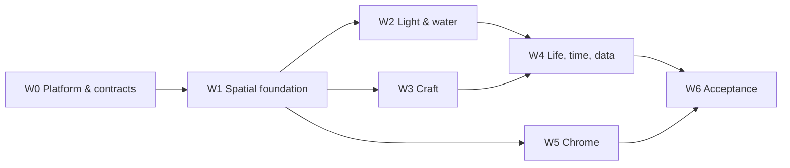

# PharosVille Reborn — consolidated implementation plan

Date: 2026-09-08. Base: `main` @ `4edd97c` (v0.16.0). Author: orchestrator, from 25 lane
reports in `reviews/` (4× `heavy` holistic critics, 10 component lanes, designer,
reviewer, security-reviewer, 3 inventory lanes, coupling map, decision ledger, live census).
Every claim below that matters was re-verified in source by the orchestrator; where lanes
disagreed the decision and the reason are recorded in §2.

Goal (operator, verbatim): *visually stunning, beautiful, relaxing — a digital Japanese
garden; a scene evolving by itself, pleasant to watch and informative about stablecoin
markets.* One massive session, not another tuning round.

---

## 0. The diagnosis in one paragraph

Sixteen releases tuned coefficients inside a premise that caps the ceiling. Four structural
decisions produce the "okay": (1) **every tracked coin is a hull at rest** — ~78 visible in
the frame, 185 eligible, all at equal visual weight; (2) **ships are landscape-sized** — a
mid-ladder hull is 42–59 % of the island's width, a flagship 87 %; (3) **the camera is an
orthographic diagram** — no horizon, no sky, no recession, and the "sky" is a hidden dome
replaced by a two-triangle cream sheet whose edge is the diagonal seam in every wide frame;
(4) **the island is a fort** whose garden vocabulary is authored but sub-pixel. Light adds a
fifth: dusk is 65 % day by construction, and night is a blue day with more fill than noon.
The decision ledger (`reviews/decision-ledger.md` §Recurring) shows the August and September
plans opening with the same five complaints. The loop is not converging because the
premise, not the coefficients, is wrong. This plan changes the premise.

## 1. Target picture (the acceptance image)

A harbour seen from a shaded garden threshold. One weathered Pharos rises from an
asymmetric moss-and-stone headland slightly right of centre; its broken reflection lies in
a calm inlet; **the whole tracked fleet — all ~185 craft at the new 0.42–1.15 scale —**
gathers in unequal flotillas beyond a broad, continuous interval of untouched water, a
dozen of them near enough to read as rigged boats and the rest receding into silhouette;
a dark clipped pine bough crosses the near corner; far
headlands and a real sky band close the frame. Noon is neutral-white and blue-green, not
honey; golden hour rakes; blue hour is gentle; night is dark with a moon, a road, a beacon
sweep, and embers. Every ten minutes or so one thing *happens* — an arrival, the lamps
kindling, a heron — and between them nothing does. The DOM says in one sentence what the
market is doing; the ledger holds the rest.

Value plan (perceptual grey 0–100, rest frame 3×3, from `reviews/astra-garden-director.md`):

| | left | centre | right |
| --- | --- | --- | --- |
| top | noon 60 / dusk 35 / night 9 — distant shore | 72 / 52 / 14 — air; beacon 92 at night | 68 / 43 / 11 — borrowed hills |
| mid | 27 / 20 / 5 grove; tower 62 / 57 / 24 | 45 / 32 / 12 — clear inlet; reflection | 42 / 26 / 8 — receding fleet |
| bottom | 15 / 10 / 3 — clipped pine | 38 / 25 / 7 — open approach | 23 / 15 / 4 — partial quay |

## 2. Decisions (resolved conflicts)

| # | Decision | For | Against | Ruling and reason |
| --- | --- | --- | --- | --- |
| D1 | **Keep every eligible hull visible at rest (~185). No presentation cap.** | fleet-visuals | critic, density, data-story, garden-director, water, camera (all wanted 48) | **Operator decision 2026-09-08: keep the fleet whole.** The six lanes that wanted curation are overruled; the truthfulness question disappears entirely. Two consequences are now load-bearing and are funded below: (a) emptiness must come from **scale (D2), the projected empty inlet (W1.6) and near/far weight hierarchy (W3.6)** instead of from removal; (b) the fleet keeps its ~140 530 triangles, so the species/island/headland work is funded by W3.6's far-hull simplification and W3.7's hero-GLB retirement, both promoted to Core. `VISUAL_INVARIANTS.md:56-77` stands unchanged; no thinning test is re-pinned. |
| D2 | **Continuous cap→scale ladder 0.42–1.15 (clamped power law, `0.42·(cap/1e7)^0.10`), fleet ~45 % smaller.** | fleet-visuals, density, critic, island | — | **Adopt.** With D1 keeping the fleet whole, scale is no longer half of a curation contract — it is the *only* lever that shrinks the fleet's share of the frame, so it ships in full rather than at the milder 0.55 floor. Reverses the 0.8 floor (`garden-ships.test.ts:408-411`). Requires screen-space picking tolerance and GLB/pick-proxy scale coherence (W1.5), and pairs with W1.6's inlet and W3.6's near/far hierarchy for the emptiness curation would have provided. |
| D3 | **Perspective camera** (long-lens) replacing the locked ortho. | critic (40° FOV, 12–16° pitch), camera lane (22°, 24° pitch) | 2026-08-13 plan parked it; XL coupling | **Adopt, vFOV 32°, pitch ≈12°, yaw as today.** Geometry: horizon sits `(1 − tan(pitch)/tan(vFOV/2))/2` below the top edge = **12.9 %** unobscured sky band at 32°/12°; the camera lane's 22°/24° gives −64 % (no horizon). Hills may occlude part of the band; the crown-in-sky read is verified by capture, not formula. **Fallback** if the W1 spike fails its gate: ortho lowered to 24° with the sea-fade horizon (`reviews/sky-seam-defects.md` fix A) — this changes §1's acceptance image (no geometric horizon) and needs explicit operator re-acceptance, not a silent swap. |
| D4 | **Delete the backdrop sheet; real sky dome + camera-following infinite-sea annulus + far-rim hills + distant headlands.** | sky-seam, game-art, garden-director, shore, critic | — | **Adopt.** Root cause verified: `garden-sky.ts:444-450` hides the dome, `:464-524` draws a 1200-unit plane with everything below screen-y 0.62 flat `uLower`. |
| D5 | **Hero-only planar reflection** (tower + island + grove, clipped, half-res). | water, game-art, garden-director, critic, ambient | island lane, 2026-09-07 rejection | **Adopt, budget-gated**: +12 calls / +12k tris / +2 tex / ≤1.2 ms GPU measured by W0's timer. The rejection was for a 40-draw full-scene pass; this is not that. Displaces the synthetic beacon column + hero reflection quads. |
| D6 | **Un-park T3.1 sun elevation 0.806→0.62 rad**, shipped with the five-beat light score and god-ray re-gate. | sky-time, game-art | 2026-09-07 parked | **Adopt.** It is a geometry fix; the reason it was parked (re-keys grade/AO/probe) is exactly what W2 does anyway. |
| D7 | **Demilitarise the precinct** (curtain/bastions/merlons → shoin court, engawa, dry-stone). | island, garden-director, game-art, critic | invariant §Pharos precinct sanctions the fort | **Adopt.** Tower, pavilion, pond, mast stay; no fourth monument. Rewrites `VISUAL_INVARIANTS.md:300-310`. |
| D8 | **Sail identity = mon on cloth**, delete the identity plate. | fleet-visuals, game-art, garden-director | — | **Adopt.** `IDENTITY_FIELD_RADIUS = 62` of 128 px (`garden-sail-texture.ts:235`) is the favicon. Logos stay complete; fallback initials stay. |
| D9 | **Info lives in the DOM; the world keeps three coarse readings** (tower = PSI, water = risk band, hero ships = who leads). Sea-sign boards become inspection-only. | critic, ambient-life, ui, data-story | invariant §sea signs "always present" | **Adopt.** Ledger/detail parity is unchanged; only permanent world ornament that nobody can read at rest is removed. |
| D10 | **Rewrite `VISUAL_INVARIANTS.md` as a one-page design bible + separate technical contracts.** | critic, camera, coupling map | — | **Adopt, W0.** The 420-line document is the art director now. |
| D11 | **Ambient sound** (water, wind, wood creak; opt-in, default muted, ≤5 MB compressed, ≤6 voices, suspended on hidden tabs) | ambient lane | 2026-08-13 withheld it for lack of audio tuning time | **Operator decision 2026-09-08: include as Ext (W4.20).** Ships only after the Core acceptance gate. A motion preference never implies audio consent; no market alarm sounds. |
| D12 | WebGPU | — | perf lane | **Never in this session.** No garden gain; revisit only if timer evidence shows the 20 ms ceiling cannot be met. |
| D13 | Wall clock as premise, no flattering default hour | all | — | **Keep.** |
| D14 | Ambient-life counts | all | — | **Keep the ban; redistribute.** Fewer, larger, readable fauna. |
| D15 | **PSI becomes sky clarity** — cloud cover, horizon visibility and wind calm follow market stability, with slow hysteresis. | data-story, sky lanes | supply tide (the plan's own preference) | **Operator decision 2026-09-08: PSI sky is the one new aggregate reading** (W4.13, promoted to Core). The supply tide gauge (W4.14) and the moon record (W4.15) drop to Ext and may not both ship. This forces a **channel treaty**, written into W2.1's uniform freeze: *PSI owns clarity aloft; stale sources own bounded low fog in their own water (W4.12); the wall clock owns illumination; nothing else touches the sky.* The lighthouse remains the exact PSI channel; the caption names it "market stability", never a forecast; stale PSI freezes the last good sky rather than clearing it. |
| D16 | **Bible review checkpoint.** | operator | — | **W0.3 ends in a stop:** the rewritten design bible goes to the operator and no W1 edit lands until it returns. This is the second checkpoint alongside G1. |
| D17 | **Delivery.** | operator | — | One feature branch (`feat/pharosville-reborn`), single PR at the end, **no release without an explicit say-so.** Changelog entry is written but the release workflow is not triggered. |

## 3. Waves and the critical path

Seven waves, W0–W6. Items are tagged **Core** (must ship for the W6 acceptance image) or
**Ext** (extended vocabulary: ships in the same session only after the Core stop/go in §5
passes). Untagged = Core. Inside every wave the lanes are parallel. Each item has an ID
(`Wn.x`), files, cost (calls/tris/tex/ms · eng S/M/L/XL), what it displaces, and what it
re-pins. Costs are planning envelopes; W0.1 makes them measurable, and nothing spends a
"saving" until the saving has been measured.

### W0 — Platform and contracts (gate: green build, timer readout exists, bible merged)

| ID | Item | Files | Cost | Displaces / re-pins |
| --- | --- | --- | --- | --- |
| W0.1 | **Per-pass GPU-ms readout** in preview (`EXT_disjoint_timer_query_webgl2` is supported on the RTX): rolling p50/p95 per composer stage + scene, with `GL_GPU_DISJOINT_EXT` handling (discard the whole sample set on a disjoint), printed beside the draw census and kept **separate from CPU/main-thread ms**; `--assert` gains `--max-gpu-ms` while the existing 20 ms frame gate stays. | `scripts/pharosville/preview.mjs`, `src/three/garden-post.ts` (query hooks) | 0 · M | Nothing. Prerequisite for every ms budget below. |
| W0.2 | **Projection contract**: `projection.ts` owns view/projection matrices, `worldToScreen`, `screenToGroundRay`; camera pose becomes `{target, distance, yaw, pitch}` with `zoom` derived; every consumer (`garden-observatory-slice.ts`, `garden-observatory-hit-testing.ts`, `use-canvas-resize-and-camera.ts`, URL state, attract, follow, detail anchors) goes through it. Ortho implementation first (behaviour-identical), perspective lands in W1.1. | `src/systems/projection.ts`, `camera.ts`, `world-types.ts`, `src/renderer/garden-observatory-hit-testing.ts`, `src/hooks/use-canvas-resize-and-camera.ts`, `use-world-url-state.ts` | 0 · L | Affine assumptions in `camera.test.ts:60-98`, `garden-observatory-hit-testing.test.ts`. |
| W0.3 | **Design bible**: rewrite `VISUAL_INVARIANTS.md` to ≤1 page of picture rules (§1 above + "every addition displaces"); move runtime/a11y/security/budget rules to `ARCHITECTURE.md`/a new `CONTRACTS.md`; move history to `agents/`. | `docs/pharosville/*.md` | 0 · M | The document itself. |
| W0.4 | **Delete implementation pins** listed in `reviews/test-coupling-map.md` §"delete in a rewrite": backdrop two-triangle/shader-text (`garden-sky.test.ts:215-229`), serialized water constants in shader source (`garden-water.test.ts:1018-1024`), named mooring fixture IDs (`garden-fleet-thinning.test.ts:61-70`), attract byte-length proxy (`pharosville-gates.spec.ts:290-294`), post-chain wording (`garden-post.test.ts:575-597`). Replace with consumer-observable assertions where a contract remains. | those tests | 0 · S | — |
| W0.5 | **Ext — Split `world-renderer.ts`** (5 097 lines) along its existing sections: camera, fleet transforms, lane registry, day-cycle glue, lifecycle. Pure move, no behaviour change. Deferred behind the Core stop/go: it is change-velocity work, not picture work, and it collides with every W1–W4 lane's edits. | `src/three/world-renderer.ts` → `src/three/renderer/*.ts` | 0 · M | — |
| W0.6 | Fix **PHV-EDGE-001** (`Object.hasOwn` guard on `LANDMARK_CARD_COPY[rawSelection]`, `functions/index.ts:128-136`) + regression in `functions/index.test.ts`. | `functions/index.ts` | 0 · S | — |
| W0.7 | Reconcile draw-census owner sum (392 484) vs headline (392 474) so owner deltas are exact. | `src/three/garden-draw-census.ts` | 0 · S | — |

### W1 — Spatial foundation (gate: the integrated slice — new rest frame at 5 hours × 2 gates, the whole fleet at the new scale, a continuous empty inlet, no seam, horizon band, **tower reflection aligned in the water** — approved on the real GPU)

Parallel lanes: **Camera**, **Fleet**, **Horizon**, **Island**, **Shore**, **Reflection**. They
share W0.2 and one *composition contract* authored on day one by Camera + Fleet + Shore +
Data together: the rest shot's safe rectangles (tower crown/base, **the top-3 harbours by
supply share**, open-water corridor, foreground clip zone, shaded-threshold zone) at
900×720 and 1200×640. The hero reflection and the harbour-frontage allocation (formerly
W2.6 and W4.16) live here as **W1.15** and **W1.16** — the frame cannot be approved without
them, and approving it twice is how the last three passes lost time.

**Truth and access contracts that every W1 item preserves** (explicit, because D2/D3/D4
touch all of them): the finite 140×140 field remains the sole authority for navigation,
risk classification and placement — the added ocean, headlands and hills are decorative and
non-selectable; hit testing gains a screen-space tolerance floor so a 0.42-scale hull stays
clickable at the rest camera and under perspective foreshortening; GLB scale/anchor/pick-proxy
coherence is re-derived, not assumed; DOM detail disclosure on selection is immediate;
keyboard order, ledger rows and search continue to cover every tracked record — unchanged,
because D1 keeps the fleet whole.

| ID | Item | Files | Cost | Displaces / re-pins |
| --- | --- | --- | --- | --- |
| W1.1 | **Perspective rig** (D3): `PerspectiveCamera` vFOV 32°, pitch ≈12°, distance from zoom; **shadow camera fitted to the view frustum ∩ plate with a stable caster margin covering the island, near shore and breathing extremes** (today it is world-bounds fitted; a naive frustum fit will swim under W1.3); water/fog/billboard view-direction math converted from the ortho parallel-ray form (`garden-water.ts:717-726, 864-874`, `garden-sky.ts` fog scale, `garden-sky-billboards.ts`). Timeboxed spike first (2 days): if hit-test parity or the p95 gate fail, fall back to D3's ortho-24° variant **and re-accept §1 with the operator**. | `world-renderer.ts:862, 5024-5042` → renderer/camera module, `projection.ts`, water/sky shaders | 0 · XL | Fixed-ortho invariant; `camera.test.ts`, hit-testing tests, `garden-sky.test.ts:363-403` fog-near pins. |
| W1.2 | **Authored rest shot** per gate (not a zoom constant): tower at ~62 % x / 38 % y island base, Mole + one southern harbour in frame, open-water corridor, foreground clip zone. Tests assert subject rectangles, not centre ranges. | `camera.ts`, `camera.test.ts` | 0 · L | `GARDEN_DEFAULT_CAMERA_ZOOM` 0.72 premise (`camera.test.ts:155-167`), 128-px gutter rule. |
| W1.3 | **Camera breathing**: 90–140 s yaw ±2°, pitch ±1°, dolly ±1.5 %; freezes on input, static under reduced motion. *Recorded conflict:* the critic lane wanted bounded post-idle parallax rather than perpetual breathing; the plan takes perpetual-but-sub-perceptual because a fully static frame is what makes the current stills read as a diagram. Acceptance decides: if the 30-minute watch reads as drift, it becomes idle-only. | camera module, `use-canvas-resize-and-camera.ts` | 0 · M | Observe's 5 % push/tangent drift; hit snapshot invalidation cadence; projected picking/anchor parity must hold at both breathing extremes. |
| W1.4 | **Fleet weight hierarchy — no count cut** (D1): with all ~185 hulls retained, emptiness has to be authored rather than vacated. Three levers, all in placement and presentation: anchorage clusters re-solved against the *projected* frame so the inlet in W1.6 stays clear; the existing `FLEET_FRAMING_RESTRAINT` chroma step applied by screen distance rather than only by zoom; mark presence (`garden-fleet-batch.ts:363`) driven by the same screen-distance term so far hulls stop asserting identity. The count contract and every thinning test stay exactly as they are. | `src/systems/garden-fleet-placement.ts`, `garden-fleet-batch.ts:246, 363`, `world-renderer` fleet section | 0 calls / 0 tris · M | Nothing removed; **no thinning re-pin** (`garden-fleet-thinning.test.ts` untouched — D1 keeps `VISUAL_INVARIANTS.md:56-77`). |
| W1.5 | **Scale re-base** (D2): `marketCapVisualScale(cap) = clamp(0.42·(cap/1e7)^0.10, 0.42, 1.15)`; six tier labels kept for DOM parity, derived from cap thresholds; picking tolerance and pick-proxy/GLB scale coherence re-derived. | `src/systems/ship-visuals.ts`, `garden-observatory-slice.ts:78-87`, `garden-ships.ts`, hit testing | 0 · S code / L consequence | `garden-ships.test.ts:402-411` (both the 0.8 floor **and the 2.5–2.7 ratio band**), `garden-fleet-placement.test.ts:218-235`, `motion-sampling.test.ts:123-127`. |
| W1.6 | **Continuous empty inlet**: placement authors one curved unoccupied interval from foreground to the tower in *projected* space; anchorages outside it; test asserts the screen-space corridor at both gates. With D1 keeping all 185 hulls, this is the primary source of emptiness in the frame and its acceptance is non-negotiable at G1. | `garden-fleet-placement.ts`, `camera.ts` | 0 · L | Largest-empty-circle (`garden-fleet-placement.test.ts:134-158`) gains a projected-corridor assertion beside it; cluster structure (`:91-131`) and crowded-band spread (`:161-171`) re-derived for the new anchorage solve at unchanged count. |
| W1.7 | **Sky dome visible + infinite sea annulus** (D4): un-hide the dome (it already has sun/corona/ember/stars/moon), delete `createBackdrop`, add a camera-following sea annulus using the water shader with waves/reflection fading into horizon fog over 40–80 u, soft alpha at the playable boundary. | `garden-sky.ts:444-571`, `garden-water.ts` (annulus mesh), `garden-horizon.ts` | +2 calls / +4k tris / +0–1 tex / 0.3 ms · M | Backdrop sheet; `garden-sky.test.ts:215-229` (deleted in W0.4). |
| W1.8 | **Far rim → hills that meet the sky**: raise north/west rim to 8–18 u with a ridge profile keyed off `rimDepthAt`; two–three partial distant headland silhouettes beyond (shakkei), depth-faded. | `garden-rim-mesh.ts:377-400`, `garden-horizon.ts:50-127` | 0–1 calls / +8k tris · M | Flat haze-seam framing; station envelopes must stay level. |
| W1.9 | **Foreground repoussoir**: one near-camera pine bough merged static mesh in the lower-left/upper-left corner, dark, `castShadow=false`, N8AO-excluded; replaces the two invisible foreground masses. | `garden-rim-mesh.ts:1164-1209` | +1 call / +1.5k tris · S | `GARDEN_RIM_FOREGROUND_MASSES`, `garden-rim-mesh.test.ts:82,487`, `VISUAL_INVARIANTS.md:133-140`. |
| W1.10 | **Island as headland** (D7): rewrite `createGardenPrecinct` — cliff plinth kept; curtain/bastions/merlons/arrow slits → low dry-stone wall + engawa slabs + gravel court; castle arch → torii-scale opening; keep `LIGHTHOUSE_WINDOW_MATERIAL_NAME` on one aperture. Tsukiyama rock: 2–3 hill lobes, moss caps, gravel beach arc on the camera lee. | `src/three/garden-precinct.ts`, `garden-island.ts:173-229, 582-649` | net 0–4 calls / +10–30k tris · XL | Fort permission (`VISUAL_INVARIANTS.md:300-310`); `garden-island.test.ts` precinct names + drawable 49. |
| W1.11 | **Garden props that survive the 16-px blur**: unbury the 15 Sakuteiki stones (+0.4–0.9 y), path half-width 1.28→2.0 and one stop lighter, karikomi ×1.4, pond → r≈5.5, pavilion → thatched chaseki silhouette (same root, same secondary slot), one maple pad family on the niwaki batch. | `garden-island.ts:1014-1277, 1490-1530, 1617-1669, 1704-1761` | 0–1 calls / +2–8k tris · M | Karikomi count 23, drawable 49→50, stone-triad pins. |
| W1.12 | **Landing sequence**: torii + one stone replace the obelisk gateposts at the quay stair; a 3–5-span plank bridge to a satellite islet (pulled from the islet budget) with one pine + one triad. | `garden-island.ts:1787-1859, 1966-1978`, `garden-islets.ts` | +1–2 calls / +3–6k tris · M | Obelisks; islet pine redistributed; fleet clearance re-check. |
| W1.13 | **Terraced garden shore**: land material by slope+height (gravel/sand flats, moss, exposed rock on the existing outcrop shelves, raked-gravel precinct bands); three coast forms — sand beach (2–3 tile shelf), dressed-stone revetment (1 instanced draw), boulder toe (stones 23→~120 on the existing batch). | `garden-rim-mesh.ts` `rimColor:403`, `rimHeight:377`, `addShoreCourses:469`, `buildLandGeometry:544-556` | +2 calls / +6k tris · L | Single shore recipe; stone count 23 (`garden-rim-mesh.test.ts:94`). |
| W1.14 | **Whole-map LOD inversion fix**: remove `garden-rim-pines` from `OVERVIEW_LOD_*` lists (`garden-overview-lod.ts:80,119`); add one canopy-mass impostor batch (~120 instances) hard-swapped at zoom 0.53. | `garden-overview-lod.ts`, `garden-rim-mesh.ts` | +1 call at overview · M | `garden-overview-lod.test.ts` name lists. |
| W1.15 | **Hero planar reflection** (D5, was W2.6): half-res linear-HDR RT, mirrored camera, clip plane at `GARDEN_WATER_Y`, layer = tower GLB + rock + grove + precinct only, sampled inside `mirrorZone`/near-island mask with region reflectivity + normal distortion; frozen under reduced motion; skipped when the tower is off-frame. Pulled into W1 because the acceptance frame contains it. | `garden-water.ts:630-642, 879-946`, new `garden-hero-reflection-pass.ts`, `garden-hero-reflections.ts` (remove quads) | +12 calls / +12k tris / +2 tex / ≤1.2 ms · L | Synthetic beacon column (`garden-water.ts:1297-1316`), hero reflection quads; the 2026-09-07 rejection. Gate: W0.1 timer + alignment check. |
| W1.16 | **Harbour frontage by supply share** (was W4.16): shoreline frontage and dominant roof mass on a bounded log scale; the top 3–4 harbours guaranteed inside the rest frame. Pulled into W1 because W1.2 cannot fix a shot whose subjects move afterwards. | `garden-docks.ts`, `dock-layout.ts`, `chain-docks.ts` | +0 calls / **+12k tris (capped — was +25k; the fleet keeps its triangles under D1)** · L | Flag-only importance; `dock-layout.test.ts` heights; ledger states "share of tracked supply". |

### W2 — Light and water (gate: five-beat contact sheet shows five distinct lights; night blur-audit keeps a dark field; open-night emissive ≤0.016; no W1 acceptance regressions)

| ID | Item | Files | Cost | Displaces / re-pins |
| --- | --- | --- | --- | --- |
| W2.1 | **Five-beat light score**: `dayCyclePhase` returns a partition of unity over dawn (04:45–07:15) / day / golden (16:15–18:15) / blue (18:15–20:00) / night; every consumer (lights, fog, grade, LUT band, practicals) blends adjacent beats only. Kills the 65 %-day dusk (`garden-day-cycle.ts:215-221`). | `garden-day-cycle.ts:210-322`, `garden-post.ts:551-618, 1851-1859`, `garden-sky.ts:761-768`, `garden-height-fog.ts:60-114` | 0 · L | Three-phase tables everywhere; `garden-day-cycle.test.ts` phase samples; `garden-post.test.ts` LUT weights. |
| W2.2 | **Real night**: ambient/hemi .28/.36 → ~.06/.10, moon key ~.6, global lift removed; visible moon disc + sparse stars on the dome (already authored at `garden-sky.ts:573-665`, currently never in frame); cool rim; moon road gain .06→~.16 with glitter occupancy traded down to hold the 0.016 mean. | `garden-day-cycle.ts:112-149`, `garden-post.ts:211-228`, `garden-water.ts:1125-1151`, `garden-water-contract.ts:86-100` | 0–1 calls · L | Cobalt fill; `garden-day-cycle.test.ts` light ordering; **night grade pins `garden-post.test.ts:747-760` (lift `[.01,.01,.018]`, saturation 1.02, vignette .28/.15) — the removed lift breaks these; delete the incidental values, keep an observable "night midtones sit below X" assertion**; `garden-water.test.ts:1012-1016` re-pinned to the new occupancy. |
| W2.3 | **Sun apex 0.62 rad** (D6) + god rays gated by dawn/golden weights (not elevation) with steps 28→36 only in those windows. | `garden-sun.ts:26-35, 104-115`, `garden-post.ts:974-1018, 1158-1163` | saves 1 half-res draw by day · S–M | "preserve fixed rig" pin; `garden-sky.test.ts:245-252`; `garden-post.test.ts` ray gates. |
| W2.4 | **One atmosphere owner at noon**: keep linear depth fog for aerial perspective; height fog only on authored banks, not on every sea-level material; day mist opt-in to far anchors; re-author day grade/LUT around neutral whites and blue-green water, warmth into direct sun only. | `garden-sky.ts:89-133, 875-955`, `garden-height-fog.ts:152-268`, `garden-post.ts:242-255`, `scripts/pharosville/generate-garden-luts.mjs` | 0 (likely faster) · M | Beige wash; `garden-post.test.ts:788-800` day values. Do not touch the operator's in-flight LUT edit — rebase on it. |
| W2.5 | **Phase-authored key:fill and exposure**: dawn 3:1, noon 5–6:1, golden 7–9:1 violet fill, blue 2.5–3.5:1 low energy, night 4–5:1 dim; environment intensity phase-aware (fixed 0.6 today). | `garden-day-cycle.ts`, `garden-environment.ts:133-164` | 0 · M | Universal 0.6 env. **Note: the coupling map found no existing ambient/hemi floor test (`reviews/test-coupling-map.md:31`) — this item must ADD the ratio/floor assertions, not re-pin absent ones.** |
| W2.6 | *(moved to W1.15 — the acceptance frame contains the reflection, so it cannot follow the frame's approval.)* | — | — | — |
| W2.7 | **Volume water from the shore field** (finish T3.2): depth, Beer darkening, alpha toward seabed tint, shallow shelf, lap foam and wet-band darkening all from `uRegionDistance.g`; island ellipse terms demoted to modulation; caustics gated by shore field, not island radius. | `garden-water.ts:761-976, 1278-1293, 1389-1408` | 0 · M | Ellipse bathymetry/foam vocabulary; T3.2 string pins in `garden-water.test.ts`. N8AO `transparencyAware=false` must be checked against alpha water. |
| W2.8 | **Calm mirror zones**: in calm/ledger bodies double probe blend, higher fresnel clamp, flattened normals, crest foam + glitter suppressed; region value ladder widened after luma match so seven bodies separate at rest. | `garden-water.ts:671, 934-946, 1022-1027`, `garden-sea-regions.ts:284-348` | 0 · S | Generic glitter in calm; fresnel gain test (`garden-water.test.ts:285`). |
| W2.9 | **Beacon that sweeps**: cone opacity .11→~.25 with a bright core + noisy volume; water gets a travelling ribbon + terminal glitter locked to beam yaw (replaces the diffuse caustic blob); day lantern gets glass (transmission whisper) via the GLB generator; selective bloom layer for beacon/lanterns/windows only (quarter-res mask), full-frame bloom removed. | `garden-lighthouse.ts:808-815, 941-1059`, `garden-water.ts:1222-1275`, `generate-garden-lighthouse.mjs`, `garden-post.ts:1640-1649` | +2 calls / +4k tris / +2 tex / 0.4 ms · L | Broad beacon patch; full-frame `BloomEffect`; model hash + `check:garden-models`. |
| W2.10 | **Ext — Shadows**: A/B 4096² for the hero rig on tier full; phase-tuned bias and penumbra (crisp noon, soft low sun); sail batch casts shadow for the near set only. Optional upgrade, adopted only on measured evidence; the sail-shadow half depends on W3.6's near set and is edited by the W3 owner, not W2. | `garden-environment.ts`, `garden-fleet-batch.ts:1287` | 0 calls / +48 MB depth / 0.2–0.8 ms · M | Uniform softness. Timer-gated. |
| W2.11 | **Ext — Cloud shadows** advected across sea and terrain (two-octave transmittance in the existing shaders; frozen under reduced motion). The `garden-rim-mesh.ts` material edit is owned by the W3 shore owner. | `garden-water.ts`, `garden-rim-mesh.ts` materials | 0 calls / 1 small tex / 0.1–0.3 ms · M | Some grain visibility. |
| W2.12 | **Tilt-shift edge fix**: mirror UVs at the blur target boundary (12.92 px kernel footprint); confine tilt-shift to authored close postcards, off at rest. **Delete the CSS inset frame** (`pharosville.css:434-440`, 14 px `::before` border). | `garden-post.ts:735-819`, `pharosville.css:425-450` | −2 blur draws at rest · S | Frame ornament; `garden-post.test.ts` kernel pins. |
| W2.13 | **Ext — LUT authoring loop**: export linear ungraded plates for the five beats + neutral ramps; grade externally; bake a five-band strip; contact sheets + gamut stats in the script. W2.4's re-grade lands with the existing tooling first; this industrialises it. Also decides the **dusk-grade pins** (`garden-post.test.ts:771-785`) that W2.1's five beats invalidate: replace the three-phase value assertions with per-beat band presence. | `scripts/pharosville/generate-garden-luts.mjs` | 0 · M | Hand-typed RGB tuples; three-phase grade pins. |

### W3 — Craft (gate: `dusk-close`-style capture reads as boats, not toys; species silhouettes distinct at rest; budget table holds)

| ID | Item | Files | Cost | Displaces / re-pins |
| --- | --- | --- | --- | --- |
| W3.1 | **Mon on cloth** (D8): delete `paintIdentityField`/`IDENTITY_FIELD_*`; logo mask at ~52 % cell, one ink chosen for value contrast, `multiply` into dyed cloth, 2–3 seeded wear blotches; bezaisen cloth 3.35×4.1 → 4.3×3.0; yard + boom on rectangle/fore-aft rigs. | `garden-sail-texture.ts:218-323`, `garden-ships.ts` rigs, `garden-fleet-batch.ts` | +2 tris/hull · M | Identity plate; `gardenFleetMarkPresence` thresholds; sail-texture tests. |
| W3.2 | **Backlit cloth**: wrap term `clamp(-dot(N, sunDir),0,1)·cloth·uBacklight` in `patchSailAtlasMaterial`, driven by the W2.1 golden/blue weights. | `garden-fleet-batch.ts:1254-1262` | 0 · S | — |
| W3.3 | **Wet collar + rail + contact**: wet band 0.11→0.22, darkened/desaturated (`vColor *= mix(1, .62, wet)`) as well as glossed; gunwale strake rail term 0.55→1.0; blob shadow → heading-aligned ellipse scaled to hull reach. | `garden-fleet-batch.ts:652-655, 940-950`, `garden-ships.ts:2786` | 0 · S | T3.4 as shipped; gloss pins. |
| W3.4 | **Value-first hull ladder**: `GARDEN_HULL_FAMILY_PAINT` re-spaced on OKLCH L (junk .28 → kobaya .82), chroma −25 %, chroma returned to trim strake + sail dye. | `garden-ships.ts:550-589` | 0 · S | Hue-separated timbers; `garden-ships.test.ts:794-797` ceiling stays. |
| W3.5 | **Takasebune fix** (24 % of fleet): mast 2.35→4.2, sail 1.45×1.55→2.9×2.2 aft, cargo arches in two groups of three + open well with a matting tint + lashing, sculling oar. | `garden-ships.ts:259-265`, `garden-fleet-batch.ts` tints | +90 tris/hull · M | Caterpillar covers; `GARDEN_HULL_MAX_X_REACH_WORLD.takasebune`. |
| W3.6 | **Hero-few / background-many — promoted to Core by D1.** `aDetailLevel` instance attribute by screen distance with 0.35 s hysteresis. Near set (~14): rigging `LineSegments`, awning, oars, hanging stern lantern, sail shadow. **Far set: a reduced hull variant** — fewer strake and cargo-arch segments, sail as a single quad, marks at `MARK_MIN_PRESENCE`, chroma −25 %. With 185 hulls retained this is no longer a refinement: it is both the frame's depth hierarchy *and* the triangle budget for the rest of the plan. Target −30k net fleet triangles. | `garden-fleet-batch.ts`, `garden-ships.ts:2686`, camera module (near definition) | +1 call / **−28k tris** / −0.3 ms · L | Uniform rig on every hull. Needs a `garden-ships.test.ts` case that the far variant preserves family silhouette and hit envelope. |
| W3.7 | **Retire the 10 shared hero GLBs — promoted to Core by D1**; keep the 8 named titans, route the rest to the procedural batch. The census attributes 104 calls to fleet + hero ships against 13 for the batch, so the shared heroes are where fleet draw calls actually live. | `garden-models.ts:319-806`, `generate-garden-heroes.mjs` | **−10 calls / −11k tris / −10 fetches** · M | Hero manifest, `check:runtime-media` inventory, `garden-models.test.ts`. |
| W3.8 | **Species library** `garden-flora.ts`: black pine (plate pads on S-trunk), momiji (lobed umbrella), cherry, bamboo clumps (the only vertical accent), karikomi at 1.2–2.2 u, moss/gravel decals in the land draw; one `SPECIES` table + `createSpeciesBatch`; island niwaki share it. Redistribute: drop the 490 micro-domes; ~120 pines, ~60 momiji/cherry, ~80 karikomi, ~35 bamboo. Seasonal policy per species; ground tint by season. | new `src/three/garden-flora.ts`, `garden-rim-mesh.ts:605-950`, `garden-islets.ts:218`, `garden-island.ts:1306-1476` | +4 calls / **+25k tris (capped — was +35k; counts trimmed because the fleet keeps its triangles)** · L | Two `SphereGeometry` blob builders; `garden-rim-mesh.test.ts:70-101` windows; `garden-draw-census.test.ts`. |
| W3.9 | **Station approaches**: stone-stepped landing at each cove mouth, tōrō pair line along the widened (1.4 u, gravel-pale) spur, one arched timber bridge where a spur crosses the wet band, raked forecourt; engawa re-authored as a veranda facing water (floor, posts, roof edge) instead of a dark pier. | `garden-rim-mesh.ts:100-107, 1374-1406`, `garden-docks.ts` | +2 calls / +4k tris · M | `coveSpurCount` 8 pin; `RIM_STATION_CLEARANCES` respected. |
| W3.10 | **Reeds on the coast lattice** (~120 clumps, wind-swayed, land-side of the waterline). | `garden-rim-mesh.ts`, `garden-sea-edges.ts` untouched | +1 call / +3k tris · S–M | — |
| W3.11 | **Ground re-key**: `MOSS = aurora_green×0.92` desaturated ~25 %, yellow-green in sun / blue-green in shade; earth band → sand; night `nightValue` uniform drives vegetation albedo to silhouette. | `garden-rim-mesh.ts:88, 105, 403` | 0 · S | `GARDEN_RIM_COLOR_HEX` consumers; palette guards. |
| W3.12 | **Ext — Value/material planes** shared shader patch: cool deep water, darker tactile land, luminous-not-yellow stone; broad two-zone diffuse response + local occlusion; consumed by fleet, island, rim materials. Extended because W2.4/W2.5 re-grade and re-ratio the same picture first; if they land the three planes, this abstraction is unnecessary. **One owner** — it touches every material and must not run concurrently with W3.1–3.11. | new `garden-material-planes.ts`, `garden-fleet-batch.ts`, island/rim materials | 0–1 ramp tex / 0.1–0.4 ms · L | Stacked warm multipliers. |

### W4 — Life, time and data (gate: a 30-minute real-GPU watch shows ≥3 distinct beats separated by ≥6 min of quiet; every new cue has ledger/detail parity)

| ID | Item | Files | Cost | Displaces / re-pins |
| --- | --- | --- | --- | --- |
| W4.1 | **Garden director** (pure): one event slot; **6–10 environmental beats/hour** (so a 30-minute watch reliably contains ≥3), ≤1 foreground beat at a time, 6–12 min silences between foreground beats; market transitions pre-empt decorative beats; consumed by weather, arrivals, attract, almanac dressing. Separates occurrence time / visual envelope / lingering evidence / attention reservation (fixes the 14-minute meteor lockout, `garden-almanac-dressing.ts:188-194` vs `pharosville-world.tsx:642`). | new `src/systems/garden-director.ts`, `garden-almanac.ts`, `garden-attract.ts`, `garden-arrival-beats.ts:86-114` | 0 · XL | Metronomic accents; almanac lottery; event tests. |
| W4.2 | **Temporal spine**: explicit visible-tab wall-clock subscription + UTC rollover; hidden tabs resume without replaying; reduced motion gets one authored static state. | `use-world-time-controls.ts:80`, `use-garden-almanac.ts:21-34` | 0 · M | Render-driven hour sampling. |
| W4.3 | **Harbour tide as master clock**: 8–12 min oscillator; moored hulls swing inside a 0.07-tile tether with berth lag; rafted pairs share phase; underway ships get a small cross-current. Ships the unlanded half of T1.5. | `world-renderer` fleet section (`:4584-4619`), `motion-planning.ts` | 0 · M | Independent bob toys; `motion.test.ts` sway contract. |
| W4.4 | **Bow-to-wind at open rest**; dock tangent kept with narrow tide yaw; one wind vector (from `weather.ts`) drives sails, flags, foliage flex, smoke lean, waterfall spray, Gerstner bearing with a slow travelling gust front. | `motion-planning.ts:651-683`, `weather.ts:142-171`, wind consumers | 0 · M | Private phase oscillators; reduced-motion zero pose. |
| W4.5 | **Ext — Chain processions**: small lane graph + departure windows; flagship/consort inheritance (`motion-planning.ts:480-492`) promoted into 3–7-ship single-file processions, ≤2 active. Persistent calligraphic wakes with longer memory for underway hulls, erased at berth. | `motion-planning.ts`, `garden-wakes.ts`, `garden-wake-batch.ts` | 0–1 call / 0–1 tex / 0.2–0.7 ms · L | Random independent vectors; wake state pins in `motion.test.ts`. |
| W4.6 | **Arrival ceremony** (director slot, every 2–4 min at most): one data-significant arrival — lanterns bow in sequence, convoy compresses, sails dip, ensō wake ring, 8–12 s accessible annotation. Replaces the six simultaneous four-second chips. | `garden-arrival-beats.ts:3-10, 46-70` | 0 · M | Six-way beat cap → 1; `garden-arrival-beats.test.ts`. |
| W4.7 | **Ext — Depeg / issuance stories** (edge-triggered, hysteretic, provenance-stamped): depeg → hero ship heels, lowers sail, slow escorted course to the strait; recovery reverses; verified positive net issuance → arrival ceremony at its anchorage, negative → quiet departure. **No bell** — sound is deferred (D11); the beat is visual plus the DOM annotation. Copy says "supply increased/decreased in the window", never transfer/bridge/mint/issuer. | `garden-director.ts`, `motion-planning.ts:54-60`, `detail-model.ts`, ledger | 0–2 calls · L | That day's decorative event; ordinary voyage for the asset. |
| W4.8 | **Evening keeper ritual** (clock-driven, dusk beat, 2–4 min): one small figure walks the rim path lighting existing fixtures; fireflies emerge on one dark arc (quads view-scaled to ≥1.5 px); birds settle; dawn reverses. Replaces the seven-sphere `lantern-round`. | `garden-almanac-dressing.ts:149-184`, `garden-harbor-life.ts:68-157`, `garden-lanterns.ts` | +1–2 calls / ≤3k tris · L | Lantern-round event; dusk bird sorties. |
| W4.9 | **Readable fauna**: merge ship/summit/quay bird batches into 3–5 birds at 8–14 px — one heron perching on the camera-side rock as a regular dusk beat, two gull pairs, rest perched; koi: 1–2 of the four cross the enlarged pond's reflection. | `garden-summit-birds.ts`, `garden-ship-gulls.ts`, `garden-harbor-life.ts`, `garden-koi.ts` | −2 calls · M | Invisible microflocks; sortie-share pins; the "empty basin" decision. |
| W4.10 | **Ext — Waterfall as focal event**: re-site onto a visible camera-side rock cut, taller drop, one instanced spray draw, plunge pool from the wake field; luminance capped below sails by day. | `garden-waterfall.ts` | +1 call / ~128 tris · M/L | Unreadable ribbon. |
| W4.11 | **Ember reflections as broken vertical strokes** (length by source height + wind; beacon longest), same 16-lane cap. | `garden-water.ts:1332-1379` | 0 / 0.2–0.5 ms · M | `pool·.55 + streak·.4` discs. |
| W4.12 | **Stale data as a fog bank that arrives**: on a freshness edge, move a bounded bank across the affected water/quay over 30–60 s with an instrument flag; caption names the feed and last-good time. | `epistemic-haze.ts`, `garden-sky.ts` mist banks, ledger | 0 · M | Decorative mist in that region. |
| W4.13 | **PSI as sky clarity — Core by D15**: cloud cover, horizon visibility and wind calm follow the PSI band with slow hysteresis; the lighthouse remains the exact channel; stale PSI freezes the last good sky rather than clearing it; the caption names it "market stability". Bound by the **channel treaty** frozen at G2: PSI owns clarity aloft, W4.12 owns bounded fog in stale water, the wall clock owns illumination, nothing else writes the sky. | `garden-sky.ts`, `garden-day-cycle.ts`, `weather.ts`, `detail-model.ts` | +2 calls / +2k tris / +1 tex / 0.3–0.8 ms · M/L | Generic veil. Parity: exact PSI, band, as-of and unavailable state in panel + ledger. Must not be readable as a weather forecast — the copy and the ledger both say correlation, never causation. |
| W4.14 | **Ext — Supply tide gauge**: one marked stone gauge on the island quay; 24 h ease from previous daily close; absolute level only against a labelled recent range; never oscillates. Demoted to Ext by D15 (PSI took the aggregate slot); may ship after G4 only if the sky reading has not already saturated the viewer's attention. | new `garden-supply-gauge.ts`, `detail-model.ts` | +1–3 calls / <3k tris · M | Shoreline foam noise at the quay. |
| W4.15 | **Ext — Moon = 30-day record**: phase = sample coverage, halo = average band. **Mutually exclusive with W4.14** and in tension with W2.2's need for a plainly readable moon; ship at most one of the two, and only after G4. | `garden-sky.ts` moon, `garden-month-record.ts` | 0–1 call · M | Decorative phase. |
| W4.16 | *(moved to W1.16 — the rest shot cannot be approved before harbour footprints settle.)* | — | — | — |
| W4.17 | **Ext — Microseasons**: blossom open/fall, leaf release, bare winter from bounded calendar phases; one maple sheds a few leaves during a director beat, reusing the spring particle budget. | `season.ts`, `garden-seasonal-dressing.ts`, `garden-flora.ts` | 0–1 call / ≤2k tris · L | Constant spring drift; spring-only dressing pin. |
| W4.18 | **Attract as stationary windows**: 3–6 min locked compositions from a named postcard book (Pharos Dawn, Mole Market, Storm Passage, Wreck Memorial…), 20–35 s transitions. At 3–6 min holds that is **10–16 relocations/hour**; the ≤4/hour figure applies to *foreground director beats*, not camera moves — recorded because the review caught the two being conflated. Chrome fades during holds; fix the dwell→next-leg discontinuity (`observe-tour.ts:128-143, 258-262`). Follow-a-ship becomes a user-triggered voyage mode (ship lower-left third, destination upper-right, ease-out at berth). | `garden-attract.ts`, `observe-tour.ts`, `use-canvas-resize-and-camera.ts:738-839` | 0 · L | 144-s loop, dwell creep, exact-centre follow. |
| W4.19 | **Sea-sign boards inspection-only** (D9): hidden at rest; raised on water-body hover/focus; ledger canonical. | `garden-sea-signs.ts`, `garden-sea-sign-siting.ts` | −1 tex / −1 call at rest · M | Always-present boards (`VISUAL_INVARIANTS.md:184-189`). |
| W4.20 | **Ext — Ambient sound** (D11): three seamless originals/licensed loops — water, wind, wood creak — plus sparse bird detail; Web Audio gain/filter/pan follows the existing weather and director state; ≤6 concurrent voices, ≤5 MB compressed, ≤24 MB decoded; **default muted**, an explicit "Sound on" gesture creates/resumes the context, independent volume, suspended on hidden tabs. No market alarms; a reduced-motion preference never implies audio consent. | new `src/lib/garden-audio.ts`, `world-controls.tsx`, `garden-director.ts` | 0 GPU / ≤0.3 ms audio CPU · L | Visual-only insistence that every event must catch the eye. Needs a licensing decision and 3–5 days of tuning — the reason it was withheld in 2026-08. |

### W5 — Chrome (gate: default frame shows the world + one sentence + one affordance; a11y lane green in Chromium + Firefox)

| ID | Item | Files | Cost | Displaces / re-pins |
| --- | --- | --- | --- | --- |
| W5.1 | **Scene-first chrome**: default = world + "now" line + one quiet menu/search affordance; Find, Guide, Ledger, view controls reveal on pointer approach / focus / `/` / camera input; focused controls never hide. | `pharosville-world.tsx:1232-1260`, `world-controls.tsx`, `pharosville.css:789-837, 1175-1194` | 0 · M | Persistent footer, 76 % idle discs. |
| W5.2 | **"Now" caption** (data-story owns grammar, deterministic precedence, explicit warning state): "12:25 — a quiet noon · readings current · USDC moved to Watch water, observed 18:42". Updates only on data/time boundaries. Version/FPS → debug overlay (`?debug=1`) with draws/tris/tex/p95. | `pharosville-world.tsx`, new `now-caption.tsx`, `detail-model.ts` | 0 · S–M | "Readings current", "142 of 185…", fps, version in the footer. |
| W5.3 | **Ext — First-run story replaces the legend modal**: three beats pointing at live targets (ship = stablecoin; water = peg risk; lighthouse = fleet stability) then "Watch the harbour"; full keys behind "Reading guide". Once per version, skippable, reduced-motion deterministic. Core keeps the existing legend behind the new quiet affordance; a bad picture is not fixed by better onboarding. | `legend-panel.tsx:104-227`, `pharosville-world.tsx:1102-1123` | 0 · L | Harbormaster note; legend density. |
| W5.4 | **Woodblock record card** for the detail panel (seal/status, serif title + narrative, rule, sans figures; flips to a side rail on overlap) — Core, because the panel opens on every selection. **Ext — Ledger as almanac**: non-modal side sheet with the Now / Waters / Harbours / Ships / Wrecks / Sources index. **No Core ledger work**: D1 keeps every hull on screen, so the "N shown / 185 tracked" coverage block that curation would have required is tautological and is dropped — the ledger's existing per-record rows already are the coverage statement. | `detail-panel.tsx:99-181`, `accessibility-ledger.tsx:113-387`, `pharosville.css:598-617, 1081-1163` | 0 · M (+L for the Ext half) | Parchment gradient; report-dialog ledger. |
| W5.5 | **Type + colour tokens**: EB Garamond (bundled) for titles/narrative, system sans for figures/controls; 12/14/16/20/28 roles; tokens `ink/mist/moss/stone/water/lantern` + semantic risk derived from the W2 palette, day/night variants; brass only as the lantern accent. **The four immutable palette tokens (`lantern_warm`, `vermillion`, `sail_teal`, `sail_red`) and vermillion's chroma primacy survive unchanged** (`palette.test.ts:42-57`); DOM tokens are derived, never redefinitions. | `pharosville.css:1-8, 407-423` + tokens | 0 · M | Georgia everywhere; timber/brass/parchment skin; colour guards. |
| W5.6 | **Motion tokens**: `whisper` 180–220 ms, `settle` 320–450 ms, no infinite DOM motion; loading = held establishing still + 320 ms crossfade (no orb, no 9-s veil); gate page = a real seasonal still with alt text, no world boot. | `pharosville.css:73-180, 296-400`, `client.tsx:56-67` | 0 · S+M | Loading choreography; timber gate plaque. |
| W5.7 | Public copy: title/OG/page copy re-written to the goal sentence (see `reviews/changelog-promises.md` §3). | `index.html`, `docs/pharosville-page.md` | 0 · S | — |

### W6 — Acceptance (gate: all of the following, on the RTX via `preview.mjs` with the Vulkan flags)

1. **Contact sheet**: `#t=5.5, 7, 12.25, 17, 18.5, 22&n=1` × {900×720, 1200×640, 1600×1000} × {rest, whole-map, one postcard}. Reviewed against §1 and the value plan; "a prettier version of the same carpet" is a fail.
2. **Blur audit** (`--blur-audit`) at noon and night: a large calm dark low-contrast region survives at 16 px in both.
3. **Composition, not counts** (D1 keeps all ~185 hulls, so a hull cap is not the test): the projected empty inlet spans ≥30 % of the frame's width with no hull in it at both gates; the island + tower silhouette owns its quarter of the frame unchallenged; at most ~14 hulls carry full rig detail and the rest read as silhouettes; the ledger still lists every tracked record.
4. **Budget** (W0.1 timer): scene ≤ 275 calls after Core (≤ 285 with Ext), ≤ 480k tris, ≤ 60 tex; **GPU p95 ≤ 16 ms** at 1600×1000 with every shipped pass on, **and** the existing whole-frame 20 ms `--assert` gate still passes with CPU reported separately; per-item deltas reconciled against §4.
5. **Access and truth**: every new world cue has detail/ledger parity; picking still resolves a 0.42-scale hull at the rest camera and under perspective foreshortening; projected picking and DOM anchors stay correct at both camera-breathing extremes; the hero reflection is aligned (tower base meets its inverted base at the waterline) at three camera poses; the PSI sky reads as market stability in the caption and ledger and never as a forecast, with the unavailable/frozen state exercised; each attract postcard's named subject is inside frame at both gates and at its intended phase; `validate:docs`, viewport-gate and the accessibility lanes (Chromium + Firefox) are green; reduced motion is one static frame with zero RAF.
6. **Time**: a 30-minute unattended watch log (director events with timestamps) shows ≥3 beats and ≥6-minute silences between foreground beats; hidden-tab resume without replay.
7. `npm run validate:release` green, changelog entry written (`src/content/pharosville-changelog.ts`), single PR opened from `feat/pharosville-reborn`. **No tag and no release workflow without an explicit operator say-so (D17).** Seven-frame before/after pair archived in `outputs/reborn/after/`.

## 4. Budget allocation (baseline measured 2026-09-08: 242 calls / 392 474 tris / 51 tex, `reviews/render-perf-budget.md`)

Every row is a **maximum net delta for that item**, to be replaced by a measured number as it
lands. This table is rebased on **D1 (fleet kept whole)**, which removed the −80k-triangle
saving an earlier draft assumed.

| item(s) | calls | tris | tex | GPU ms |
| --- | ---: | ---: | ---: | ---: |
| W1.4/1.5 whole fleet, rescaled (transform only) | 0 | **0** | 0 | 0 |
| W1.7 dome + sea annulus | +2 | +4k | +1 | +0.3 |
| W1.8 far hills + headlands | +1 | +8k | 0 | +0.1 |
| W1.9 foreground bough | +1 | +2k | 0 | +0.05 |
| W1.10–12 island headland, props, landing | +6 | +28k | +1 | +1.0 |
| W1.13 terraced shore | +2 | +6k | 0 | +0.2 |
| W1.14 overview impostors (overview framing only) | +1 | +3k | 0 | +0.05 |
| W1.15 hero reflection | +12 | +12k | +2 | +1.2 |
| W1.16 harbour frontage | 0 | +12k | 0 | +0.2 |
| W2.9 beam + selective bloom | +2 | +4k | +2 | +0.4 |
| W2.12 tilt-shift off at rest | −2 | 0 | 0 | −0.2 |
| W3.1–3.5 craft (sail, wet band, ladder, takasebune) | 0 | +5k | 0 | +0.1 |
| **W3.6 near/far hull LOD (funds the wave)** | +1 | **−28k** | 0 | −0.3 |
| **W3.7 hero GLB retirement** | **−10** | **−11k** | 0 | −0.1 |
| W3.8 species library | +4 | +25k | 0 | +0.4 |
| W3.9–3.10 station approaches + reeds | +3 | +7k | 0 | +0.2 |
| W4.6/4.8/4.9 ceremony, ritual, fauna | 0 | +3k | 0 | +0.1 |
| W4.13 PSI sky clarity | +2 | +2k | +1 | +0.5 |
| W4.19 sea signs inspection-only | −1 | 0 | −1 | −0.05 |
| **Core net** | **+24** | **+82k** | **+6** | **+4.2** |
| **Core result** | **266** | **474k** | **57** | timer-gated |
| Ext pool (W2.10/2.11/2.13, W3.12, W4.5/4.7/4.10, one of W4.14/4.15, W4.17, W5.3/5.4, W0.5, W4.20 audio) | +6 | +6k | +3 | +1.5 GPU, +0.3 audio CPU |
| **Ceiling** | 700 | 500k | 72 | 20 ms frame / 16 ms GPU target |

**Two consequences of keeping the fleet whole, stated plainly.**

*Triangles are now the binding constraint.* The fleet is 13 batched draws carrying 140 530
triangles (`outputs/reborn/census/draw-census.txt:56-68`, headline `fleet 13`). Scale is a
transform: shrinking 185 hulls submits exactly the same geometry. So the ~82k triangles the
garden work adds are paid for by **W3.6's far-hull variant (−28k) and W3.7's hero-GLB
retirement (−11k)**, both promoted from Ext to Core, plus caps on the island (+40k → +28k),
species (+35k → +25k) and harbour frontage (+25k → +12k). Core lands at ~474k against the
500k ceiling — **26k of margin, versus 108k before**. If W3.6 returns less than 28k, the
species counts come down first, then the island prop pass. Nothing new is added to W1/W3
without naming the triangles it gives back.

*Frame time is the second constraint.* Core's +4.2 ms allowance exceeds the ~3.3 ms the perf
lane inferred between the current frame and the 20 ms ceiling. The two largest single items
— the hero reflection (1.2 ms) and the PSI sky (0.5 ms) — are the designated cuts if W0.1's
timer says the budget is real. Neither is cut on estimate.

Contingency after Core + Ext: 428 calls, 20k triangles, 12 textures. Shadow memory
(W2.10's 4096² map, ~+48 MB) is tracked separately from the texture count and is Ext.

**Rule**: nothing lands without a W0.1 timer reading beside it, and a forecast saving may
not fund a spend before it is measured.

## 5. Execution order and shared-file ownership

Gates, not calendar days. Each gate is a stop/go; nothing downstream starts on a red gate.

**G0 — platform.** W0.1 (timer), W0.2 (projection contract), W0.3 (bible), W0.4 (pin
deletions), W0.6, W0.7 in parallel. W0.2 blocks W1.1. **Operator checkpoint (D16): the
rewritten design bible goes to the operator and no W1 edit lands until it comes back.**
*Go when:* build green, timer prints per-pass GPU ms, bible approved.

**G1 — the picture. Operator checkpoint (the only one during execution).** One integrated
slice, six owners, one shared composition contract authored before any edit: Camera
(W1.1–3), Fleet (W1.4–6), Horizon (W1.7–8, W1.14), Island (W1.10–12), Reflection (W1.15),
Shore (W1.9, W1.13) + Data (W1.16). Camera's 2-day spike gate is internal and comes first;
if it fails, D3's fallback triggers an operator re-acceptance of §1 before the slice
continues. Because D1 keeps all 185 hulls, **W1.6's projected empty inlet and W1.4's
screen-distance weight hierarchy are the load-bearing items here** — if the frame is still
a carpet at G1, that is the finding, and curation returns to the table as an operator
question rather than a silent fix. *Go when:* the W6.1 contact sheet at the **current**
light reads as §1's composition — masses, emptiness, horizon, reflection, scale — and the
operator says go. A red G1 means fixing the picture, not proceeding to light it.

**G2 — light and craft.** W2 (Core: 2.1–2.5, 2.7–2.9, 2.12) and W3 (Core: 3.1–3.11,
including the promoted 3.6 and 3.7) in parallel. **Shared-file ownership is exclusive**:
`garden-water*`, `garden-sky*`, `garden-post`, `garden-day-cycle`, `garden-environment`,
`garden-lighthouse` → W2 owner; `garden-ships`, `garden-sail-texture`, `garden-fleet-batch`,
`garden-flora`, `garden-rim-mesh`, `garden-docks`, `garden-models` → W3 owner. Cross-file
items are executed by the *owning* lane on request. Frozen in writing at G2 start: the
five-beat weights, sun/moon/wind direction, `nightValue`, waterline y, **and the D15 channel
treaty** (PSI owns clarity aloft; stale sources own bounded local fog; the wall clock owns
illumination). **W3.6 and W3.7 must land and be measured before W3.8's species triangles
are spent** — they are the funding. *Go when:* five-beat contact sheet + night blur audit
pass, the triangle count is inside 480k, and G1's composition has not regressed.

**G3 — life, time, chrome.** W4 Core (4.1–4.4, 4.6, 4.8, 4.9, 4.11, 4.12, **4.13 PSI sky**,
4.18, 4.19) and W5 Core (5.1, 5.2, 5.4 card, 5.5, 5.6, 5.7) in parallel; W4.1–4.2 land first
because everything else in W4 consumes the director and the clock; W4.13 lands after them
and inside the channel treaty. *Go when:* the 30-minute watch log and the a11y lanes pass.

**G4 — acceptance (§W6).** Full gates, contact sheet, budget reconciliation, PR opened. No
release without an explicit say-so (D17).

**G5 — extended vocabulary.** Only after G4 is green and only while budget and attention
remain, in this order: W2.13 (LUT pipeline), W4.5 (processions), W4.7 (depeg/issuance),
W3.12 (material planes), W2.10/2.11 (shadows, cloud shadows), W4.10 (waterfall),
**W4.20 (ambient sound)**, one of W4.14/W4.15, W4.17 (microseasons), W5.3 (first-run story),
W5.4 (ledger almanac), W0.5 (renderer split) — then re-run G4.

Subagent rule for the session: every task says *edit only, skip formatters/lint/tests*; the
integration owner runs `validate:changed` per gate and `validate:release` at G4.

## 6. Rejected in consolidation

- Full-scene planar reflection / SSR-lite / refraction grab — cost and fragility; W1.15 scopes it.
- Wide-angle (≥40°) perspective, free orbit, handheld noise — miniature distortion, loss of authored frames, calm.
- Full toon/outline shader, monochrome ink filter, paper grain, chromatic aberration, animated grain — equalise edges, tax logos, fight calm.
- Alpha-card foliage — N8AO `transparencyAware=false` turns cards into blocks.
- More birds/koi/fireflies/lanterns/torii/pagodas — attention budget; cultural costume.
- Raising the tower, a fourth island monument, more station tiers — landmark escalation.
- Bigger map as density relief — tried; more acreage is not composition.
- Accelerated day, flattering default hour — falsifies the wall clock.
- Per-ship live prices, animated mint/burn crates, red water for depegs — terminal urgency; invented rates; colour-only meaning.
- Daily-login rewards, fireworks — obligation and spectacle.
- WebGPU, FFT ocean, cascaded shadow maps, auto-exposure — no garden gain at this ceiling.
- Camera lane's 22°/24° rig — geometrically shows no sky (see D3).

**Deferred, not rejected** (the "Ext" tag in §3; they ship after the G4 acceptance, in the
G5 order in §5): renderer-file split (W0.5), 4096² shadows and cloud shadows (W2.10–11),
external LUT pipeline (W2.13), shared material abstraction (W3.12), chain processions
(W4.5), depeg/issuance choreography (W4.7), waterfall rebuild (W4.10), **one** of the supply
tide gauge (W4.14) or moon record (W4.15), microseasons (W4.17), ambient sound (W4.20),
onboarding story (W5.3), ledger almanac (W5.4 second half).

**Promoted out of Ext to Core by the 2026-09-08 decisions**: near/far hull LOD (W3.6) and
hero-GLB retirement (W3.7) — D1 keeps the fleet whole, so these two are the only source of
triangles for the garden work; PSI sky clarity (W4.13) — D15 made it the aggregate reading.

## 7. Operator decisions — settled 2026-09-08

All twelve open items are answered; the plan above is rebased on them. Nothing here is
outstanding.

| # | Question | Answer | Where it lands |
| --- | --- | --- | --- |
| 1 | Camera | **Perspective 32° vFOV / 12° pitch, 2-day spike gate** | D3, W1.1; ortho-24° fallback needs re-acceptance |
| 2 | Fleet count | **Keep all ~185 hulls; no presentation cap** | D1, W1.4/W1.6; six lanes overruled, consequences funded in §4 |
| 3 | Ship scale | **0.42–1.15 continuous log ladder (~45 % smaller)** | D2, W1.5 |
| 4 | Hero reflection | **Yes, timer-gated at 1.2 ms** | D5, W1.15 |
| 5 | Island | **Demilitarise + enlarge garden props past the 16 px blur** | D7, W1.10–12 |
| 6 | World readings | **Three coarse readings, DOM-led detail, sea signs inspection-only** | D9, W4.19, W5.2/5.4 |
| 7 | Aggregate cue | **PSI as sky clarity** (supply tide and moon record drop to Ext) | D15, W4.13 |
| 8 | Invariants | **Rewrite as a design bible, operator reviews it before W1 edits** | D10, D16, W0.3 / G0 |
| 9 | Ext scope | **Ship Ext in-session, only after the Core acceptance gate** | §5 G5 |
| 10 | Checkpoints | **G1 only** (plus the G0 bible review); G2–G4 run to completion | §5 |
| 11 | Delivery | **One branch `feat/pharosville-reborn`, PR at the end, no release without say-so** | D17, W6.7 |
| 12 | Sound | **Include as Ext (W4.20)**, opt-in and default muted | D11, G5 |

**The one answer that changed the plan's shape** is #2. Curation was the plan's first move
and six of seven lanes asked for it; keeping the fleet whole removes both the truthfulness
question and the ~80k triangles that funded the garden work. §4 is rebased, W3.6 and W3.7
are promoted to Core to pay for it, W1.4 becomes a weight hierarchy instead of a cap, and
W6.3 tests the composition rather than a hull count. The risk this leaves on the table: the
measured noon frame has no frame-ninth with fewer than five hulls, so if the projected inlet
and the near/far hierarchy do not produce emptiness at G1, the carpet survives — and that
will be the G1 finding, put back to the operator rather than fixed silently.

## 7b. Disposition of the plan review (`02-plan-review.md`)

| Review finding | Action |
| --- | --- |
| D3 geometry is 12.94 %, not "~12 %"; ortho fallback changes the acceptance image | Applied — D3 now carries the exact formula and requires operator re-acceptance on fallback. |
| Dependency cycles (W1 gate ← W2.6; W1.2 ← W4.16; W3.2 ← W2.1; W2.10/2.11 edit W3 files; W5 ← W2) | Applied — reflection and harbour frontage moved into W1 (W1.15/W1.16); §5 replaced with gates G0–G5 and exclusive shared-file ownership; W3.2's dependency on the five-beat weights is why W3 Core starts at G2, alongside W2, with the weights frozen first. |
| §4 coverage gaps and unfunded items | Applied — §4 rebuilt per item, all Core items listed, Ext pooled, shadow memory separated, fleet saving marked forecast-not-funding. |
| W0.1 lacks disjoint handling; GPU vs frame ceiling conflated | Applied in W0.1 and W6.4 — both numbers retained, CPU reported separately. |
| D9 vs the W4.13–16 metaphor stack; W4.18 relocation arithmetic; W4.7 bell vs deferred sound; beats/hour vs the 30-minute gate | Applied — one aggregate reading (W4.14) is Core and the rest compete for it as Ext; the ≤4/hour figure is re-scoped to foreground beats and the camera math stated; the bell is removed; beats raised to 6–10/hour. |
| Missing truth/access contracts; unrecorded lane conflicts; omitted re-pins | Applied — W1 preamble states the truth/access contracts, W1.3 records the breathing conflict, W1.1 the shadow-fitting change; monotonicity, cluster/spread, ratio band, night-grade and dusk-grade pins added to the relevant rows. |
| Acceptance coverage (promotion, picking during breathing, reflection alignment, postcard subjects) | Applied — W6.5 rewritten. |
| Over-scope: cut ~12 items | Applied as **Ext**, not deletion: they are real improvements the lanes justified, and this is one session for an operator who is tired of increments. The G4-before-G5 rule is what protects the picture from them. |
| Mechanical: "six waves", "log" ladder | Applied — seven waves W0–W6; D2 says clamped power law. |
| Order: curate + timer first, then one integrated picture slice, acceptance before optional | Applied as G0–G5, **except curation**, which the operator declined on 2026-09-08 (D1). The picture-slice-before-lighting order and acceptance-before-optional rule stand. |

## 8. Swarm record

Wave 1: 22 agents (4 heavy/astra, grok×2, kimi×2, task×6, designer, reviewer,
security-reviewer, scout×2, bulk×3, sonic). Wave 2: 19 narrower agents after a 15-minute
runtime cap killed 11 of wave 1 (several had already written full reports). Wave 3: 4
file-writing agents replacing scouts, which cannot write and were killed composing their
yield. Final report set: 25 files in `reviews/`; not produced: `tuning-water`,
`asset-lod-inventory`, `draw-owner-inventory` (draw owners are covered by
`render-perf-budget.md` from the live census). Census artefacts and the seven real-GPU
reference frames are in `outputs/reborn/` (the `chrome-gpu.sh` wrapper with
`--use-angle=vulkan --enable-features=Vulkan` is what puts headless capture on the RTX
now that the operator's `chrome-flags.conf` no longer forces the render node).
